---
title: "M12-base "  
author: "LearningSpoonsR "
date: "`r Sys.Date()`"  
fontsize: 9pt  
output:  
  beamer_presentation:  
    theme: "Singapore"   
    # For code line number, choose among   
    # ["Antibes", "Montpellier", "Singapore", "Szeged"]  
    colortheme: "beaver"   
    # For Singapore - ["beaver": print-friendly, "beetle": grey]  
    latex_engine: xelatex  
    # keep_tex: true  
    # template: myTemplate.tex  
    toc: True
    includes:  
      in_header: myRmdBeamerStyle/latex-topmatter.tex  
classoption: t  
mainfont: NanumGothic  
---  

```{r setup, include=FALSE}
library(rmarkdown)
knitr::opts_chunk$set(echo = TRUE)
knitr::opts_chunk$set(background = '718CBA')
```

## Contents  

+ Part 1. Hello World  
+ Part 2. 자료형 (Data Type)  
+ Part 3. 자료 구조 (Data Structure)  
+ Part 4. 프로그램 제어 (Control Statement)  


## 
\vspace{30pt}
\begin{center}
\Huge{Part 1. Hello World}
\end{center}

## Motivation   

- 가장 간단한 프로그램을 작성하고 R문법을 탐색해 봅니다.  \br
- 코딩은 GUI (Graphic User Interface)이 아니기 때문에 CPU와의 커뮤니케이션을 위해 문자로 된 메시지를 잘 다룰 수 있어야 합니다. \br
- 그렇기 때문에 "Hello World" 프로그램은 전통적으로 모든 프로그래머의 모든 프로그래밍 학습에 있어서 첫 번째 프로그램

## 문자 (String, Character)

1. 문자(String, Character)로 된 입력은 따옴표를 넣어줘야 합니다.

```{r, eval=FALSE}
Hello World
```
```{r, echo=FALSE}
cat("Error: unexpected symbol in \"Hello World\"")
```
```{r}
"Hello World"
```

\vspace{15pt}

2. 변수 입력 (Variable Assignment)

```{r}
greeting <- "Hello World"
greeting
```

\vspace{15pt}

3. 문자끼리는 덧셈 기호를 이용해서 더할수 없다.  

```{r, eval = FALSE}
greeting + "Sir"
```
```{r, echo=FALSE}
cat("Error in greeting + \"Sir\" : non-numeric argument to binary operator")
```

\vspace{15pt}

**문자끼리 더하는 함수를 찾아야 한다!**

## 변수 입력 

```{r}
a <- "apple"
```

- `a`라는 변수에 "apple"이라는 문자를 입력하는 명령 \br
- `a = "apple"`을 사용해도 같음. 그러나 **집어넣는 다는 의미로서** `"<-"`을 권장 \br
- 홑따옴표와 쌍따옴표의 기능은 대부분 경우에 같음  
\vspace{15pt}

```{r}
a
```  
\vspace{15pt}  

- 현재 메모리에 `a`라는 변수에 어떤 값이 들어있는지 확인 \br
- `print(a)`도 같은 기능을 함. \br
- `cat(a)`도 거의 같은 기능을 함. (문장 부호가 많이 쓰인 경우에 좀더 단정하게 출력)
\vspace{15pt}

## 변수의 이름

- 변수의 이름은 영어로 하는 것이 바람직함.
- 특수 문자는 대부분 사용이 불가능 함. (예외: `"_"`, `"."`)
- 너무 길지 않으면서 의미가 잘 전달되게 지어야 함.
- 이름 짓는 방식  
  1. `learningspoons`: 가독성이 나쁨 
  2. `learningSpoons`: Camel 방식이라고 함.  가독성이 좋아 추천.  R에서 가장 추천되는 방식  
  3. `learning_spoons`: 전통적인 방식으로 대소문자 구분이 없던 시절부터 사용됨.  아직도 많이 사용되고 있음.

\vspace{15pt}

*"좋은 프로그래머가 되려면 두 가지를 잘해야 하는데, 하나는 메모리를 잘 관리하는 것이고, 다른 하나는 이름을 잘 짓는 것이다". - from Advanced R*

## 함수 (Function)

함수는   
1. 입력 (Input)을 가지고  
2. 어떤 행동을 수행하고  
3. 그 결과로서 출력(Output)을 반환(Return)하는 것

\vspace{15pt}

대표적인 함수의 기능   
1. 처리 (process)  
2. 생성 (generate, populate)  
3. 변환 (convert)  
4. 표시 (display, print)  
5. 합치기 (aggregate, combine, concatenate, merge)  
6. 추출 (filter)   
7. 저장 (save, write)  
8. 불러오기 (load, infile)  

## 문자 두 개를 합쳐주는 함수?  

- google "R functin combine two strings"  \br
- google "R에서 문자를 합치는 함수"  \br
\vspace{15pt}
- 여러분은 이제 모든 프로그래밍 언어에서 문자를 합하고 출력하는 방법을 알고 있습니다?!  \br
- 함수의 도식화  

## 변수(variable)와 함수(function)

1. 변수   
  + ex) greeting  
  + 존재하는 것  
  + 이름은 명사로 지어야 함  
  
2. 함수  
  + ex) paste  
  + 행동하는 것
  + 이름은 동사로 지어야 함  
  
3. 데이터 사이언스의 대부분 프로그램은 변수로 시작해서 함수가 계속 작동하면서 최종적으로 결론에 해당하는 변수를 만들어 내는 것   

## `paste` 함수  

```{r}
paste(greeting, "Sir")
paste(greeting, "!")
paste0(greeting, "!")
paste(greeting, "!", sep = "")
```

\vspace{15pt}
1. 더하기로는 문자를 합칠 수 없습니다. (파이썬에서는 됩니다.)  
2. "+"는 binary operator라고 합니다.  
3. `paste` 함수는 문자열을 합칩니다.  
4. `paste0`을 사용하면 띄어쓰기 없이 합쳐집니다.  
5. `sep` 옵션을 사용하면 `paste`함수로도 띄어쓰기를 안 할 수 있습니다.  

## blank

## 
\vspace{30pt}
\begin{center}
\Huge{Part 2. 자료형 (Data Type)}
\end{center}

## 1. String (Character, 문자열)

```{r}
greeting <- "R says \"Hello World!\""
nchar(greeting)
substr(greeting, 3, 6)
greeting
cat(greeting)
```

\vspace{15pt}

- 따옴표를 입력할때는 "\"(backslash)를 앞에 붙여줍니다. \br  
- `substr`은 SUBset of STRing, 즉, 문자열 변수의 부분 집합을 추출합니다.  \br
- `cat`함수를 사용하면 "\"(backslash)를 빼고 출력해줍니다.  \br

```{r, eval=FALSE}
paste(string1, string2)
paste0(string1, string2, sep)
nchar(string)
substr(string, start, end)
cat(string)
```

##

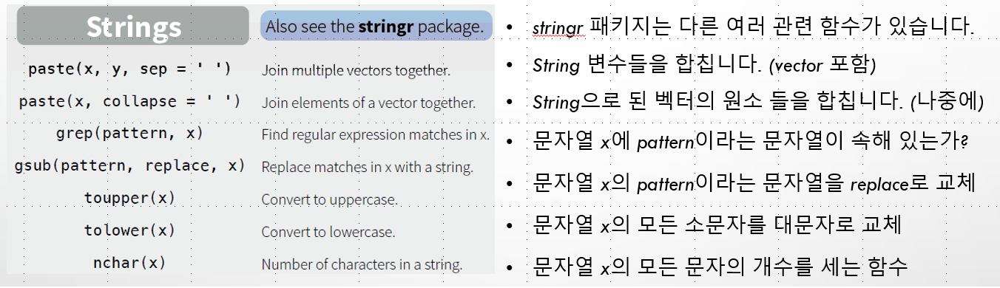

- Cheatsheet을 가까이 하세요 (ex. 책상이나 파티션에 붙여둠) \br  
- 설명서가 읽기 귀찮으면 Trial & Error도 좋은 방법입니다. \br  

## 2. numeric

```{r}
10^2 + 36
a = 4
a
a*5
a = a + 10
a
```

## 3. logical
```{r}
2==3
5>3
```

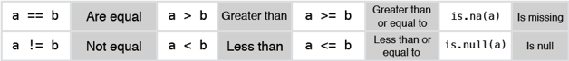

## Data Type 확인과 변환

\lc  

```{r}
is.character(5)
is.character("5")
a <- as.character(5)
is.character(a)
b <- as.numeric(a)
is.numeric(b)
as.numeric(2==3)
```

\rc

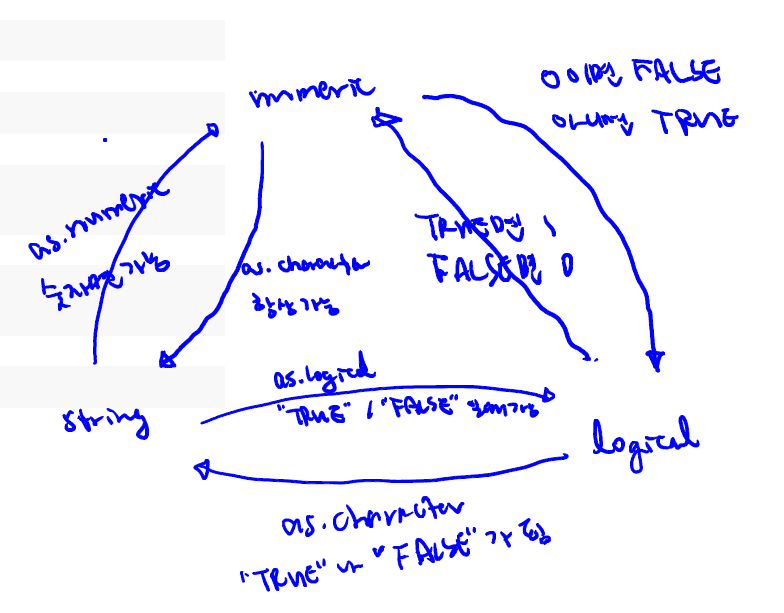  

\ec

## 4. factor (Categorical, 범주형 변수)

1. Group 별로 서로 예외적인(exclusive) 특성을 표현한 것  
  + 남자, 여자, 미성년 (여기에서 남자와 여자는 성인이어야 함)  
  + 산업 분류: 제조업, 금융업, 광공업 등  
  + 맑음, 흐림, 비가 옴, 더움  
  + 숫자로 되어있을 경우에 A,B,C로 바꿔도 무리가 없다면 Categorical 변수  
  
2. String vs Factor
  + Name/Message(이름/단문) vs Classficiation/Category(분류/속성)  
  + 일반적으로 유일한 값 vs 몇 가지 비슷한 것이 존재  

## 5. Date

```{r}
mydates <- as.Date(c("2007-06-22", "2004-02-13"))
mydates[1] - mydates[2]
today <- Sys.Date( )
today
as.numeric(substr(today, 1, 4)) # year # substr works for date
as.numeric(substr(today, 6, 7)) # month
as.numeric(substr(today, 9, 10)) # day
format(today, format="%B %d %Y")
```

## Data Type 변환

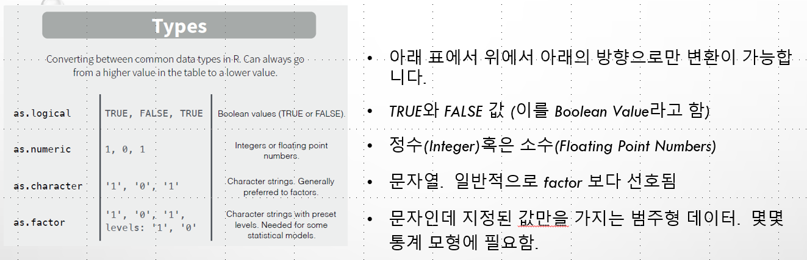

- 데이터 타입의 개수도 매우 많습니다. \br
- 새로운 패키지마다 패키지에 적합한 타입을 나름대로 정의하기도 합니다. \br
- 마주칠때마다 검색하고 필요한 만큼 알아보고 사용하는 것이 프로그래밍입니다.

## 예시 - 주민등록번호  

**YYMMDD – 1ABCD1E**

\vspace{10pt}

- YYMMDD – 생년 월일 \br
- 1 – 출생 연대와 성별 \br
- ABCD – 출생등록지 고유번호 \br
- AB – 광역시도 고유번호 \br
- CD – 읍면동 고유번호 \br
- 1 – 일련번호 \br
- E – 검증번호 \br
- E = 11-{(2×ㄱ+3×ㄴ+4×ㄷ+5×ㄹ+6×ㅁ+7×ㅂ+8×ㅅ+9×ㅇ+2×ㅈ+3×ㅊ+4×ㅋ+5×ㅌ) mod 11} \br

## blank

## 
\vspace{30pt}
\begin{center}
\Huge{Part 3. 자료 구조 (Data Structure)}
\end{center}

## 자료형 (type) vs 자료구조 (structure)  

1. 자료형   
  + 변수에 입력된 하나의 값의 형태 \br
  + 즉, 0차원의 하나의 점 \br
  + 하나의 값, singleton \br  
  + 그런데 하나의 값마다 하나의 변수가 되어 이름을 가진다면? \br   
  + 엑셀도 A컬럼 1번행 등으로 **묶어서** 처리하는 기능을 제공 \br  
  
2. 자료 구조   
  + 각각의 값(singleton)들이 모여서 구성되어 있는 구조를 자료 구조라고 함. \br
  + 대용량 데이터도 한 번에 포함할 수 있기에 데이터 분석의 근간이 됨.  

## 1. Vector  

```{r}
strVec1 <- c("Hello", "Hi", "What's up")
cbind(strVec1)
strVec2 <- c("Ma'am", "Sir", "Your Honor")
cbind(strVec2)
strVec3 <- paste(strVec1, strVec2)
cbind(strVec3)
```

## 

\lc
 
```{r}
numVec1 <- c(30,50,70)
numVec1
numVec2 <- seq(30,70,20)
numVec2
numVec3 <- c(25,55,80)
numVec3
numVec4 <- seq(from=20, to=1, by=-3)
numVec4
2:6
```

\rc

```{r}
min(numVec1)
min(numVec1,numVec3)
pmin(numVec1,numVec3)
numVec1 > numVec3
numVec1[2]
numVec1[-2]
numVec1[1:2]
numVec1[c(1,3)]
```

\ec

##

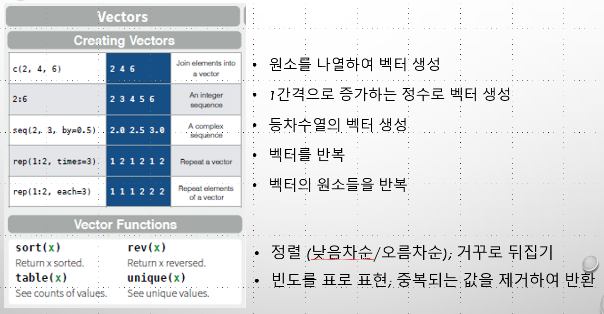

## 

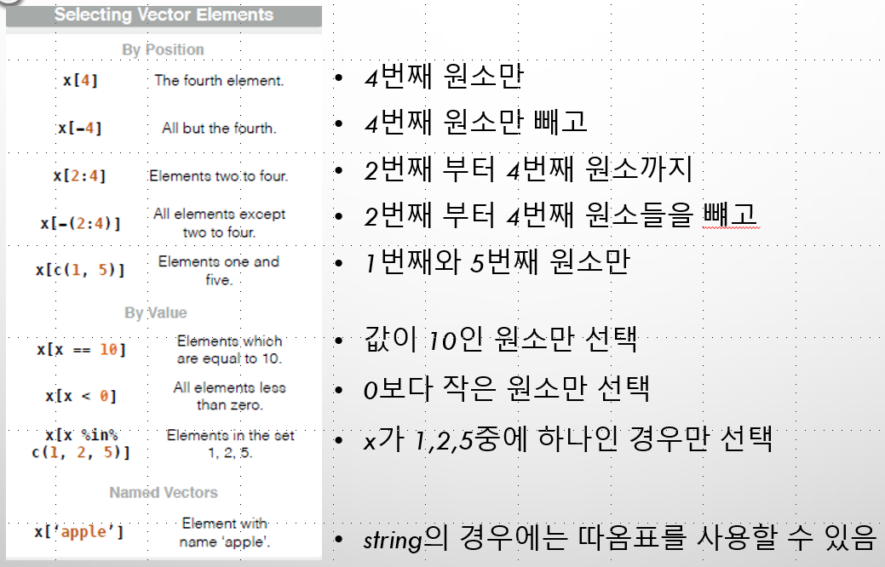

## 

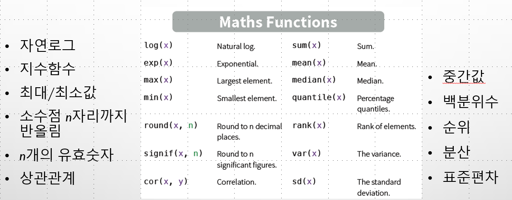

## 2. matrix (array)

```{r}
mat=matrix(data=c(9,2,3,4,5,6),ncol=3)
mat
mat[1,2]
mat[2,]
mean(mat)
apply(mat, 2, mean)
apply(mat, 1, mean)
```

## 

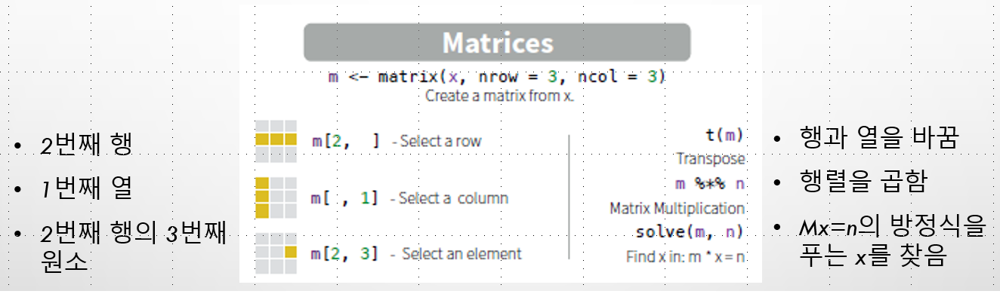

## 3. data.frame

```{r}
weather <-
  data.frame(date = c("2017-8-31","2017-9-1","2017-9-2"),
             sky  = c("Sunny", "Cloudy", "Rainy"), 
             temp = c(20,15,18))
weather
colnames(weather)
weather$sky
weather$sky==weather[,2]
```

## 

```{r}
class(weather$date)
weather$date <- as.Date(weather$date)
weather$sky <- as.character(weather$sky)
weather
sapply(weather, class)
```

##

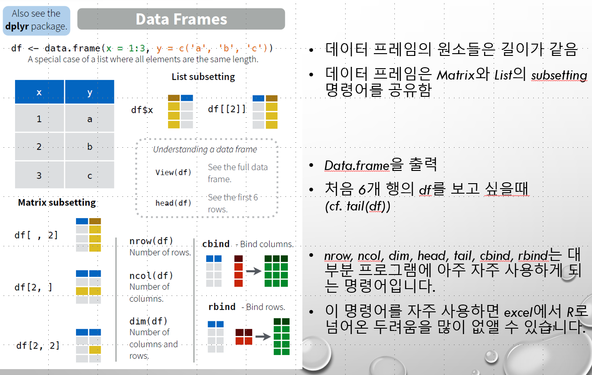

## 

- data.frame을 생성할 때(데이터 파일을 불러올 때)에는 문자로된 데이터를 자동으로 factor로 처리함! \br
- 따라서 `stringsAsFactors=FALSE`의 option을 data.frame 생성시 추가하는 것을 권장 \br
- 혹은 `options(stringsAsFactors=FALSE)` 명령을 global option으로 사용 가능 \br  
- factor 변수로 원할때에는 `as.factor()`를 사용하여 변환 \br
- Date인데 string으로 분류된 변수들에 대해서 `as.Date()`를 이용하여 type변환


## 5. list

\lc

```{r}
sim <- list(numClubs = c(1, 8, 3, 1),
            car     = c("Mercedez", "Porche", "Kia"),
            hobby   = c("golf", "squash"))
sim
names(sim)
sim[[1]]
sim$numClubs * c(10, 5, 7, 20)
```

\rc

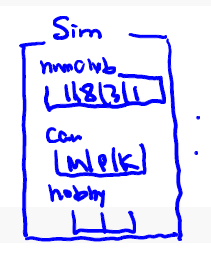  

\ec


##

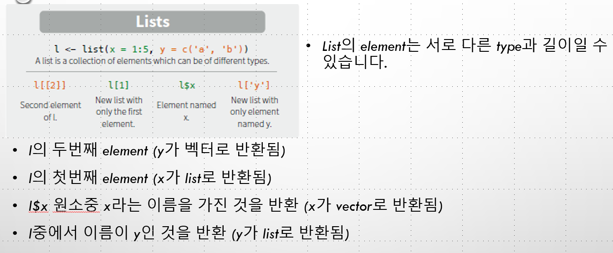

## 자료 구조 Summary  


## blank

## 
\vspace{30pt}
\begin{center}
\Huge{Part 4 프로그램 제어 (Control Statement)}
\end{center}

## 

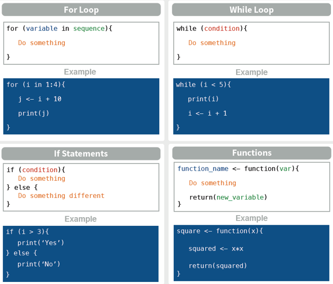

##

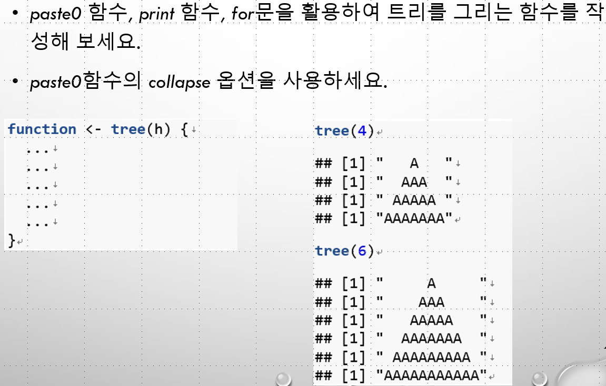

## blank

## 
\vspace{30pt}
\begin{center}
\Huge{Cheatsheet for Base}
\end{center}

##  
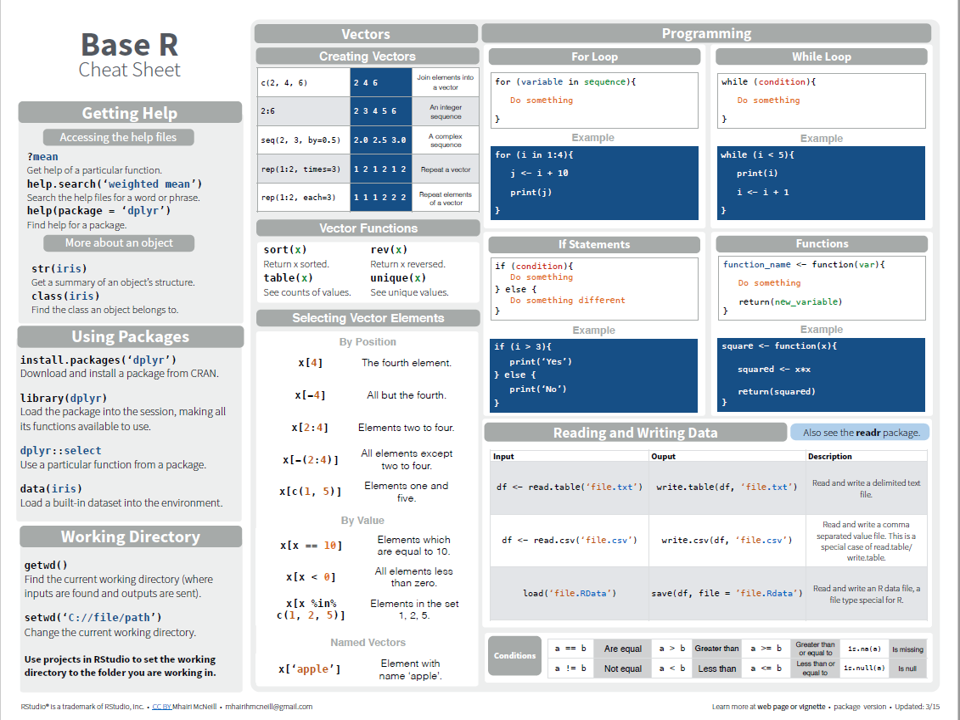\


##  
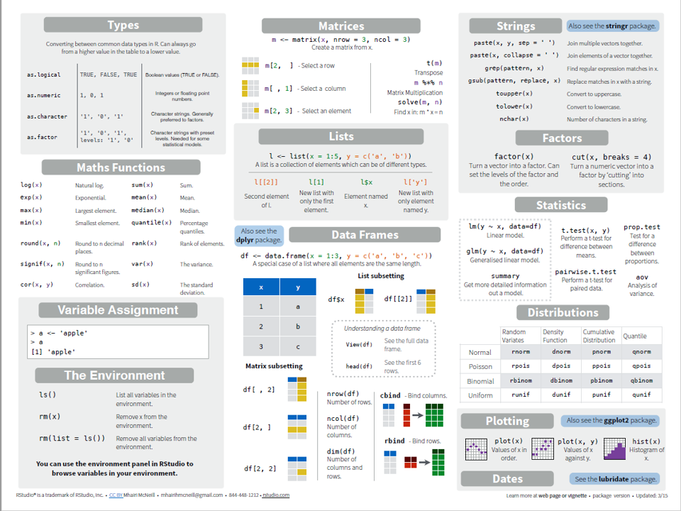\


# `M12-base` (`Hello World`, `Data Type`, `Data Structure`, `Control Statements`s)  


