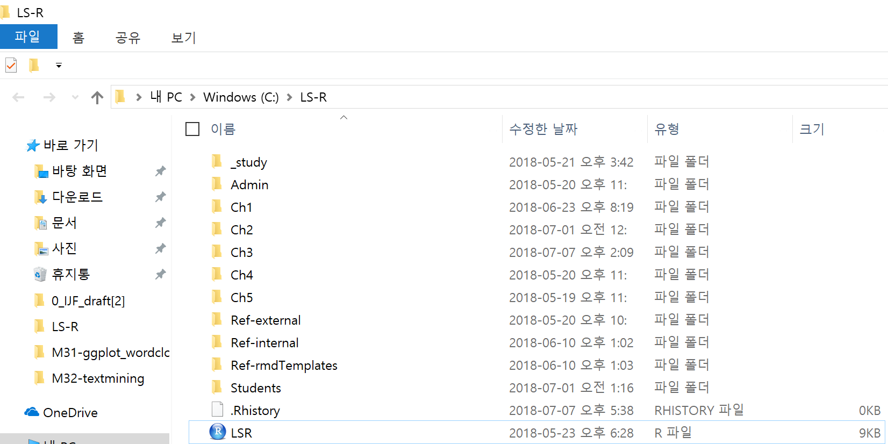

---
title: "M31 - Text Mining "  
author: "LearningSpoonsR "
date: "`r Sys.Date()`"  
fontsize: 9pt  
output:  
  beamer_presentation:  
    theme: "Singapore"   
    # For code line number, choose among   
    # ["Antibes", "Montpellier", "Singapore", "Szeged"]  
    colortheme: "beaver"   
    # For Singapore - ["beaver": print-friendly, "beetle": grey]  
    latex_engine: xelatex  
    # keep_tex: true  
    # template: myTemplate.tex  
    includes:  
      in_header: myRmdBeamerStyle/latex-topmatter.tex  
classoption: t  
mainfont: NanumGothic  
---  

```{r setup, include=FALSE}
library(rmarkdown)
library(dplyr)
library(ggplot2)
knitr::opts_chunk$set(echo = TRUE)
knitr::opts_chunk$set(background = '718CBA')
knitr::opts_chunk$set(warning = FALSE)
```

## Contents  

+ Part 2. 분석 & 시각화 - `ggplot2`  
+ Part 1. Text 전처리 - `tm`, `KONLP`      
+ Part 3. 일반화 - Writing a function  
+ (NEXT - Part. 일반화) - `M32-flexdashboard`  

\vspace{20pt}

+ `ggplot2`의 원리와 다른 용법에 대해서 알아봅니다.  
+ Text 문서를 입력으로 하여 분석하는 `text-mining` 도구들을 알아봅니다.  
+ 함수를 작성하면서, 1) 공통 기능을 일반화 하고, 2) 다른 기능은 분기하여 범용적인 도구로 진화시킵니다.  
+ (Next - 다양한 input형태를 모두 처리할 수 있는 도구로 완성시킵니다. (`shiny`))   

##  

\vspace{30pt}
\begin{center}
\Huge{Part 2. - 분석 \& 시각화 - \texttt{ggplot2}}
\end{center}


## GG - Grammar of Graphics  

- Motivation   
  1. 그래픽스에 대한 원리가 없다면, 그래픽 관련 패키지와 함수는 단지 특수 경우의 모음일 뿐  
  2. 요리 백과사전을 다 읽는 것 vs. 물과 기름과 불의 작용에 대해서 익히고 백과사전을 **찾아가면서** 요리하는 것  
- Advantage    
  1. 새로운 package나 함수의 등장을 빠르게 흡수  
  2. 새로운 graphics를 만들어 내는 아이디어가 체계적이 됨  

- Features  
  1. 독립적이고 더할 수 있는 구성 요소들로 그래픽을 표현  
  2. 개발과정에서 그래프의 특징을 한 가지 씩, 반복적으로 바꾸면서 그래프를 만들어 감  
  3. 생각의 흐름, 스토리텔링의 흐름과 연계시킬 수 있기에 interactive graphics와 잘 조화됨

## 구성 요소  

\lc

```{r}
library(ggplot2)
ggplot(mpg) + 
  aes(x = displ, y = hwy, color = cyl) +
  geom_point()
``` 

\rc  
 
+ Aesthetics    
  1. position  
  2. size  
  3. color  
  4. shape  
  
+ Geometric Object (`geom_`)  
  1. Scatterplot - `point`   
  2. Bubblechart - `point`  
  3. Barchart - `bar`  
  4. Box-and-whisker plot - `boxplot`  
  5. Line chart - `line`  
  
\ec

## Behind the scene  

\  


## 중첩된 관찰값에 노이즈를: `position = "jitter"`   

```{r, message = FALSE, fig.width = 7, fig.height = 3}
library(gridExtra)
a <- ggplot(mpg) + geom_point(aes(displ, hwy, color = cyl))  
b <- ggplot(mpg) + geom_point(aes(displ, hwy, color = cyl), position = "jitter")
grid.arrange(a, b, nrow = 1, ncol = 2)
```

## Barchart  

\lc  

+ x축에 이산변수 (discrete value)를 넣고 변수 x의 각각의 값에 대해서 몇 개의 관찰값이 있는지를 보여줌.   
+ \#count \#density \#distribution  

```{r, fig.width = 3, fig.height= 2.5}
mpg$displ_fac <- 
  as.factor(round(mpg$displ,0))
ggplot(mpg) + 
  geom_bar(aes(x = displ_fac))
```

\rc  

+ x변수 외에도 이산 변수를 추가할 수 있음.  

```{r, fig.width = 3, fig.height= 2.5}
ggplot(mpg) + 
  geom_bar(aes(x = displ_fac, color = class))
```

\ec

## Barchart (Color and Fill)

\lc  

+ `color` - 테두리만 됨     

```{r, fig.width = 3, fig.height= 2.5}
ggplot(mpg) + 
  geom_bar(aes(x = displ_fac, color = class))
```

\rc

+ `fill` - 채워짐     

```{r, fig.width = 3, fig.height= 2.5}
ggplot(mpg) + 
  geom_bar(aes(x = displ_fac, fill = class))
```

\ec  

## Barchart (`position = "dodge"`)

\lc  

```{r, fig.width = 3, fig.height= 2.5}
ggplot(mpg) + 
  geom_bar(aes(x = displ_fac, fill = class))
```

+ 2개의 discrete 변수를 잘 처리하는 법?  

\rc

```{r, fig.width = 3, fig.height= 2.5}
ggplot(mpg) + 
  geom_bar(aes(x = displ_fac, fill = class),
           position = "dodge")
```

\ec

## Barchart (`position = "fill"`)  

\lc  

```{r, fig.width = 3, fig.height= 2.5}
ggplot(mpg) + 
  geom_bar(aes(x = displ_fac, fill = class))
```

+ `class`의 각각의 `displ_fac` 값에서의 분포?  

\rc

```{r, fig.width = 3, fig.height= 2.5}
ggplot(mpg) + 
  geom_bar(aes(x = displ_fac, fill = class),
           position = "fill")  
```

\ec

## Boxplot  

\lc  

+ x 변수는 이산 변수이고 x 변수의 각각의 값에 대해서 연속 변수인 y의 분포를 보기 위함.  

```{r, fig.width = 3, fig.height= 2.5}
ggplot(mpg) +
  geom_boxplot(aes(x = class, y = hwy))
```

\rc

+ 점으로 표현된 것은 이상치(outlier)로서 이상하게 높거나 낮은 값   
+ 꼬리의 각 끝은 상위/하위 10%의 값   
+ 박스의 상단은 상위 25%, 하단은 하위 25%   
+ 박스의 가운데 직선은 중간값  

+ x변수가 이산 변수이면서 `factor`라면, 변수의 값이 `character`라서 display가 복잡할 가능성이 높음  
+ 이럴때는?  

\ec

## Boxplot (`coord_flip()`)

```{r, fig.width = 5, fig.height= 4}
ggplot(mpg) +
  geom_boxplot(aes(x = class, y = hwy)) +
  coord_flip()
```

## Barplot (`coord_flip()`) 

\lc

```{r}
ggplot(mpg, aes(x = class, fill = class)) +
  geom_bar()
```

\rc

```{r}
ggplot(mpg, aes(x = class, fill = class)) +
  geom_bar() + coord_flip()
```

\ec

## Pie-chart (`coord_polar()`)

\lc

```{r}
ggplot(mpg, aes(x = 1, fill = class)) + 
  geom_bar()
```

\rc

```{r}
ggplot(mpg, aes(x = 1, fill = class)) + 
  geom_bar() + coord_polar(theta = "y")
```

\ec

## Pie Chart (from `M91-ggplot2-50examples.pdf`)    

```{r, fig.width = 4, fig.height = 4}
ggplot(mpg, aes(x = "", fill = factor(class))) +
  geom_bar(width = 1) +
  theme(axis.line = element_blank(), plot.title = element_text(hjust=0.5)) +
  labs(fill = "class", x = NULL, y = NULL, 
       title = "Pie Chart of class", caption = "Source: mpg") +
  coord_polar(theta = "y", start=0)
```
  
## ggplot 기타 기능 (저장 \& `plotly`)

\lc

+ `ggplot`객체를 `png` 파일로 저장    


```{r, eval=FALSE}
png("out_file.png")
ggplot(mpg) + geom_bar(aes(x=class)) + 
  coord_flip()
dev.off()
```

\rc

+ `plotly` - html에서 각종 추가 기능 제공  

```{r, eval=FALSE}
library(plotly)
a <- ggplot(mpg) + geom_bar(aes(x=class))
ggplotly(a)
```

\ec

##  

##  

\vspace{30pt}
\begin{center}
\Huge{Part 1. Text 전처리 - \texttt{tm, KONLP}}
\end{center}

## "I have a dream" – Martin Luther King, Jr.

\lc

**Nulla. Source packages**    

\vspace{5pt}

```{r, message = FALSE}
library(tm) # for text mining
library(SnowballC) # for text stemming
library(wordcloud) # word-cloud generator 
library(wordcloud2) # word-cloud generator 
library(RColorBrewer) # color palettes
library(ggplot2)
library(dplyr)
```

\rc

**I. Infile**  

\vspace{5pt}

```{r}
# txt in web? no problem!
filePath <- paste0(
  "http://www.sthda.com/sthda/RDoc/",
  "example-files/martin-luther-king",
  "-i-have-a-dream-speech.txt")
text <- readLines(filePath)
docs <- Corpus(VectorSource(text))
inspect(docs)
```

\ec

## 

**II. Cleanup text**  

\vspace{5pt} 

```{r, warning = FALSE}
toSpace <- content_transformer(
  function(x, pattern) gsub(pattern, " ", x))
docs <- docs %>% 
  tm_map(toSpace, "/") %>%
  tm_map(toSpace, "@") %>%
  tm_map(toSpace, "\\|")
```

```{r, warning = FALSE}
docs <- docs %>% 
  tm_map(content_transformer(tolower)) %>%         # Convert it to lower case
  tm_map(removeNumbers) %>%                        # Remove numbers
  tm_map(removeWords, stopwords("english")) %>%    # Remove english common stopwords
  tm_map(removeWords, c("blabla1", "blabla2")) %>% # Remove your own stop word
  tm_map(removePunctuation) %>%                    # Remove punctuations    
  tm_map(stripWhitespace)                          # Eliminate extra white spaces
```

```{r, warning = FALSE}
inspect(docs)
```

##  

**III. Generate `FreqTable`**  

\vspace{5pt}

```{r}
termMat   <- TermDocumentMatrix(docs) 
termTable <- as.matrix(termMat)
freqTable <- data.frame(word = rownames(termTable),
                        freq = rowSums(termTable),
                        row.names = NULL)
freqTable <- freqTable %>% arrange(desc(freq))
```

```{r}
freqTable %>% head()
```

##

**IV. Render barplot**   

\vspace{5pt}

```{r, fig.width = 7, fig.height = 4}
ggplot(data = head(freqTable, 20)) +
  geom_bar(aes(x = reorder(word, freq), y = freq), stat="identity") +
  coord_flip() +
  theme(axis.text = element_text(size = 16)) +
  labs(x = "Word", y = "Frequency")
```

##

**V. Render wordcloud**   

\vspace{5pt}

```{r, fig.width = 7, fig.height = 4, warning = FALSE}
wordcloud(words = freqTable$word, freq = freqTable$freq, 
          min.freq = 1, max.words=200, random.order=FALSE, rot.per=0.35, 
          colors=brewer.pal(8, "Dark2"))
# for html, newer version is available!
# wordcloud2(freqTable, color = "random-light", backgroundColor = "grey")
```

## Summary  

0. Source packages    
1. Infile    
2. Cleanup text    
3. Generate `FreqTable`    
4. Render barplot     
5. Render wordcloud  

+ **Next step: `sonaki.pdf`**  

## 

## `sonaki.pdf`  

\begin{center}
\textbf{Nulla. Source packages}
\end{center}

\lc 

**i-have-a-dream.txt**

\vspace{5pt}

```{r, message = FALSE}
library(tm) # for text mining
library(SnowballC) # for text stemming
library(wordcloud) # word-cloud generator 
library(wordcloud2) # word-cloud generator 
library(RColorBrewer) # color palettes
library(ggplot2)
library(dplyr)
```

\rc

**sonaki.pdf**

\vspace{5pt}

```{r, message = FALSE}
library(tm) # for text mining
library(SnowballC) # for text stemming
library(wordcloud) # word-cloud generator 
library(wordcloud2) # word-cloud generator 
library(RColorBrewer) # color palettes
library(ggplot2)
library(dplyr)
```

```{r, message = FALSE}
library(KoNLP) 
# Korean Natural Language Processing
library(pdftools) 
# Extract text from pdf
```

\ec

##

\begin{center}
\textbf{I. Infile}  
\end{center}

\lc 

**i-have-a-dream.txt**  

\vspace{5pt}

```{r, message = FALSE, eval=FALSE}
# txt in web? no problem!
filePath <- paste0(
  "http://www.sthda.com/sthda/RDoc/",
  "example-files/", "martin-luther-",
  "king-i-have-a-dream-speech.txt")
text <- readLines(filePath)
docs <- Corpus(VectorSource(text))
inspect(docs)
```

\rc  

**sonaki.pdf**

\vspace{5pt}

```{r}
# local pdf
text <- pdf_text("../script/sonaki.pdf")
# Apply extract Noun
docs <- sapply(
  text, extractNoun, USE.NAMES = F) 
docs <- unlist(docs)
# Character length >= 2
docs <- Filter(
  function(x) {nchar(x) >= 2}, docs) 
```

`head(docs):` `r head(docs)`  

\ec  

##

\begin{center}
\textbf{II. Cleanup text}
\end{center}

\lc 

**i-have-a-dream.txt**  

\vspace{5pt}

```{r, eval=FALSE, warning = FALSE}
toSpace <- content_transformer(
  function(x, pattern) gsub(pattern, " ", x))
docs <- docs %>% 
  tm_map(toSpace, "/") %>%
  tm_map(toSpace, "@") %>%
  tm_map(toSpace, "\\|")
```

```{r, eval=FALSE, warning = FALSE}
docs <- docs %>% 
  # Convert it to lower case
  tm_map(content_transformer(tolower)) %>%         
  # Remove numbers
  tm_map(removeNumbers) %>%
  # Remove english common stopwords
  tm_map(removeWords, stopwords("english")) %>%
  # Remove your own stop word
  tm_map(removeWords, c("blabla1", "blabla2")) %>% 
  # Remove punctuations
  tm_map(removePunctuation) %>%
  # Eliminate extra white spaces
  tm_map(stripWhitespace)                          
```

\rc

**sonaki.pdf**    

\vspace{5pt}

```{r}
# `extractNoun` already
# took care of...
```

\ec

##

\begin{center}
\textbf{III. Generate `FreqTable`}
\end{center}

\lc 

**i-have-a-dream.txt**

\vspace{5pt}

```{r, eval=FALSE}
termMat   <- TermDocumentMatrix(docs) 
termTable <- as.matrix(termMat)
freqTable <- 
  data.frame(word = rownames(termTable),
             freq = rowSums(termTable),
             row.names = NULL)
freqTable <- freqTable %>% 
  arrange(desc(freq))
# head(freqTable)
```

\rc

**sonaki.pdf**

\vspace{5pt}

```{r}
freqTable <- data.frame(table(docs))
names(freqTable) <- c("word", "freq")
freqTable <- freqTable %>% 
  arrange(desc(freq))
# head(freqTable)
```

\ec

##

\begin{center}
\textbf{IV. Render barplot}
\end{center}

**i-have-a-dream.txt**  
**sonaki.pdf**  

\vspace{5pt}

```{r, fig.width=7, fig.height=3}
ggplot(data = head(freqTable, 20)) +
  geom_bar(aes(x = reorder(word, freq), y = freq), stat="identity") +
  coord_flip() +
  theme(axis.text = element_text(size = 16)) +
  labs(x = "Word", y = "Frequency")
```


##

\begin{center}
\textbf{V. Render wordcloud}
\end{center}

**i-have-a-dream.txt**  
**sonaki.pdf**  

\vspace{5pt}

```{r}
wordcloud(words = freqTable$word, freq = freqTable$freq, 
          min.freq = 1, max.words=200, random.order=FALSE, rot.per=0.35, 
          colors=brewer.pal(8, "Dark2"))
# for html, newer version is available!
# wordcloud2(freqTable, color = "random-light", backgroundColor = "grey")
```

## Summary  

+ txt vs pdf  
+ English vs Korean  

##  

\vspace{30pt}
\begin{center}
\Huge{Part 3. 일반화 - Writing a function.}
\end{center}

## function `getDocs2`  

**0. Source packages** \& **1. Infile**      

```{r, eval=FALSE}
getDocs2 <- function(fileName) {
  # 0. Source packages
  activate("tm", "SnowballC", "wordcloud", "KoNLP", "pdftools")
  activate("ggplot2", "dplyr", "RColorBrewer", "cld3")
  # 1. Infile
  fileType <- unlist(strsplit(fileName, split = "\\.")) %>% tail(1)
  if (fileType == "pdf") {
    text <- pdf_text(fileName)
  } else if (fileType == "txt") {
    text <- readLines(fileName)
  } else {
    stop("We only support pdf and txt!") # defensive programming  
  }
  isKO <- "ko" %in% detect_language(text)
  if (isKO) { # if Korean
    docs <- sapply(text, extractNoun, USE.NAMES = F) %>% unlist()
    docs <- Filter(function(x) {nchar(x) >= 2}, docs)
    attr(docs, "lang") <- "kr"
  } else { # if English
    docs <- Corpus(VectorSource(text))
    attr(docs, "lang") <- "en"
  }
  return(docs)
}
```  

## function `cleanDocsGenerateFreqTable`  

**2. Cleanup text** \& **3. Generate `FreqTable`**  

```{r, eval=FALSE}
cleanDocsGenerateFreqTable <- function(docs, lang) {
  if (lang == "kr") {
    docs <- unlist(docs)
    docs <- Filter(function(x) {nchar(x) >= 2}, docs) # Character length >= 2
    freqTable <- data.frame(table(docs))
    names(freqTable) <- c("word", "freq")
    freqTable <- freqTable %>% arrange(desc(freq))
  } else { # lang == "en"
    toSpace <- content_transformer(function (x , pattern) gsub(pattern, " ", x))
    docs <- docs %>% tm_map(toSpace, "/") %>% 
      tm_map(toSpace, "@") %>% tm_map(toSpace, "\\|")
    docs <- docs %>% 
      tm_map(content_transformer(tolower)) %>%         # Convert it to lower case
      tm_map(removeNumbers) %>%                        # Remove numbers
      tm_map(removeWords, stopwords("english")) %>%    # Remove english common stopwords
      tm_map(removeWords, c("blabla1", "blabla2")) %>% # Remove your own stop word
      tm_map(removePunctuation) %>%                    # Remove punctuations    
      tm_map(stripWhitespace)                          # Eliminate extra white spaces
    termMat   <- TermDocumentMatrix(docs)
    termTable <- as.matrix(termMat)
    freqTable <- data.frame(word = rownames(termTable), freq = rowSums(termTable))
    freqTable$word <- rownames(freqTable)
    freqTable <- freqTable %>% arrange(desc(freq))
  }
  return(freqTable)
}
```

## Source File 관리  

+ 위의 두 함수 `getDocs2`와 `cleanDocsGenerateFreqTable`를 `LSR.R`파일에 저장 \br
+ 다른 곳에서 `source("LSR.R")`을 한번 실행하면 함수가 메모리에 정의되어 있으므로 두 함수를 사용이 가능함 \br
+ 수업 중 프로그램 단위인 `MXX`의 폴더에서는 상위 폴더로 두 번 올라가면 `LSR.R`이 있으므로 `source("../../LSR.R")`은 경로로 실행

\  

## `activate` - `LSR.R`내의 다른 function(1)    

+ 패키지가 인스톨 되어있지 않으면 인스톨 한후에, \br
+ 패키지가 로드되어 있지 않다면 로드함. \br
+ 주의. `shiny`에서는 실행하지 말 것  

```{r}
activate <- function(...) {
  # activate("dplyr")
  # activate("xts", "dygraphs")
  # activate(c("ggplot2", "ISLR"))
  packages <- unlist(list(...))
  for (i in 1:length(packages)) {
    package_i <- packages[i]
    if (!package_i %in% installed.packages()[,"Package"]) {
      print(paste("Installing", package_i))
      suppressMessages(install.packages(package_i))
    }
    suppressMessages(require(package_i, character.only = TRUE))
  }
}
```

## `rndQuote` - `LSR.R`내의 다른 function(2)    

+ `ranjith19`라는 github 사용자가 올려놓은 명언들 중에서 \br
+ 무작위로 몇개를 선택하여 돌려주는 함수  
+ 매일 자동 실행되는 프로그램에서 사용하기에 유용함  

```{r}
rndQuote <- function(n = 1) {
  # rndQuote() # 2018-05-09
  fileName <- paste0(
    "https://raw.githubusercontent.com/ranjith19/",
    "random-quotes-generator/master/quotes.txt")
  activate("readr")
  quotes <- read_file(fileName)
  quotes <- gsub("\n.\n", "zzzzzz", quotes)
  quotes <- unlist(strsplit(quotes, split="zzzzzz"))
  return(quotes[sample(length(quotes), n)])
}
```

```{r}
cat(rndQuote(1))
cat(rndQuote(1))
```


