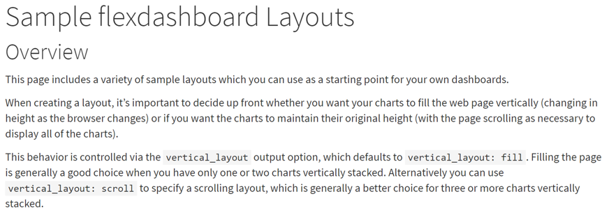
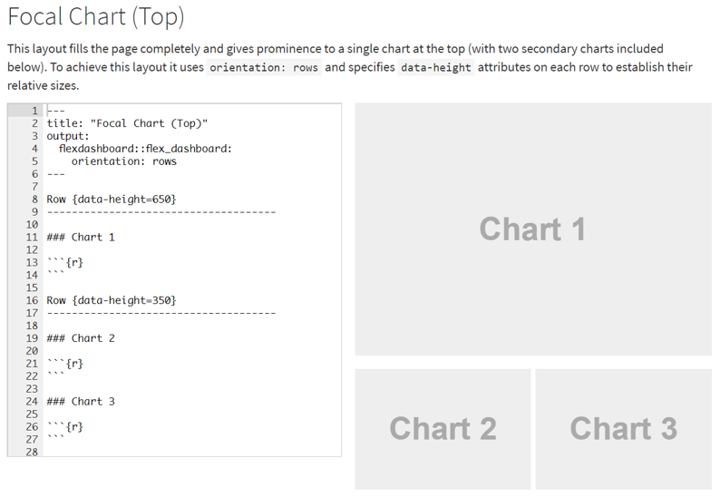
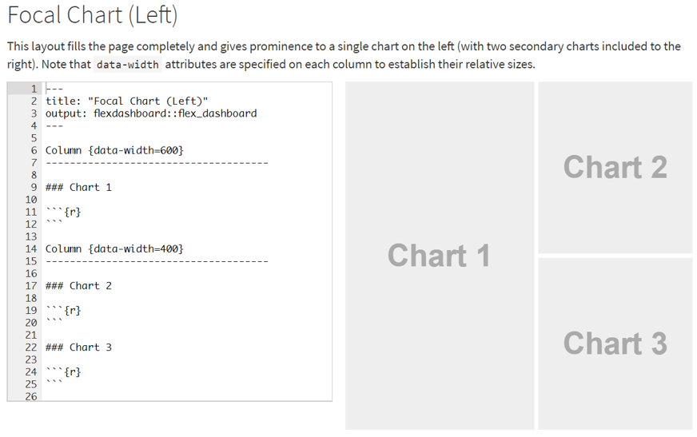
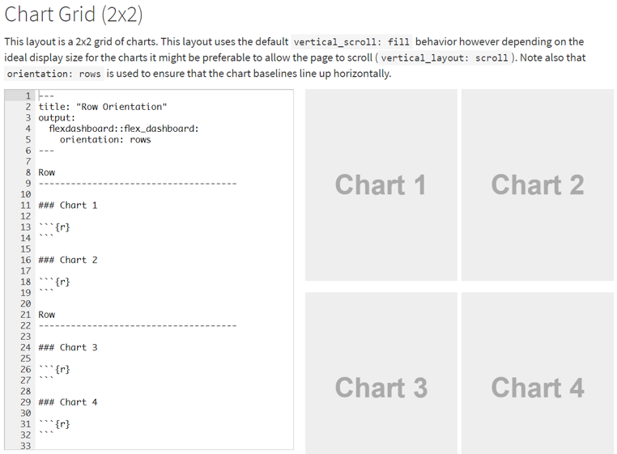
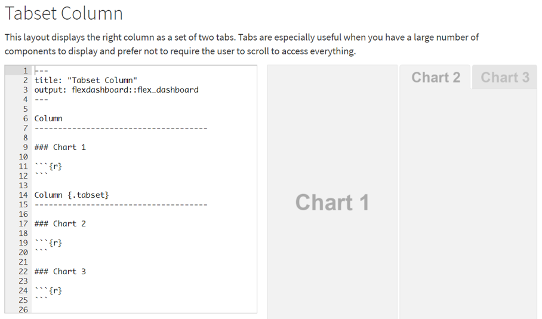
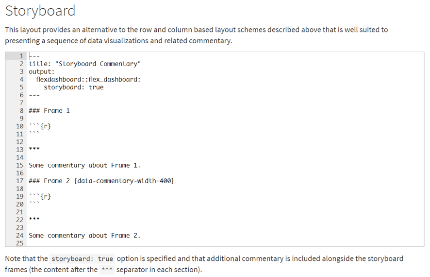
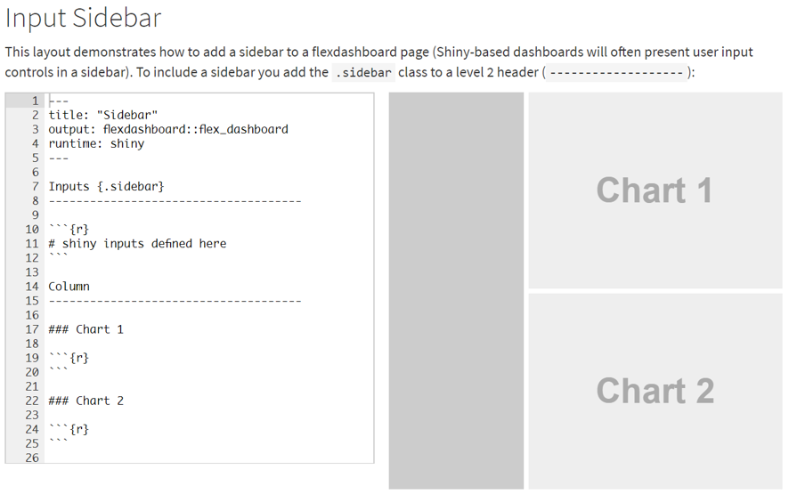
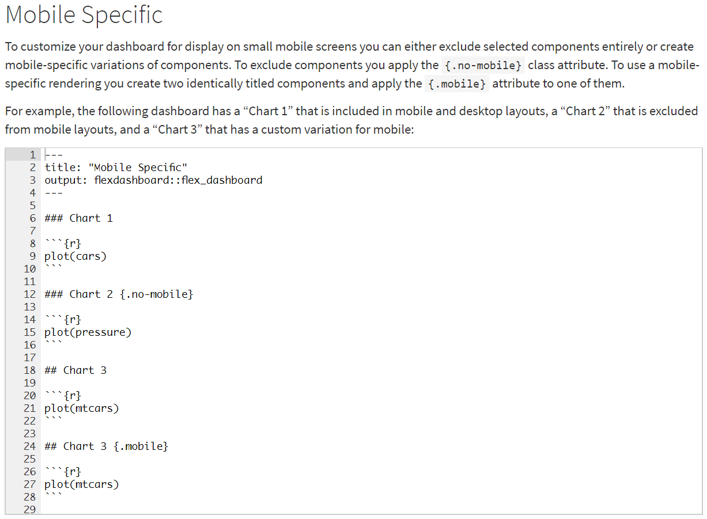

---
title: "M32 - Flexdashboard "  
author: "LearningSpoonsR "
date: "`r Sys.Date()`"  
fontsize: 9pt  
output:  
  beamer_presentation:  
    theme: "Singapore"   
    # For code line number, choose among   
    # ["Antibes", "Montpellier", "Singapore", "Szeged"]  
    colortheme: "beaver"   
    # For Singapore - ["beaver": print-friendly, "beetle": grey]  
    latex_engine: xelatex  
    # keep_tex: true  
    # template: myTemplate.tex  
    includes:  
      in_header: myRmdBeamerStyle/latex-topmatter.tex  
classoption: t  
mainfont: NanumGothic  
---  

```{r setup, include=FALSE}
library(rmarkdown)
library(dplyr)
library(ggplot2)
knitr::opts_chunk$set(echo = TRUE)
knitr::opts_chunk$set(background = '718CBA')
knitr::opts_chunk$set(warning = FALSE)
```

## Contents  

Previously...  

+ Part 2. 분석 & 시각화 - `ggplot2`  
+ Part 1. Text 전처리 - `tm`, `KONLP`      
+ Part 3. 일반화 - Writing a function  

\vspace{10pt}

Now...  

+ **Part. 일반화 - `M32-flexdashboard`**  

## Flexdashboard – easy \& interactive dashboards for R  

+ R Markdown을 사용하여 관련 데이터 시각화 그룹을 대시 보드로 게시하십시오.  
  1. `htmlwidgets`를 포함한 다양한 구성 요소 지원   
  2. 기본, 격자 및 격자 그래픽    
  3. 표 형식의 데이터   
  4. 게이지 및 가치 상자   
  5. 텍스트 주석  
+ 유연하고 쉽게 행 및 열 기반 레이아웃을 지정할 수 있습니다.  
+ 구성 요소는 브라우저를 채우고 모바일 장치에 표시되도록 지능적으로 크기 조정됩니다.   
+ 시각화 시퀀스 및 관련 해설을 제시하는 스토리 보드 레이아웃.   
+ Shiny를 사용하여 시각화를 동적으로 구동 할 수 있습니다.   
+ <https://rmarkdown.rstudio.com/flexdashboard/index.html>   
+ **파일 – 새파일 – Rmarkdown – Template – Flexdashboard!**  

## 개 요  

+ 이 페이지에는 자신의 대시 보드의 시작점으로 사용할 수있는 다양한 샘플 레이아웃이 포함되어 있습니다.  
+ 레이아웃을 만들 때 차트가 웹 페이지를 수직으로 채우고 싶을 때 (브라우저가 바뀌면 높이가 변경됨), 혹은 차트가 원래 높이를 유지하게 할 것인지 결정할 필요가 있습니다. (모든 차트를 표시)   
+ 이 동작은 `vertical_layout` 출력 옵션을 통해 제어되며, 기본값은 `vertical_layout : fill`입니다. 일반적으로 하나 또는 두 개의 차트 만 세로로 쌓아두면 페이지 채우기가 좋습니다.   
+ 또는 `vertical_layout : scroll`을 사용하여 스크롤 레이아웃을 지정할 수 있습니다. 이 레이아웃은 일반적으로 세 개 이상의 세로로 겹쳐진 차트에 더 좋습니다.  

\  

## Chart Stack (Fill)

+ 이 레이아웃은 두 차트의 간단한 스택입니다.  
+ 하나의 차트 또는 다른 차트는 데이터 높이 특성을 지정하여 세로로 더 크게 만들 수 있습니다.

##  

\  

## Chart Stack (Scrolling)

+ 이 레이아웃은 세 개의 차트로 구성된 간단한 스택입니다.   
+ 모든 차트를 표시 할 수있는 충분한 공간을 제공하기 위해 스크롤 레이아웃이 사용됩니다.  
(`vertical_layout: scroll`)  
+ 이 레이아웃을 스크롤 할 수 있기 때문에 많은 수의 차트를 여러 페이지로 구성 할 수 있습니다.   
+ 많은 수의 차트의 경우에는 `Multiple Pages`를 참조하세요.  

##  

\  

## Focal Chart (Top)  

+ 이 레이아웃은 페이지를 완전히 채우고 상단의 단일 차트 (두 개의 보조 차트 포함)에 중요성을 부여합니다.  
+ 이 레이아웃을 달성하기 위해 `orientation: rows`를 사용하고, 각 행의 `data-height` 속성을 지정하여 상대 크기를 설정합니다.  


##  

\  

## Focal Chart (Left)  

+ 이 레이아웃은 페이지를 완전히 채우고 왼쪽의 단일 차트에 두드러진 보조 차트를 제공합니다 (오른쪽에 두 개의 보조 차트 포함).  
+ 데이터 너비 특성은 각 열에 지정되어 상대 크기를 설정합니다.  


##  

\  

## Chart Grid (2 by 2)  

+ 이 레이아웃은 2x2 그리드 차트입니다.  
+ 이 레이아웃에서는 기본 `vertical_scroll: fill`를 사용하지만 차트의 이상적인 표시 크기에 따라 페이지를 스크롤하는 것이 바람직 할 수 있습니다 (`vertical_layout: scroll`).   
+ `orientation: rows`는 차트 기준선이 수평으로 정렬되도록하는 데 사용됩니다.  

##  

\  

## Tabset Column  

+ 이 레이아웃은 오른쪽 열을 두 개의 탭으로 표시합니다.  
+ 탭은 표시 할 구성 요소 수가 많고 사용자가 모든 항목에 액세스 할 때 스크롤하지 않아도 되는 경우에 특히 유용합니다.  

##  

\  

## Tabset Row  

+ 이 레이아웃은 하단 행을 두 개의 탭으로 표시합니다.  
+ `{.tabset-fade}` 속성은 탭을 전환 할 때 페이드 인 / 아웃 효과를 사용하는 데에도 사용됩니다.

##  

\  

## **Multiple Pages**  

+ 이 레이아웃은 레벨 1 마크 다운 헤더 (`================`)를 사용하여 여러 페이지를 정의합니다. 각 페이지에는 고유 한 최상위 탐색 탭이 있습니다.   
+ 또한 두 번째 페이지는 데이터 방향 특성을 통해 고유 한 방향을 사용합니다. 사용자 정의 `data-width` 및 `data-height` 특성이있는 여러 열과 행을 사용하는 방법도 설명합니다.  


##  

\  

## Storyboard  

+ 이 레이아웃은 위에 설명 된 행 및 열 기반 레이아웃 스키마 대신 데이터 시각화 및 관련 해설 시퀀스를 표시하는 데 적합합니다.   
+ `storyboard: true` 옵션이 지정되고 추가 해설이 스토리 보드 프레임 (각 섹션의 `***` 구분 기호 뒤의 내용)과 함께 포함됩니다.  

##  

\  

## Input Sidebar  

+ 이 레이아웃은 플렉스 대시 페이지에 사이드 바를 추가하는 방법을 보여줍니다 (샤이니 기반 대시 보드는 종종 사용자 입력 컨트롤을 사이드 바에 표시합니다). 
+ 사이드 바를 포함 시키려면 `.sidebar` 클래스를 레벨 2 헤더에 추가하십시오 (`-------------------`).

##  

\  

## Input Sidebar (Global)   

+ 여러 페이지를 사용하는 레이아웃이있는 경우 사이드 바를 전역으로 (즉, 모든 페이지에 대해) 표시 할 수 있습니다.   
+ 전역 사이드 바를 포함 시키려면 레벨 1 헤더 (============)에 `.sidebar`를 추가하세요.  

##  

\  

## Mobile Specific  

+ 소형 모바일 화면에 표시 할 대시 보드를 사용자 정의하려면 선택한 구성 요소를 완전히 제외하거나 모바일 전용 변형을 만들 수 있습니다. 구성 요소를 제외하려면 `{.no-mobile}` 클래스 속성을 적용하십시오.  
+ 모바일 전용 렌더링을 사용하려면 동일한 제목의 두 개의 구성 요소를 만들고 그 중 하나에 `{.mobile}` 특성을 적용하십시오.  
+ 예를 들어, 다음 대시 보드에는 모바일 및 데스크톱 레이아웃에 포함 된 "Chart 1", 모바일 레이아웃에서 제외 된 "Chart 2"및 모바일 용 사용자 지정 변형이있는 "Chart 3"이 있습니다.  

##     

\  

##  

\  

##  

```{r}
"Express Yourself"
```
