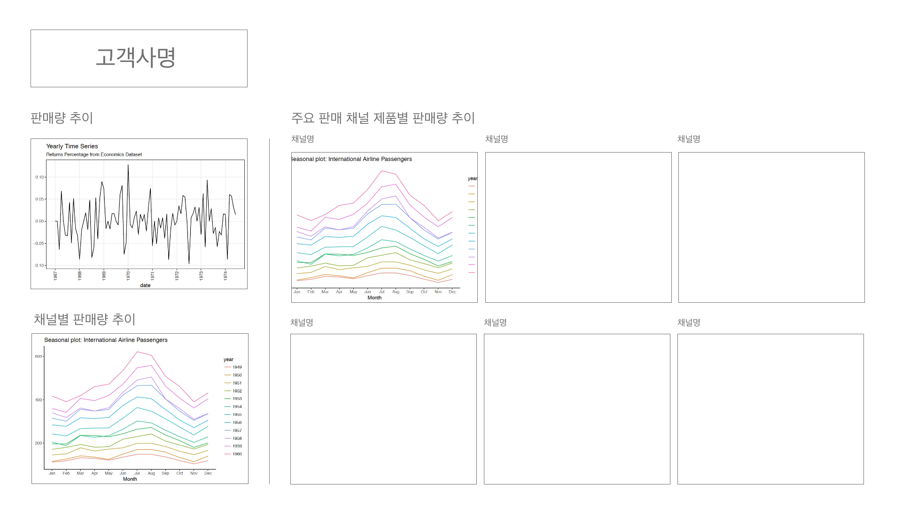
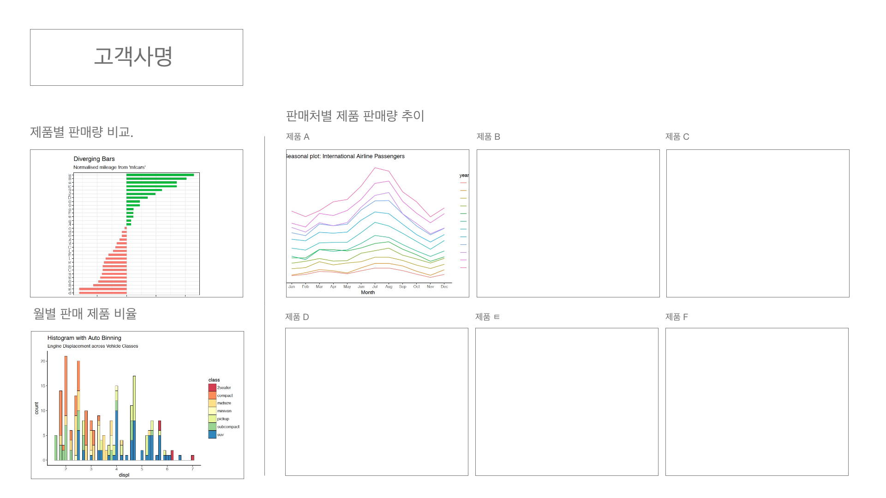

```{r setup, include=FALSE}
knitr::opts_chunk$set(echo = TRUE)
```

+ Task 1. 아래에 사용할 패키지를 로드하세요.  

```{r, message = FALSE}
library(dplyr)
```

## 1. 불러오기  

```{r}
shipment <- read.csv("shipment.csv", stringsAsFactors = FALSE)
str(shipment)
```

## 2. 전처리  

+ Task 2. 변수들을 필요에 따라 `Date`, `factor`등으로 변경하세요.

## 3. 그래픽 (Part 1)     

+ Task 3. 판매량 추이  
+ Task 4. 채널별 판매량 추이  

  

## 4. 그래픽 (Part 2)  

+ Task 5. 제품별 판매량 비교  
+ Task 6. 월별 판매 제품 비율  
+ Task 7. 판매자별 제품 판매량 추이  



## 5. 분석  

+ 고객의 구매 패턴을 파악하여 SNS 마케팅 전략 수립하기  
+ 특정 상품의 판매 주기와 지역별 수요를 파악하여 재고 관리 전략 수립하기  
+ 매출 추이를 확인하고 간단한 매출 목표 수립하기  
+ 동시 구매가 많이 일어나는 상품을 파악하여 프로모션 기획  
+ 배송 메모 텍스트 분석  
