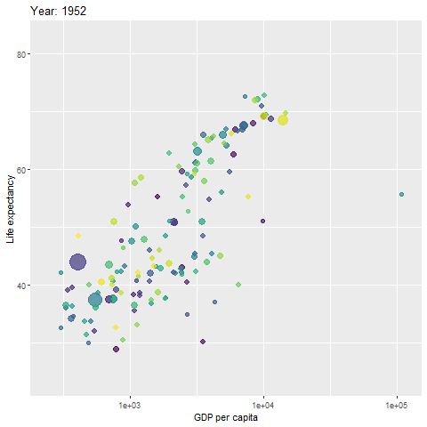

```{r setup, include=FALSE}
options(htmltools.dir.version = FALSE)
```

# About 

+ Yihui Xie가 ~~밀고 있는~~ slide format의 .Rmd 템플릿  
+ `h`키를 눌러보세요. 

---

# Get Started

+ 패키지 인스톨

  ```
  devtools::install_github("yihui/xaringan")
  ```

--

+ 새 파일 만들기

  `File -> New File -> R Markdown -> From Template -> Ninja Presentation`  

--

+ 렌더링

  `Knit -> Knit to moon_reader`  

--

+ **실시간 렌더링**

  1. RStudio 1.2 이상 버전 필요 ([다운로드](https://www.rstudio.com/products/rstudio/download/preview/))    
  1. RStudio Addins 추가:  
  ```
  devtools::install_github("rstudio/addinexamples", type = "source")
  ```
  1. RStudio 화면 상단의 `Addins`버튼을 눌러서 `Infinite Moon Reader`활성화하면 `Ctrl+S`키를 눌러서 저장할때마다 Viewer panel에 Refresh됨 
  
---

# 페이지 생성  

+ 구분자
  + `---`로 페이지 구분
  + `--`로 incremental feature 구현 (직전 페이지처럼...)
  
+ `class` (페이지 맞춤)
  + 페이지 구분자(`---`)바로 이후에 페이지 맞춤 설정 가능
  + `class: center, bottom, inverse`
  + (가운데 정렬, 아래쪽에, 흑백반전) 
  + `left/center/right`, `top/middle/bottom`, `inverse` 사용 가능
  + `class: left, top`이 디폴트 값
  
+ `background` (배경화면)
    + `background-image: url('ace.png')` (로컬 파일과 웹 링크 사용)
    + `background-position: 50% 50%` (그림의 center를 상하/좌우로 지정) 
    + `background-size: cover/contain/100px` (크기 옵션) 
    + 다음 두 페이지의 예제 확인 
 
---
background-image: url('ace.png')
background-position: 90% 10%
background-size: 200px 

```
background-image: url('ace.png')
background-position: 90% 10%
background-size: 200px 
```

> I made an ace at 2017-09-08, which is `r Sys.Date()-as.Date("2017-09-08")` days before this template was lastly updated.  sent me this badge.

> This is how quotes look in `xaringan`. Check the html code that allowed the titleist logo above as an inline image.

---
background-image: url(https://t1.daumcdn.net/cfile/tistory/22719A4852F184CC0A)
background-position: 50% 100%
background-size: cover

```
background-image: url(https://t1.daumcdn.net/cfile/tistory/22719A4852F184CC0A)
background-position: 50% 50%
background-size: cover
```
---

# 2단 구성

.pull-left[
1. 왼쪽 컬럼<sup>*</sup>

2. 수학 기호 $S = \pi r^2$ 

3. 왼쪽 컬럼 
]

.pull-right[
1. 오른쪽 컬럼 

1. 오른쪽 컬럼 

1. 오른쪽 컬럼 
]

$$a^2 = b^2 + c^2 \textrm{ -- 피타고라스의 정리}$$ 

.footnote[
[*] 주석은 이렇게 답니다. 
]

---

# htmlwidget(1) - `ggplotly`

```{r, message=FALSE, fig.width = 10, fig.height = 5}
library(ggplot2)
library(plotly)
fig <- ggplot(mpg, aes(x = displ, y = hwy)) + 
  geom_point(aes(color = class)) + geom_smooth()
ggplotly(fig) 
```

---

# htmlwidget(2) - `dygraph`

```{r, message=FALSE, fig.width = 10, fig.height = 4}
library(dygraphs)
lungDeaths <- cbind(mdeaths, fdeaths)
dygraph(lungDeaths) %>%
  dySeries("mdeaths", label = "Male") %>%
  dySeries("fdeaths", label = "Female") %>%
  dyOptions(stackedGraph = TRUE) %>%
  dyRangeSelector(height = 20)
```

---

# htmlwidget(3) - `kable()`

```{r}
library(knitr)
library(kableExtra)
head(mpg) %>% 
  kable(format = 'html') %>%
  kable_styling(
    bootstrap_options = c("striped", "hover", "condensed", "responsive"), 
    font_size = 12, full_width = F) %>% 
  column_spec(2, 
              width = "10em", background = "yellow", 
              bold = T, border_right = T)
```

---

# htmlwidget(4) - `leaflet()`

```{r}
library(leaflet)
leaflet() %>% addTiles() %>% setView(-93.65, 42.0285, zoom = 17)
```

---

# htmlwidget(5) - `datatable()`

```{r, message=FALSE}
library(DT)
mpg %>% 
  datatable(fillContainer = FALSE, options = list(pageLength = 8))
```

---

# htmlwidget(6) - `gganimate` 

```{r, message=FALSE}
library(gganimate)
library(gapminder)
fig_static <- ggplot(gapminder, 
  aes(x = gdpPercap, y=lifeExp, size = pop, colour = country)) +
  geom_point(show.legend = FALSE, alpha = 0.7) +
  scale_color_viridis_d() + scale_size(range = c(2, 12)) + 
  scale_x_log10() + labs(x = "GDP per capita", y = "Life expectancy")
fig_static %>% ggplotly()
```

---

```{r, eval=FALSE}
fig_dynamic <- fig_static + 
  transition_time(year) + #<<                    
  labs(title = "Year: {frame_time}") #<<
anim_save(filename = "fig_dynamic.gif", animation = fig_dynamic)
```

+ `transition_time(year)`  
    + `transition_time()`의 input은 `numeric`, `Date`, 혹은 다른 시간 객체
+ Code highlight  
    + code line 뒤에 `#<<`를 입력하면 하이라이트 

---

```{r, eval=FALSE}
fig_dynamic
``` 

  

---

# 다른 Tip들 

````md
`r ''````{r, highlight.output=c(1, 3)}
head(iris, 3)
```
````

```{r, highlight.output=c(1, 3), echo=FALSE}
head(iris, 3)
```

````md
`r ''````{r, highlight.output=c(FALSE, TRUE)}
head(iris, 3)
```
````

```{r, highlight.output=c(TRUE, FALSE), echo=FALSE}
head(iris, 3)
```

---
background-image: url('pebble-beach.jpg')
background-position: 50% 50%
background-size: cover

> As you walk down the fairway of life you must smell the roses, for you only get to play one round. -- Ben Hogan
