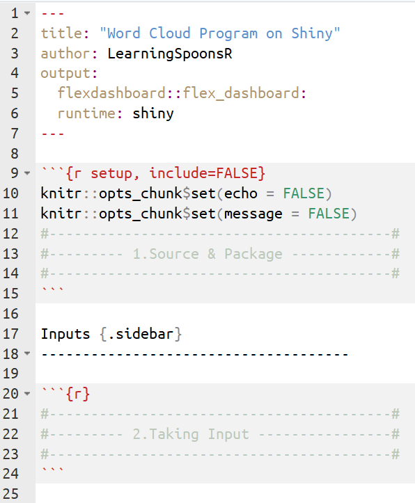
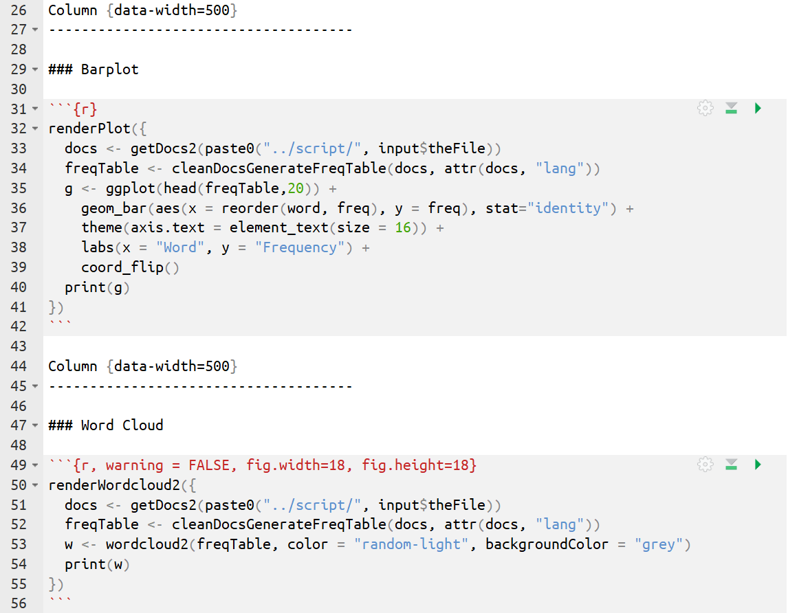

---
title: "M33 - Shiny "  
author: "LearningSpoonsR "
date: "`r Sys.Date()`"  
fontsize: 9pt  
output:  
  beamer_presentation:  
    theme: "Singapore"   
    # For code line number, choose among   
    # ["Antibes", "Montpellier", "Singapore", "Szeged"]  
    colortheme: "beaver"   
    # For Singapore - ["beaver": print-friendly, "beetle": grey]  
    latex_engine: xelatex  
    # keep_tex: true  
    # template: myTemplate.tex  
    includes:  
      in_header: myRmdBeamerStyle/latex-topmatter.tex  
classoption: t  
mainfont: NanumGothic  
---  

```{r setup, include=FALSE}
library(rmarkdown)
library(dplyr)
library(ggplot2)
knitr::opts_chunk$set(echo = TRUE)
knitr::opts_chunk$set(background = '718CBA')
knitr::opts_chunk$set(warning = FALSE)
```

## Review - Flexdashboard  

\  
   
+ Interactive한 feature를 추가한다면, 대시보드는 어떤 모양이어야 할까요?  

## Part I. "Hello, Shiny!"  

+ 파일 – 새파일 – 새 R Markdown – Shiny   

\  

## Part II. "Hello shiny" from flexdashboard  

+ 파일 – 새파일 – 새 R Markdown – From Template - flexdashbard  

\  

## Shiny 실행시 주의점  

1. 에러가 난다면 Tools - Check for Package Updates...로 가서 모든 패키지를 최신 상태로  
2. `activate`와 같이 패키지를 인스톨하는 명령이나 시스템을 변경시키는 명령은 실행 전에 하는 것이 좋음 
3. 컴퓨터가 인터넷에 연결이 되어있지 않으면 정상적으로 작동하지 않는 경우가 있음  

##  


## Part III. Wordcloud using fd \& shiny  

\lc  

\  

\rc  

\  

\ec  

## 1. Source \& Package \& 2. Taking Input  

\  

## 3.Render Barplot \& 4.Render Wordcloud  

\  

## 시연  

## Part IV. Control Widgets \& Rendering  

+ Control Widgets  
+ <http://shiny.rstudio.com/gallery/widget-gallery.html>  

\  

## 

\  

## 

+ `renderOBJECT` 함수를 이용해서 결과물을 보여줌.   
+ (기본적인것 외에 패키지에서 제공하는 render함수도 있음)  

\vspace{10pt}

+ `renderOBJECT` 종류    
  1. `renderText`     
  2. `renderTable`   
  3. `renderPlot`     
  4. `renderDygraph`   
  5. `renderWordClouds`      
  6. ...   

+ <https://shiny.rstudio.com/tutorial/>  

```{r, eval=FALSE}
"Hello"
```

