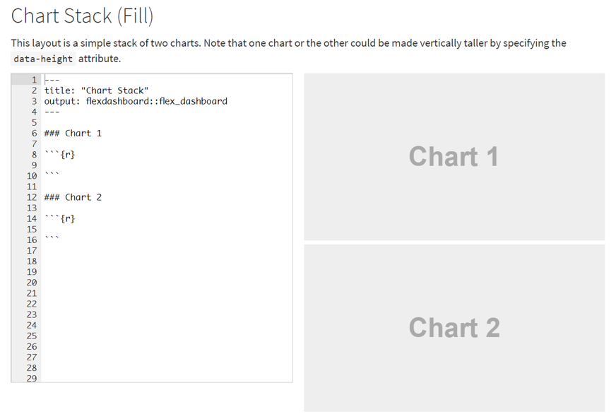
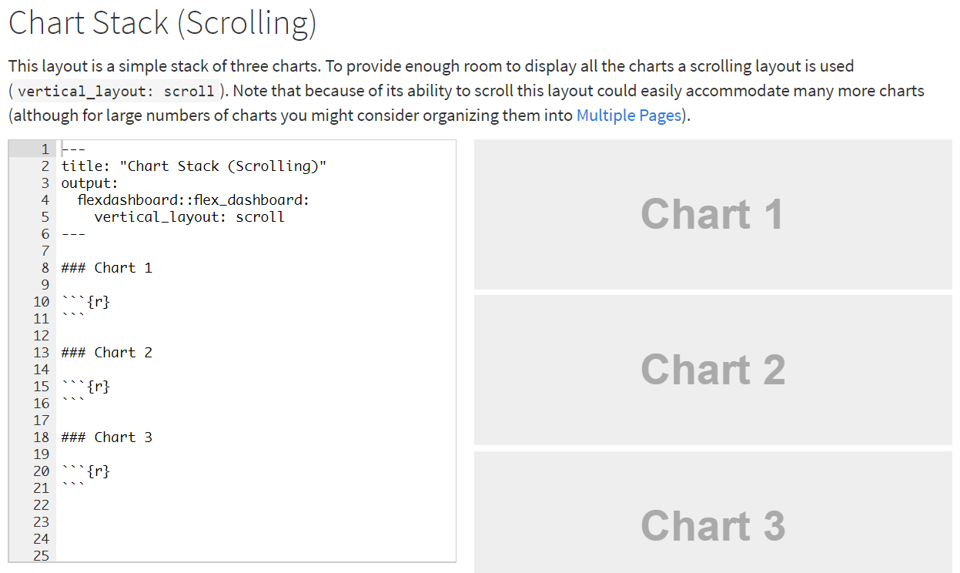
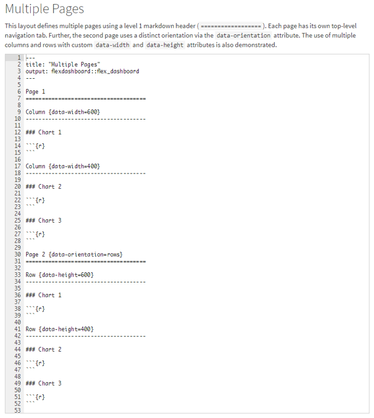
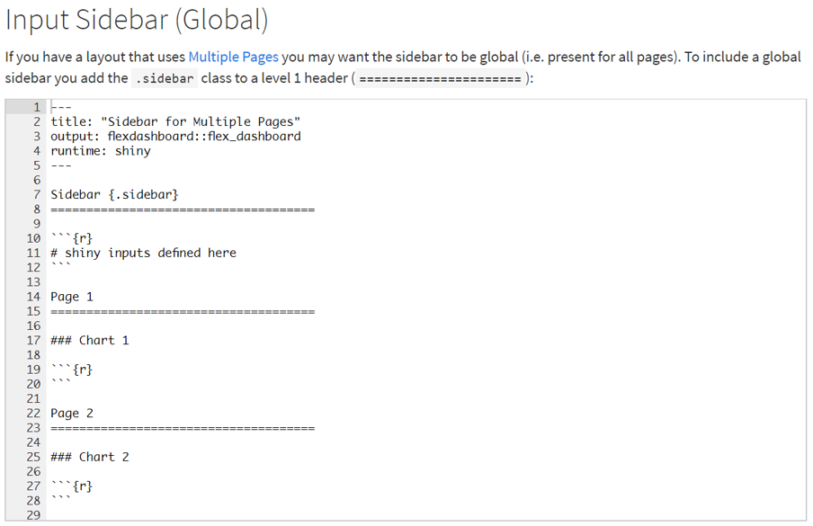
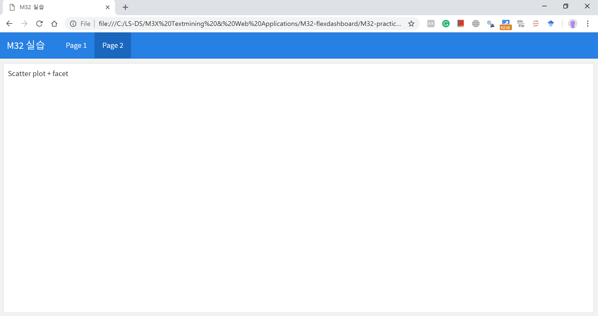
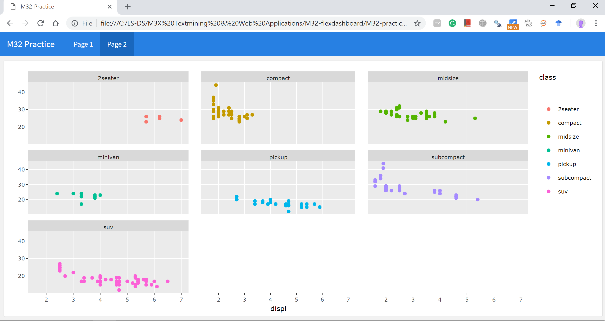

---
title: 'M32 - Flexdashboard '
author: 'LearningSpoonsR '
date: "`r Sys.Date()`"
output:
  beamer_presentation:
    colortheme: default
    includes:
      in_header: myRmdBeamerStyle/latex-topmatter.tex
    latex_engine: xelatex
    slide_level: 2  
    theme: Montpellier
    toc: yes
  ioslides_presentation: default
  slidy_presentation: default
mainfont: NanumMyeongjo # NanumGothic  
fontsize: 9pt
classoption: t
---  

```{r setup, include=FALSE}
library(rmarkdown)
library(dplyr)
library(ggplot2)
knitr::opts_chunk$set(echo = TRUE)
knitr::opts_chunk$set(background = '718CBA')
knitr::opts_chunk$set(warning = FALSE)
```

# Part 1. Getting Started

## Motivation   

#### Previously...  

+ `dplyr` - 전처리 & 표  
+ `ggplot2` - 차트  
+ `rmarkdown` - 문서화 (pdf, docx, html)  

#### Now...

+ `flexdashboard`  
    + Advanced `rmarkdown`  
    + html dashboard  
    + 압축적인 정보 배열로 효과적인 보고서 및 모니터링 도구   

```{r}
"Express Yourself"
```
  
## Easy \& interactive dashboards for R  

+ R Markdown을 사용하여 **시각화 그룹**을 **대시 보드**로 게시합니다.     
    1. 다양한 구성 요소 지원   
    2. 격자 그래픽    
    3. 표 형식의 데이터   
    4. 게이지 및 밸류 박스     
    5. 텍스트 주석  
+ 장점 
    1. 유연하고 쉽게 레이아웃을 지정할 수 있습니다.   
    2. 브라우저를 채우고 모바일 장치에 표시되도록 조정됩니다.     
    3. Shiny를 사용하여 시각화를 동적으로 구현할 수 있습니다.    
    4. Semi-interactive: htmlwidget (`plotly` & `dygraph`)
+ <https://rmarkdown.rstudio.com/flexdashboard/index.html>   
+ **파일 – 새파일 – Rmarkdown – Template – Flexdashboard! - Knit**   

# Part 2. Sample Layouts   

+ 시작점으로 사용할 수 있는 다양한 샘플 레이아웃을 훑어봅니다.    
+ <https://rmarkdown.rstudio.com/flexdashboard/layouts.html>   
+ 구현 과정: 시작점 설정 -> rendering 확인 -> fill in the blanks    
+ Lists  
    1) Chart Stack (Fill) - 상하로 fill    
    2) Chart Stack (Scrolling) - 상하로 scroll
    3) Focal Chart (Top) - main-sub 상하  
    4) Focal Chart (Left) - main-sub 좌우  
    5) Chart Grid (2 by 2)    
    6) abset Column - main-sub 좌우 (tab)  
    7) Tabset Row - main-sub 상하 (tab)  
    8) Multiple Pages  
    9) Input Sidebar    
    10) Input Sidebar (Global) - Multiple Pages + Sidebar     

## 1) Chart Stack (Fill) - 상하로 fill    
 
+ 두 차트의 간단한 스택입니다.    
+ 데이터 높이 특성을 지정하여 세로로 더 크게 만들 수 있습니다.   

##  

{height=330px}\    

## 2) Chart Stack (Scrolling) - 상하로 scroll  

+ 세 개의 차트로 구성된 간단한 스택입니다.   
+ 모든 차트를 표시 할 수 있는 충분한 공간을 확보하기 제공하기 위해 스크롤 레이아웃이 사용됩니다. (`vertical_layout: scroll`)  
+ 스크롤 할 수 있기 때문에 많은 수의 차트를 여러 페이지로 구성 할 수 있습니다.   
+ 더 많은 수의 차트의 경우에는 `Multiple Pages`를 참조하세요.  

##  

{height=500px}\  

## 3) Focal Chart (Top) - main-sub 상하  

+ 상단의 단일 차트에 중요성을 부여하며 보조차트 2개를 표현합니다.    
+ `orientation: rows`를 사용합니다.  
+ 각 행의 `data-height` 속성을 지정하여 상대 크기를 설정합니다.   

##  

{height=500px}\    

## 4) Focal Chart (Left) - main-sub 좌우  

+ 왼쪽의 단일 차트에 중요성을 부여하며 우측에 보조 차트를 제공합니다.   
+ `orientation: columns`는 default 입니다.  
+ 각 열의 `data-width` 속성을 지정하여 상대 크기를 설정합니다.   

##  

{height=500px}\      

## 5) Chart Grid (2 by 2)   

+ 2x2 그리드 차트입니다.    
+ 기본 `vertical_scroll: fill`를 사용하지만, 때로는 페이지를 스크롤하는 것(`vertical_layout: scroll`)이 바람직 할 수 있습니다.   
+ `orientation: rows`는 차트 기준선이 수평으로 정렬되도록하는 데 사용됩니다.   

##  

{height=500px}\  

## 6) Tabset Column - main-sub 좌우 (tab)  

+ 오른쪽 열을 두 개의 탭으로 표시합니다.   
+ 탭은 표시 할 구성 요소 수가 많고 사용자가 스크롤하지 않아도 되게 하는 경우에 특히 유용합니다.   
+ `fill` vs `scroll` vs `tabset` vs multiple pages  

##  

{height=500px}\  

## 7) Tabset Row - main-sub 상하 (tab)     

+ 하단 행을 두 개의 탭으로 표시합니다.   
+ `{.tabset-fade}` 속성은 탭을 전환 할 때 페이드 인 / 아웃 효과를 사용하는 데에도 사용됩니다.  
  
##  

{height=500px}\    

## 8) Multiple Pages    

+ 이 레이아웃은 레벨 1 마크 다운 헤더 (`================`)를 사용하여 여러 페이지를 정의합니다.  
+ 두 번째 페이지에서는 orientation을 바꾼게 보이시나요?  
+ 사용자 정의 `data-width` 및 `data-height` 특성이있는 여러 열과 행을 사용하는 방법도 설명합니다.     

##  

{height=300px}\    

## 9) Input Sidebar   

+ flexdashboar 페이지에 사이드 바를 추가하는 방법을 보여줍니다  
+ (샤이니 기반 대시 보드는 종종 사용자 입력 컨트롤을 사이드 바에 표시합니다). 
+ 사이드 바를 포함 시키려면 `.sidebar` 클래스를 레벨 2 헤더에 추가하십시오 (`-------------------`).

##  

{height=300px}\  

## 10) Input Sidebar (Global) - Multiple Pages + Sidebar    

+ 여러 페이지에서 사이드 바를 공통으로 (즉, 모든 페이지에 대해) 표시 할 수 있습니다.      
+ 전역(Global) 사이드 바를 포함 시키려면 레벨 1 헤더 (============)에 `.sidebar`를 추가하세요.       

##  

{height=300px}\  
  
## 많이 익숙해지셨나요? R관련 서적을 몇 개 소개해드립니다.

\lc 

**R for Data Science**  

+ 기본서, 수업 교재보다 상세  
+ <https://r4ds.had.co.nz/>  

**ggplot2**  

+ `ggplot2`와 시각화 원리  
+ <https://github.com/hadley/ggplot2-book>  

\rc  

**R Packages**  

+ R 패키지를 만드는 법  
+ <http://r-pkgs.had.co.nz/>  

**Advanced R**  

+ 고급 사용자로 나아가기   
+ <http://adv-r.had.co.nz/>  

\ec  

| | | | |  
|-|-|-|-|  
| {height=60px} | {height=60px} | {height=60px} | {height=60px} |      
| {height=60px} | {height=60px} |                              | {height=60px} |      

# Part 3. 실습!  

## Step 1. 먼저 비어있는 대시보드를 만듭니다.  

#### page 1

{height=280px}\  

##  

#### page 2  

{height=280px}\    

## Step 2. 비어있는 대시보드를 채웁니다.  

#### page 1  

{height=280px}\ 

##  
 
#### page 2  

{height=280px}\    

  
