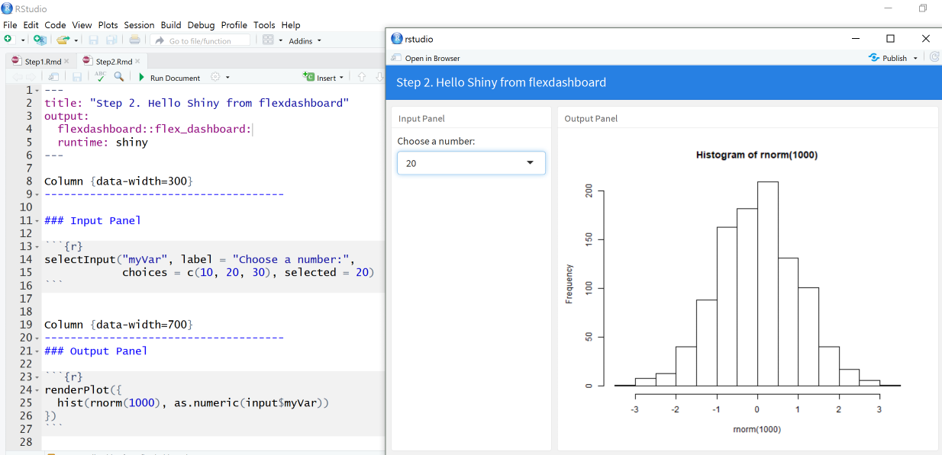
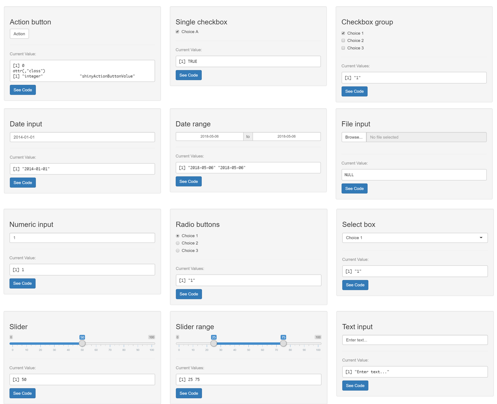
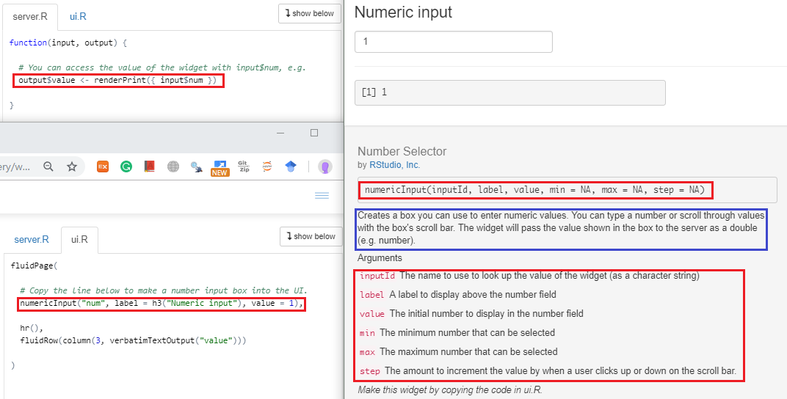

title: "Untitled"
author: "learningSpoonsR"
date: "2019-01-23"
output: html_document
runtime: shiny
---
```

\vspace{10pt} 

```{r, eval=FALSE}
knitr::opts_chunk$set(echo = TRUE)
```

\vspace{10pt}

현재 문서는 Shiny를 이용해 interactive하게 만들어진 R Markdown 문서입니다. 전통적인 정적인 보고서와 달리 독자가 설정이나 가정을 바꾸면서 결과를 바로 파악할 수 있습니다. 더 알아보고 싶으시면 아래 [링크](http://rmarkdown.rstudio.com/authoring_shiny.html)를 방문해주세요.   

<http://rmarkdown.rstudio.com/authoring_shiny.html>

##  

#### Inputs and Outputs

+ Shiny input과 output을 여러분의 문서에 embed할 수 있습니다.  
+ Input이 변화하면 output이 업데이트 됩니다.  
+ `renderPlot`이라는 함수를 이용해 Standard R output이 interactive하게 변화합니다.  
+ 사용자의 input을 받는 widget인 `selectInput`과 `sliderInput`이 사용되었습니다.  

\vspace{10pt}

```{r eruptions, eval=FALSE}
inputPanel(
  selectInput("n_breaks", label = "Number of bins:",
              choices = c(10, 20, 35, 50), selected = 20),
  
  sliderInput("bw_adjust", label = "Bandwidth adjustment:",
              min = 0.2, max = 2, value = 1, step = 0.2)
)

renderPlot({
  hist(faithful$eruptions, probability = TRUE, 
       breaks = as.numeric(input$n_breaks),
       xlab = "Duration (minutes)", main = "Geyser eruption duration")
  dens <- density(faithful$eruptions, adjust = input$bw_adjust)
  lines(dens, col = "blue")
})
```

# II. `rmd + flexdashboard + shiny`  

## 개발 과정  

1. 파일 – 새파일 – 새 R Markdown – From Template - flexdashbard  
2. Dashboard 모양을 정합니다. (google: flexdashboard layout)  
3. Header 부분에 `runtime: shiny`를 넣어줍니다. 
3. Shiny Input Control 부분을 넣어줍니다. (google: shiny widget layout)   
4. Shiny Output을 넣어줍니다. 

\  

# III. Input \& Output  

## Input  

#### Control Widgets    

+ (google: shiny widget layout)  
+ <http://shiny.rstudio.com/gallery/widget-gallery.html>   

## 

{height=250px}\  

## 

#### 예시: `numericInput`  

+ 앞의 페이지에서 click하면 상세 설명을 볼 수 있습니다.  
+ 바람직한 input의 특성에 대해서 생각해 보세요.  

\  

##

#### Control Widget 비교     

분류 | function | for... | Note  
-------------|------------- | ------------ | -------------    
Yes/No | `checkBoxInput` | 단일 체크박스 | logical 입력    
Yes/No | `checkBoxGroupInput` | 체크박스의 그룹 | 복수 logical 입력   
Number | `numericInput` | 숫자 입력 | 키보드 입력  
Number | `sliderInput` | 숫자 입력 | range와 unit이 지정됨  
Multiple Choices | `selectInput` | 드랍다운 | 선택지 많을때  
Multiple Choices | `radioButtons` | 라디오 버튼 | 선택지 7개 이하    
Date | `dateInput` | 단일 날짜 선택 |  
Date | `dateRangeInput` | 기간 선택 |   
Text | `textInput` | 문자 입력 | 검색 키워드 등을 입력 받음  
Action | ~~`submitButton`~~ | 누르면 실행 | Shiny 고급 기능    

## Output  

#### Rendering   

+ `renderOBJECT` 함수를 이용해서 결과물을 보여줍니다.  
+ 패키지에서 제공하는 render함수들도 있습니다. (e.g. `renderDygraph`)   
+ `renderOBJECT`의 종류    
    1. `renderText`     
    2. `renderTable`   
    3. `renderPlot`     
    4. `renderDygraph`   
    5. `renderWordClouds`      
    6. ...   

#### Links     

+ 샤이니를 더 공부해보려면 <https://shiny.rstudio.com/tutorial/>  
+ 웹에도 올릴수 있습니다! <https://learningspoonsr.shinyapps.io/M46-retail2-correl/>


