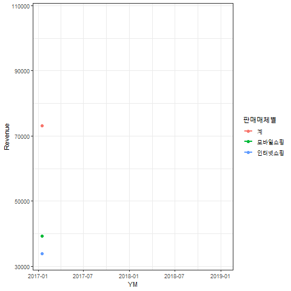
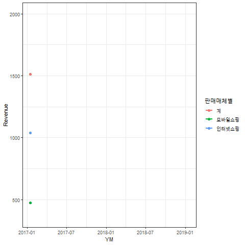
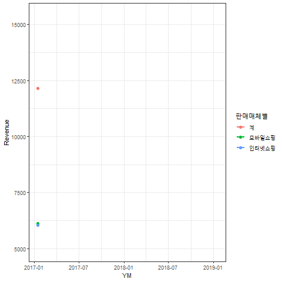
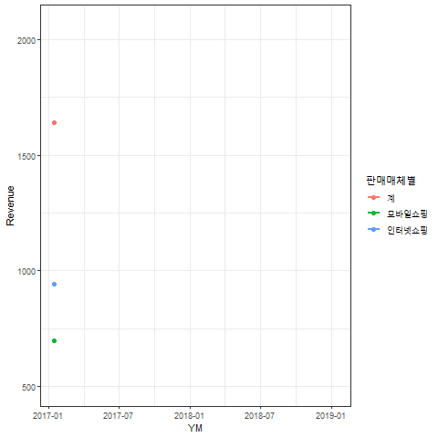
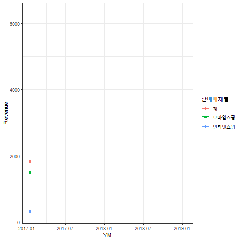
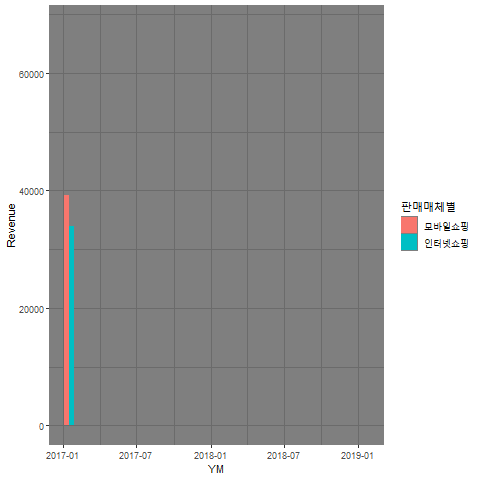
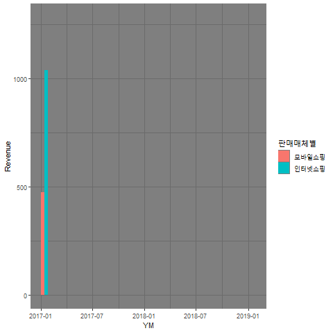
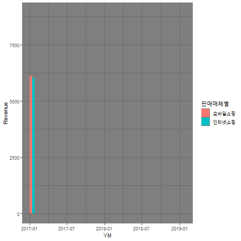
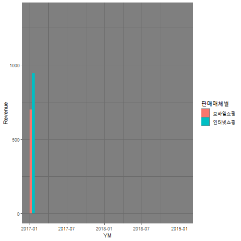
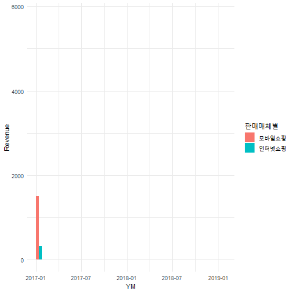

Line Chart       
=====================================   
    
Column  
-------------------------------------  
    
### All Sectors  

  
   
Column {.tabset}  
-------------------------------------  
   
### 서적    

  

### 여행 및 교통서비스   

  

### 문화 및 레저서비스  
    
    

### 음식서비스  

   

Bar Chart     
=====================================   
    
Column 
-------------------------------------
    
### All Sectors  

  

Column {.tabset}
-------------------------------------
   
### 서적   

  
 
### 여행 및 교통서비스  

  
    

### 문화 및 레저서비스  

  

### 음식서비스  

  

Reference {data-orientation=rows} 
=====================================     

Row {data-height=400}
-------------------------------------  

### 1. Raw File   

```{r, message=FALSE, echo=TRUE}
library(zoo); library(readxl); library(tidyverse); library(gganimate); library(kableExtra)
raw <- read_excel("data/온라인쇼핑몰_판매매체별_상품군별거래액_20190328095024.xlsx", sheet = "데이터")
raw$상품군별 <- na.locf(raw$상품군별)
head(raw[,1:6]) %>% kable() %>% 
  kable_styling(bootstrap_options = c("striped", "hover", "condensed", "responsive"), full_width = F)
```

### 2. Tidy dataset (`my_tidy`)  

```{r, echo=TRUE}
my_tidy <- raw %>% 
  gather(colnames(raw)[-(1:2)], key = "YM", value = "Revenue") %>%
  mutate(Revenue = Revenue/100)
my_tidy$YM <- as.Date(paste(substr(my_tidy$YM, 1, 4), substr(my_tidy$YM, 7, 8), 15, sep = "-"))
head(my_tidy) %>% kable() %>% 
  kable_styling(bootstrap_options = c("striped", "hover", "condensed", "responsive"), full_width = F)
```   

Row {data-height=300}
------------------------------------- 

### 3. Rendering Line Charts   

```{r, eval=FALSE, echo=TRUE}
sectors <- c("합계", "서적", "여행 및 교통서비스", "문화 및 레저서비스", "음식서비스") 
for (i in 1:length(sectors)) {
  print(paste("Working on:", sectors[i]))
  theme_set(theme_bw())
  fig <- 
    my_tidy %>% filter(상품군별==sectors[i]) %>% 
    ggplot(aes(x = YM, y = Revenue, group = 판매매체별, color = 판매매체별)) + 
    geom_line(size = 1) + 
    geom_point(size = 2) + 
    # geom_smooth() +
    transition_reveal(YM)
  anim_save(filename = paste0("fig", i, ".gif"), animation = fig) 
} 
```

### 4. Rendering Bar Charts   

```{r, eval=FALSE, echo=TRUE}
for (i in 1:length(sectors)) {
  print(paste("Working on:", sectors[i]))
  theme_set(theme_minimal())
  fig <- 
    my_tidy %>% filter(상품군별==sectors[i], 판매매체별 != "계") %>% 
    ggplot(aes(x = YM, y = Revenue, fill = 판매매체별)) + 
    geom_bar(stat="identity", position = "dodge") + 
    transition_states(YM, wrap = TRUE) +
    shadow_mark()
  anim_save(filename = paste0("fig_bar_", i, ".gif"), animation = fig)
} 
``` 

Row {data-height=300} 
-----------------------------------------

### 5. Developments 

+ `gganimate` 
    + 2019년 1월에 공식 버전이 발표되었음. 
    + 아직 발전해야할 요소가 많음. 
    + <https://www.datanovia.com/en/blog/gganimate-how-to-create-plots-with-beautiful-animation-in-r/>
+ 추가 기능 (현재에는 구현이 제한적임 - 기대 시간 1년)  
    + 높은 해상도  
    + 사이즈 조절  
    + Pause 기능  
    + `shiny`와 smooth한 연동  
+ 우상단 "Source Code" 클릭해서 코드 확인 가능 

