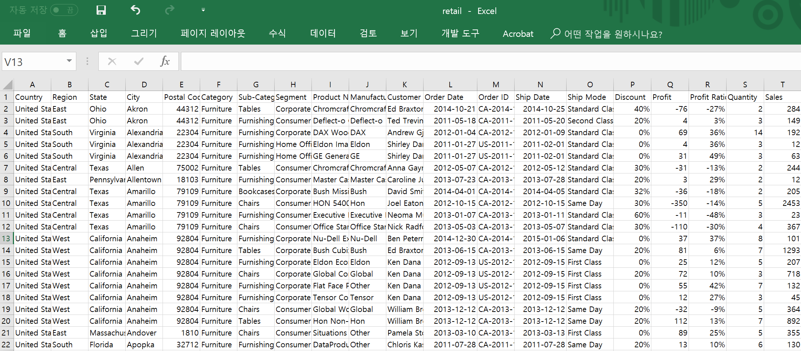

---
title: "M43-retail " 
author: 'LearningSpoonsR '
date: "`r Sys.Date()`"
output:
  beamer_presentation:
    colortheme: default
    includes:
      in_header: myRmdBeamerStyle/latex-topmatter.tex
    latex_engine: xelatex
    slide_level: 2  
    theme: Montpellier
    toc: yes
  slidy_presentation: default
mainfont: NanumGothic
fontsize: 9pt
classoption: t
---  

```{r setup, include=FALSE}
library(rmarkdown)
knitr::opts_chunk$set(echo = TRUE)
knitr::opts_chunk$set(background = '718CBA')
# source("../../LSR.R")
library(dplyr)
library(tidyr)
library(ggplot2)
```

# 0. 시작하기      

## 들어가기 앞서...     

1. 가장 처음 할 일  
    + 가장 처음에 해야할 작업은 데이터가 어떻게 구성이 되어있는지를 확인하는 것 
    + 파일로 받은 경우에는 엑셀이나 메모장으로 확인

2. 전처리  
    + **Tidy data.frame**은 각 column이 변수, 각 row가 관찰값에 대응됩니다. \br  
    + 전처리는 데이터가 tidy하지 않은 경우에 tidy하게 바꾸는 작업을 의미합니다.  

3. 전처리 과정의 특징  
    + 다양하고 복잡하고 지저분한 raw 데이터 만큼이나, 다양하고 복잡하고 세밀한 관찰력과 때로는 창의력을 요하기도 합니다.  
    + 흔히 노동집약적이기도 하지만, 데이터 구조를 이해하는 데에 큰 도움을 주기도 합니다.  
    + 얻게되는 경험과 프로그래밍 실력은 데이터 분석가로서의 자신감을 높여줍니다.    
    
##  
 
Online 판매 업체의 개별 판매 기록 데이터입니다. 

  

```{r}
# install.packages("readxl")
library(readxl)
dataset <- read_excel("retail.xlsx")
```

## 

```{r}
str(dataset)
```

##  
\
```{r}
colnames(dataset)
```

\vspace{12pt}

+ 변수 분류    
    1. 지역 `colnames(dataset)[1:5]:` `r colnames(dataset)[1:5]`   
    2. 상품 분류 `colnames(dataset)[6:8]:` `r colnames(dataset)[6:8]`  
    3. 상품 `colnames(dataset)[9:10]:` `r colnames(dataset)[9:10]` 
    4. 고객 `colnames(dataset)[11]:` `r colnames(dataset)[11]`
    5. 배송 `colnames(dataset)[12:15]:` `r colnames(dataset)[12:15]`
    6. 가격 `colnames(dataset)[16:20]:` `r colnames(dataset)[16:20]`  

+ 각 변수별 unique 관찰값의 갯수   

```{r} 
sapply(dataset, function(x) length(unique(x)))
```
    
## 데이터 분석의 과정  

+ 데이터의 관찰 -> 가설의 설정 -> 가설 검증 -> 결론 도출 -> 공유의 과정으로 이루어집니다.   
    + 이 과정에서 때로는 다른 데이터를 더 확보해서 분석에 포함시키기도 하고, 데이터의 결함과 미비한 점을 파악함으로써 데이터 관리자와 공급자와 커뮤니케이션 합니다.  
    + 마지막으로 공유의 단계에서는 데이터와 관련된 다른 사람들과 의사소통 하며 더 나은 의사결정을 돕게합니다.   
+ 업체로 부터 아래와 같은 궁금증(가설)을 제시받았습니다.     

+ 생각해 볼 수 있는 궁금증들...  
    1. `Ship Date`를 기반으로 배송이 가장 오래걸리는 상품은 무엇인가?  
    2. 마진이 가장 많이 남는 상품은 무엇인가?   

```{r, eval=FALSE, echo=FALSE}
3. 가장 많은 상품을 구매한 고객은 누구이며 언제 구매하였는가? \br
4. 가장 판매가 부진한 상품은 무엇이고 이유는 무엇인가? \br
5. 많이 팔리는 상품의 가격수준과 일정가격 이하 상품의 판매량은 어떠한가? \br 
6. Discount가 많을 수록 매출이 늘어나는가? \br 
7. 지역별로 가장 많이 팔리는 상품은 무엇인가? \br
8. `Order Date`를 기반으로 동시구매가 많이 일어나는 상품은 무엇인가? \br
9. 특정상품의 판매시기와 지역별 수요를 파악해보자 \br 
```

# 1. 배송 기간 분석 (`Ship Date`를 기반으로 배송이 가장 오래걸리는 상품은 무엇인가?)  

## Design  

#### 배경  

+ 상품의 배송 시간  
    + 주문(Order)-출고(Ship)-배송완료(Delivery)의 3개의 시점이 있음.  
    + 주문과 출고사이의 시간(lead time)은 판매자의 역량  
    + 출고와 배송완료 시점 사이의 시간(delivery time)은 배송업체의 역량 (delivery mode에 따라서 달라짐)  
    
#### 수정된 질문  

~~배송 기간 분석 (`Ship Date`를 기반으로 배송이 가장 오래걸리는 상품은 무엇인가?)~~  

1. Lead time이 오래 걸리는 상품은 무엇인가?   
2. Delivery time이 오래 걸리는 상품은 무엇인가?  

#### 논의   

+ 질문자의 의도는 주문과 배송완료 사이의 시간, 그러니까 소비자의 입장에서 생각하고 있는 것이지만... 
+ 처음 떠오르는 질문은 분석 의도와 목적과 합치하지 않는 경우가 많기에, 검증가능한 가설의 형태로 만들어야 함  
+ 의뢰업체 노력이 가능한 lead time을 분석하기로 함 
    
## 

#### Development   

+ 각 `Sub-Category`별로 `Ship Date`와 `Order Date`의 차이를 계산해서 분석    
+ 평균과 분산을 분석   
    
#### More Development  

+ Average
    + 신속도, 기대 수치, 예상 수치 
    + 전반적 speed, 운영의 효율성  
+ Variation  
    + 표준편차(Standard deviation), 신뢰도 (reliability)  
    + 운영의 항상성 (consistency)   
+ Long-tail  
    + Extreme events, 지연 및 사고  
    + 소비자의 큰 불만, 고장, 인력 공백, 기상 이변  
    + 이상치에 대한 개별 분석이 필요  
+ 그래프로 접근    

## 

#### Tasks Specification  

1. `TASK11`  
    + `leadTime`이라는 변수를 생성한다.  
    + 각각의 `Sub-Category`에 대해서 `leadTime`의 평균과 표준편차를 구한다.  
    
2. `TASK12`: 각각의 `Sub-Category`에 대해서 box-plot을 그린다.        
3. `TASK13`: `leadTime`이 가장 긴 20개의 관찰값을 출력한다.   
 
## `TASK11`: `leadTime`의 평균과 표준 편차를 구한다.     

```{r}
dataset$leadTime <- dataset$`Ship Date` - dataset$`Order Date`
task11 <- dataset %>% 
  group_by(`Sub-Category`) %>%
  summarise(avgLT = mean(leadTime), sdLT = sd(leadTime)) %>%
  arrange(desc(avgLT))
head(task11, 3)
```

\vspace{10pt}

+ `avgLT`와 `sdLT`를 구했지만, 단위가 초(second)로 되어있다.  
+ Trouble shooting  
    1. `class(task11$avgLT): ` `r class(task11$avgLT)`    
    2. google "convert difftime second to days R"을 검색하여 다음과 같이 해결 

##  

\lc  

```{r}
task11$avgLT <- 
  task11$avgLT %>% 
  as.numeric(units = "days") %>% 
  round(2)
task11$sdLT  <- 
  task11$sdLT  %>% 
  as.numeric(units = "days") %>% 
  round(2)
```

\rc  

```{r}
print(task11)
```

\ec

##    

+ 평균 
    + 평균 `leadTime`이 4일 정도이다.  
    + 기성품 판매 업체라면 너무 느리다. (미국 기준에서는 ok?)  
    + `Sub-Category`별로 차이는 크지 않다.  
+ 표준편차  
    + 약 70%의 경우에 `leadTime`의 `4일-1.7일` ~ `4일+1.7일`이다.  
    + `Sub-Category`별로 차이는 크지 않다.  
+ `Task12`의 박스플랏으로 분포를 확인해 본다.  

## `TASK12`: 각각의 `Sub-Category`에 대해서 box-plot을 그린다.  

```{r, fig.width = 7, fig.height = 3}
ggplot(dataset) +
  geom_boxplot(aes(x = `Sub-Category`, y = leadTime)) +
  coord_flip()
```

+ x축 `leadTime`의 수치가 seconds 단위로 나온다. 

##  

+ Trouble shooting  
    1. `dataset$leadTime`변수 자체가 seconds 단위의 `difftime`으로 되어있다.  
    2. 앞에서와 마찬 가지로 `dataset$leadTime <- dataset$leadTime %>% as.numeric(units = "days")`을 실행해준다.    
    3. title과 x축 label도 넣어준다. 예쁘게 ^^  

```{r, fig.width = 7, fig.height = 3}
dataset$leadTime <- dataset$leadTime %>% as.numeric(units = "days")
ggplot(dataset) +
  geom_boxplot(aes(x = `Sub-Category`, y = leadTime)) +
  coord_flip() + 
  labs(title = "Distribution of Lead Time", x = "Lead Time (in days)")
```

## 

#### 결론  

+ Overall 
    + 모든 상품에 대해서 중간값이 4일이다.    
    + 대부분 3일~5일간에 출고가 완료된다.  
    + Furnishing, Machines, Chairs, Bookcases와 같이 크기가 클 수 있는 제품의 경우에도 `leadTime`이 특별히 길다고 말할 수 없다.   
+ On the tail      
    1. 전체 관찰값의 갯수는 `nrow(dataset): ` `r nrow(dataset)`  
    2. 최장 `leadTime`은 `max(dataset$leadTime): ` `r max(dataset$leadTime)`  
    3. `leadTime`이 `r max(dataset$leadTime)`인 경우는 총 `sum(dataset$leadTime==max(dataset$leadTime)):` `r sum(dataset$leadTime==max(dataset$leadTime))`건에 해당하며    
    4. 이를 비율로 표현하면 (3번 값을 1번 값으로 나누면) `sum(dataset$leadTime==max(dataset$leadTime))/nrow(dataset)*100:` `r sum(dataset$leadTime==max(dataset$leadTime))/nrow(dataset)*100`% 이다.  
    5. 즉, `nrow(dataset)`건의 주문을 처리하면서 `leadTime`을 7일 내로 100% 처리했으며, 6일내로 94% 처리했다.  
    6. 전체 만 건중에서 7일인 경우가 621건인데, 8일 이상은 0건이다? -> **조작**의 가능성...    
    
## `TASK13:` `leadTime`이 가장 긴 20개의 관찰값을 출력한다.    

#### 목적  
   
+ `leadTime`의 분포가 long-tail의 모습을 보인다면, 즉 몇몇 제품의 `leadTime`이 이상하게 높았다면, 이것을 분석한다.    

#### Review on `TASK12`  

+ 그러나 `TASK12`의 결과로는 `r sum(dataset$leadTime==max(dataset$leadTime))`개의 배송이 최대 `leadTime`    
+ 조작이 아니라면 이상치가 없고, 원래 의도한 `TASK13`을 수행하는 것은 큰 의미가 없다.  

#### `TASK13`: `leadTime`이 7일인 경우는 어떤 상품들이 많이 있는지 알아보자.    

+ `leadTime`이 7인 주문을 `Category`와 `Sub-Category`로 나누어서 갯수를 관찰한다.  
+ **아니다!** 갯수가 아니라 주문 갯수에 대비한 비율로 보아야 한다.  
+ 예를 들어 `leadTime`이 7일인 Furniture 주문의 갯수를 전체 Furniture 주문 갯수로 나누어야 한다.  

##

#### By `Category`  

```{r}
# For each Category
task13a <- dataset %>% 
  group_by(`Category`) %>%
  summarise(maxLeadTimePercent = 
              100*sum(leadTime==7)/length(leadTime)) %>%
  arrange(desc(maxLeadTimePercent))
task13a
```

##  

#### By `Sub-Category`  

```{r}
# For each Sub-Category
task13b <- dataset %>% 
  group_by(`Sub-Category`) %>%
  summarise(maxLeadTimePercent = 100*sum(leadTime==7)/length(leadTime)) %>%
  arrange(desc(maxLeadTimePercent))
task13b %>% head(8) %>% t() # first 8 obs & transpose 
```

\vspace{10pt}

+ Supplies 품목들은 주문의 10%이상의 `leadTime`이 7일에 해당했습니다.   
+ Supplies물품을 주문 받은 이후 배송을 시행하기 까지 왜 오래 걸리는지 알아볼 필요가 있다는 결론을 내릴 수 있습니다!   


# 2. 마진이 가장 많이 남는 상품은 무엇인가? 

## Design  

#### 배경    

+ 마진이 궁금한 이유는 매출과 이익에 대해서 분석을 원하는 것입니다.   

#### 수정된 질문      

+ ~~마진이 가장 많이 남는 상품은 무엇인가?~~    
+ 개별 상품군이 기업의 매출과 이익에 얼마나 기여하는가?  
+ 개별 상품군의 이익률(Profit-Revenue-Ratio)는 얼마인가?  

#### 추가 질문 

+ 기업의 매출과 이익이 계속적으로 성장하고 있는가?  
+ 분기 단위로 나누어 분석의 깊이를 더하자.  

##  

#### Tasks Specification  

1. `TASK21`  
  + 각각의 `Category`와 `Sub-Category`에 대해서 `Sales`와 `Profit`을 각각 합산  
2. `TASK22`  
  + `Profit`을 `Sales`로 나누어서 `profitRatio`을 구한다.   
3. `TASK23`  
  + 분기를 나타내는 변수를 생성하고 위의 분석을 반복한다.    

## `TASK21`: 상품군별 `Sales`와 `Profit` 합산  

```{r}
task21 <- dataset %>% 
  group_by(Category) %>%
  summarise(Sales = sum(Sales), Profit = sum(Profit)) %>% 
  mutate(profitRatio = round(Profit/Sales,2)) %>%
  arrange(desc(profitRatio))
print(task21)
```

##

```{r, fig.width = 4, fig.height = 2}
# Reference: `M24 piechart`  
ggplot(task21, aes(x = "", y = Sales, fill = factor(Category))) +
  geom_bar(width = 1, stat = "identity") +
  theme(axis.line = element_blank(),
        plot.title = element_text(hjust = 0.5)) +
  labs(fill = "Category", x = NULL, y = NULL, title = "Sales Contribution") +
  coord_polar(theta = "y", start = 0)
```

##  

```{r, fig.width = 4, fig.height = 2.5}
ggplot(task21, aes(x = "", y = Profit, fill = factor(Category))) +
  geom_bar(width = 1, stat = "identity") +
  theme(axis.line = element_blank(),
        plot.title = element_text(hjust = 0.5)) +
  labs(fill = "Category", x = NULL, y = NULL, title = "Profits Contribution") +
  coord_polar(theta = "y", start = 0)
```

##  

#### 해석  

+ Furniture   
    + 74만불의 매출, 2만불에 못 미치는 이익  
    + 특성  
        1. 부피와 무게가 커서 다루는데에 인력과 시간이 많이 필요  
        2. 운반, 재고 저장, 재고 감가상각 비용이 큼    
        3. 반품이 생기면 완전 골치아픈 ㅠㅠ   
    + 그런데 이익률이 2%입니다. ㅠㅠ    

+ Questions on Furniture   
    1. `Sub-Category` 전부가 그럴까? 대형 가구와 중소형 가구의 이익률이 다른가?  
    2. 예전부터 이랬나? 최근의 IKEA의 습격을 당해서 마진율이 내려간 것인가?  
    3. 계속해야 하는가? 어떤 대안으로 돌파가 가능한가?  
    4. (2의 분석의 경우에는 IKEA의 동향에 대한 데이터를 추가로 확보하고 IKEA 매장의 근교 지역과 아닌 지역을 구분해서 비교하는 분석을 해야 할 것입니다.)    


## 

## `TASK22`: 상품군별 `profitRatio` 분석  

```{r}
task22 <- dataset %>% 
  group_by(`Sub-Category`) %>%
  summarise(Sales = sum(Sales), Profit = sum(Profit)) %>% 
  mutate(profitRatio = round(Profit/Sales,2)) %>%
  arrange(desc(profitRatio))
task22
```

## 

Diverging bar로도 표현이 가능

\vspace{5pt}

```{r}
# Reference: `M24. Deviation`
task22$profitHL <- 
  ifelse(task22$profitRatio < mean(task22$profitRatio),
         "below average", "above average")
task22 <- task22 %>% arrange(profitRatio)
# Convert to factor to preserve sorted order in plot.
task22$`Sub-Category` <- 
  factor(task22$`Sub-Category`, levels = task22$`Sub-Category`)
a <- ggplot(task22, 
            aes(x = `Sub-Category`, y = profitRatio, label = profitRatio)) + 
  geom_bar(stat = 'identity', aes(fill = profitHL), width = .5) +
  scale_fill_manual(
    name = "Profit Ratio",
    labels = c("Below Average", "Above Average"),
    values = c("below average" = "#f8766d", 
               "above average" = "#00ba38")) + 
  labs(title = "Diverging bar",
       subtitle = "Profitability of each Sub-Category") +
  coord_flip()
```

## 

```{r}
print(a)
```

## 

좀 더 modern look을 제공하는 아래와 같은 "Diverging Lollipip Chart"  

\vspace{5pt}

```{r}
# Reference: `M24 Deviation`
a <- ggplot(task22, 
            aes(x = `Sub-Category`, y = profitRatio, label = profitRatio)) +
  geom_point(stat = 'identity', fill = "black", size = 8) +
  geom_segment(aes(y = 0, x = `Sub-Category`, 
                   yend = profitRatio, xend = `Sub-Category`),
               color = "black") +
  geom_text(color = "white", size = 3) + 
  labs(title = "Diverging Lollipop Chart",
       subtitle = "Profitability of each Sub-Category") + 
  ylim(-0.2, 0.5) +
  coord_flip()
```

##

```{r}
print(a)
```

## 

#### 해석  

+ **Overall**  
    + 이익률이 높은 `Sub-Category`들의 경우에는 이익률은 높지만 실제 이익의 총량은 얼마 안되는 품목들도 많이 있습니다.  
    + Labels, Envelopes, Fastener, Art의 경우에는 이익 자체가 크지 않습니다.  
    + 같은 table을 이익순으로 정렬하는 것이 다른 시각을 제공할 수 있습니다.  
    
+ **Furniture**  
    + 이익률 하위 부분의 Storage, Chairs, Bookcases, Tables이 가구류에 해당합니다.   
    + 해당 소형 가구라인의 유지를 전면적으로 고민할 것 같습니다.   

## 

```{r}
task22 %>% arrange(desc(Profit, Sales))
```  

##  

##  

## `TASK23`: 분기를 나타내는 변수를 생성하고 위의 분석을 반복       

#### 변수 생성 및 집계  

```{r}
task23 <- dataset %>% 
  mutate(year    = substr(`Order Date`, 1, 4),
         quarter = ceiling(as.numeric(substr(`Order Date`, 6, 7))/3)) %>%
  select(year, quarter, Category, `Sub-Category`, Profit, Sales) %>%
  group_by(year, quarter, Category) %>%
  summarise(Sales = sum(Sales), Profit = sum(Profit))
task23$year    <- factor(task23$year)
task23$quarter <- factor(paste0("Q", task23$quarter))  
head(task23)
```

## 

```{r}
ggplot(task23, aes(x = factor(Category), y = Sales, fill = factor(Category))) +
  geom_bar(stat = 'identity') + # for already aggregated quantity  
  facet_grid(year ~ quarter) + # x: quater, y: year 
  theme(axis.text.x = element_text(angle = 45, hjust = 1)) + # rotate x_label 
  labs(title = "Sales Trend") # title 
```

##

#### 해석  

+ **시계열 변동의 구성요소**  
    1. 경향성 (트렌드, trend)
    2. 계절성 (계절성, seasonality)
    3. 그외의 잡음  
    
+ **경향성** 
    + 매출량의 트렌드는 긍정적입니다.  
    + 연도가 지나면서 점점 매출이 늘어나고 있습니다. \br  

+ **계절성**  
    + 1분기, 2분기, 3분기, 4분기로 갈수록 매출이 급격하게 늘어나는 것을 볼 수 있습니다.  
    + retail 상품이기에 계절성이 매우 뚜렷한 특징을 보이고 있습니다.  
    + B2C가 아닌 제조업체 등의 B2B였다면, 이렇게 뚜렷한 계절성을 보이지는 않았을 것입니다.  
    + 소비 경기에 민감한 비지니스입니다.  

##  

#### More on 계절성  

+ 어떤 고정된 길이의 시간에 따라서 주기적인 모습(cyclic pattern)을 보이는 것
+ 인간의 삶과 밀접한 연관이 있는 시계열 데이터는 대부분 계절성이 있음.  
+ 예시  
    + 교통 수단의 이용량의 경우: 출퇴근 시간 vs 낮시간, 1주일에 대해서 요일별, 매년 명절이 찾아옴  
    + 미국 소비자의 쇼핑 패턴을 보면 대부분의 소비가 겨울에 집중  
    + (In your biz) 
    + (In your biz) 
+ 기업의 매출과 이익의 성장은 "전월대비"가 아닌 "전년동월대비" 관점으로 보아야 함.  

##  

```{r}
ggplot(task23, aes(x = factor(Category), y = Profit, fill = factor(Category))) +
  geom_bar(stat = 'identity') +
  facet_grid(year~quarter) +
  theme(axis.text.x = element_text(angle = 45, hjust = 1)) + 
  labs(title = "Profit Trend")
```

## 

#### 해석 

+ **Overall**  
    + 매출과 비슷한 패턴을 보이는 것을 확인  
+ **Technology** 
    + 2014년 1분기에는 전년과 전전년 동분기에 비해서 Technology 제품에 대해서 큰 수익을 거둠   
    + 2012년, 2013년, 2014년의 1분기에 어떤 상품들이 팔렸는지?   
    + 예를 들어서 2014년 1분기에 아이폰의 새로운 버전이 나왔고 그것을 해당 쇼핑몰에서 많이 판매하였다면, 그것이 이익에 크게 기여하였다라고 말할수 있겠네요.   
+ **Furniture**  
    + 2014년도 4분기에는 전년과 전전년 동분기에 대비해서 순이익이 적었습니다.   
    + 이유를 더 살펴보고 2015년에의 Furniture 관련 전략을 수립할 필요가 있어보입니다.   

```{r, eval=FALSE, echo=FALSE}
## Rest...    
3. 가장 많은 상품을 구매한 고객은 누구이며 언제 구매하였는가? \br
4. 가장 판매가 부진한 상품은 무엇이고 이유는 무엇인가? \br
5. 많이 팔리는 상품의 가격수준과 일정가격 이하 상품의 판매량은 어떠한가? \br 
6. Discount가 많을 수록 매출이 늘어나는가? \br 
7. 지역별로 가장 많이 팔리는 상품은 무엇인가? \br
8. `Order Date`를 기반으로 동시구매가 많이 일어나는 상품은 무엇인가? \br
9. 특정상품의 판매시기와 지역별 수요를 파악해보자 \br 
```

