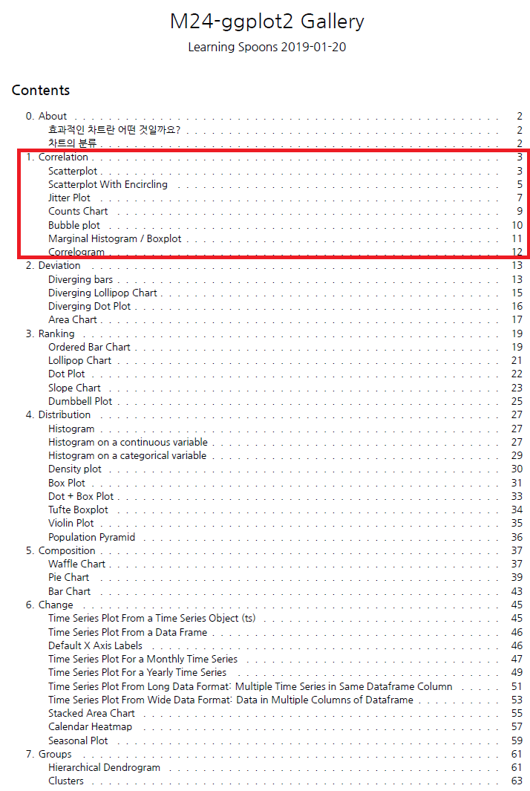
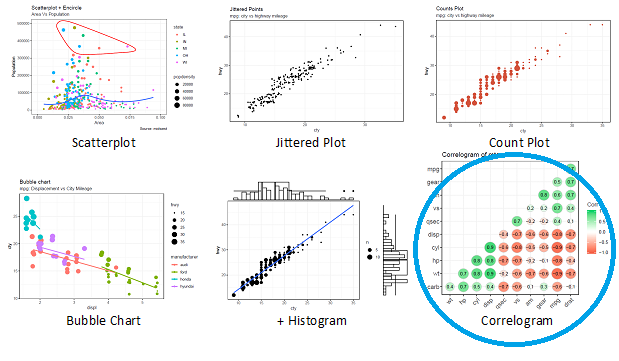
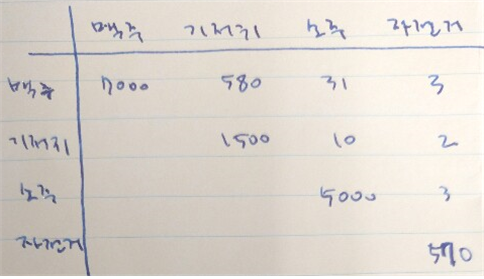
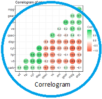
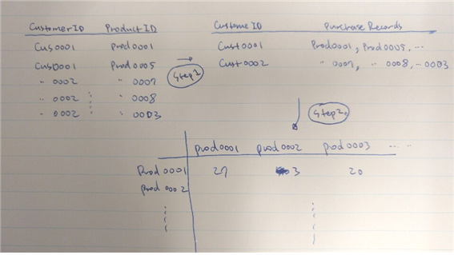
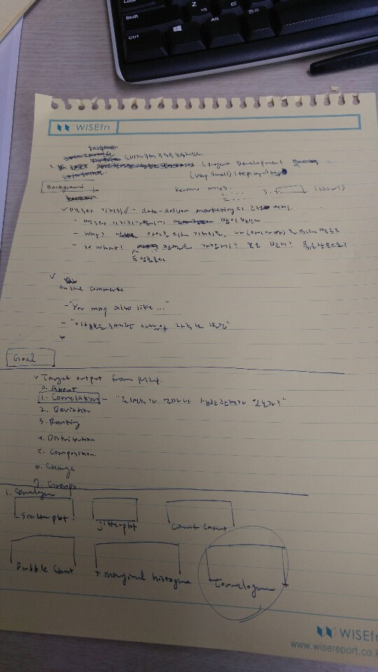
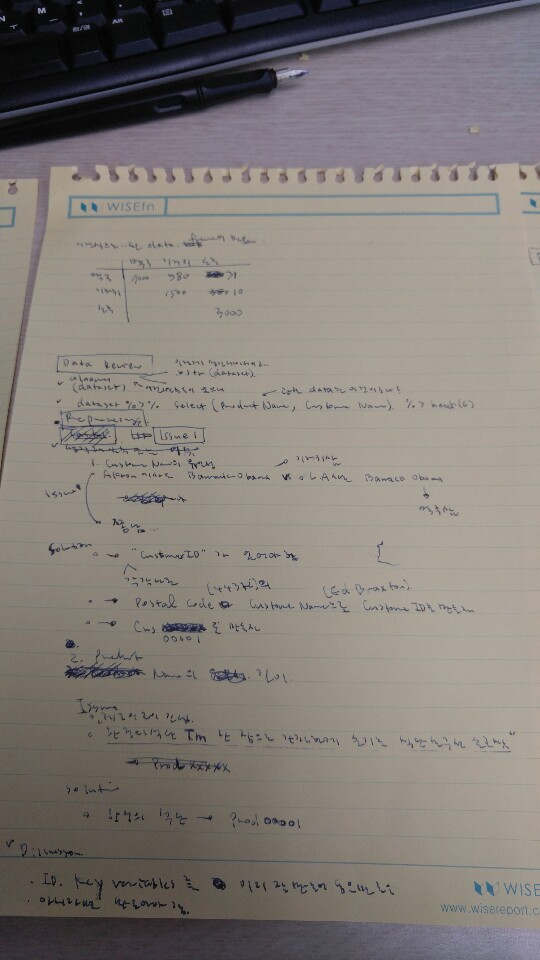
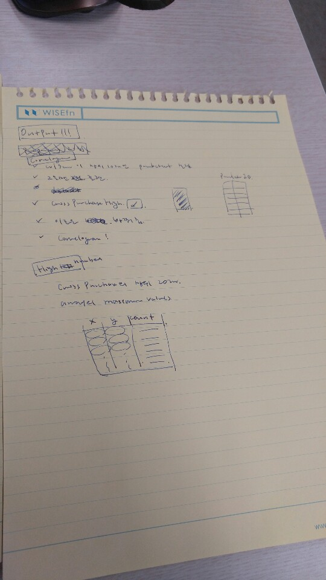
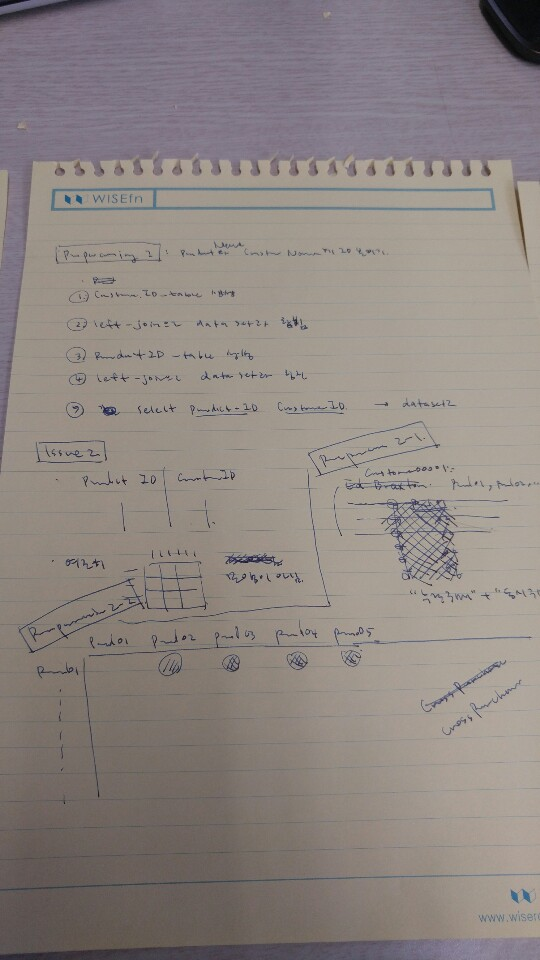

---
title: 'M46-retail2 '
author: 'LearningSpoonsR '
date: "`r Sys.Date()`"
output:
  beamer_presentation:
    colortheme: default
    includes:
      in_header: myRmdBeamerStyle/latex-topmatter.tex
    latex_engine: xelatex
    slide_level: 2  
    theme: Montpellier
    toc: yes
  ioslides_presentation: default
  slidy_presentation: default
mainfont: NanumMyeongjo # NanumGothic  
fontsize: 9pt
classoption: t
---  

```{r setup, include=FALSE}
library(rmarkdown)
knitr::opts_chunk$set(echo = TRUE)
knitr::opts_chunk$set(background = '718CBA')
```

# Background

## I. Background   

+ Continued from `M43-retail1`     
    1. 배송 기간 분석 (`Ship Date`를 기반으로 배송이 가장 오래걸리는 상품은 무엇인가?)  
    2. 마진이 가장 많이 남는 상품은 무엇인가?  
    3. **`M46`에서는 소비자 별 구매 기록을 분석해보자**  

+ 맥주와 기저귀  
    + Data-driven marketing의 고전적 예제  
    + 맥주와 기저귀가 동시에 많이 팔린다.  
    + *Why?* 아이를 위해 기저귀를, 나를 위해 맥주를 사는 아이 아빠들...  
    + *So what?* 두 상품의 진열을 가깝게? 아니면 멀게해서 동선을 확보? 묶음 상품으로? 
    
+ Online Commerce?  
    + "이 상품을 구매한 사람이 자주 본 물건"  
    + "You may also like..."   

# Goal  

## II. Goal  

#### 목표 결과물 (Target output)  

\lc  

+ 이 노트는 제작 과정을 최대한 재현한 노트입니다. 분석가의 생각의 흐름을 느껴보세요.  
+ From `M24`,    
    0. About  
    1. **Correlation: 두 변수가 얼마나 상관관계가 있는가?**   
    2. Deviation  
    3. Ranking 
    4. Distribution  
    5. Composition  
    6. Change  
    7. Groups  

\rc  

{height=200px}\

\ec      
    
##  

#### 목표 결과물 (Target output)  

+ From `M24. 1. Correlation`,  

\  

##  

#### 필요한 데이터셋의 구조  

\lc  

**We need...** 

{width=180px}

\rc  

**for...**

{width=180px}

\ec  

## 

# Data Review  

## III. Data Review  

```{r}
library(tidyverse) # dplyr + ggplot2 + tidyr + ...
library(readxl)
dataset <- read_excel("retail.xlsx")
```

+ `tidyverse` 많이도 포함하고 있네요.  
+ rmarkdown 문서에 r chunk의 아웃풋 출력을 안하려면 `message=FALSE`하면 됩니다.

## 

이렇게 생긴 데이터이고...  

\vspace{10pt}  

```{r}  
str(dataset)  
```

## 

이런 변수들이 있구나... 

\vspace{10pt}  

```{r}
colnames(dataset) 
``` 

\vspace{15pt}  

관련 데이터는...  

\vspace{10pt}  

```{r}
dataset %>% select(`Product Name`, `Customer Name`) %>% head()
```

\vspace{10pt}  

## 

각각 컬럼의 `unique`한 value의 갯수는...   

\vspace{10pt}  

```{r}
dataset %>% select(`Product Name`, `Customer Name`) %>% 
  sapply(function(x) length(unique(x)))
```

\vspace{15pt}  

**암튼 `dataset`을 이용해서 Figure 1 모양의 구조를 만드는 preprocessing을 하면 되겠구나!** 


# Preprocessing  

## Preprocessing 1: Assign IDs    

**Issue &rarr; Solution &rarr; Discussion &rarr; Implementation**   

#### Issue  

1. `Customer Name`의 유일성 (uniqueness)  
    + `Akron`에 사는 `Barrack Obama` &rarr; 기저귀 구매    
    + `L.A.`에 사는 `Barrack Obama` &rarr; 맥주 구매  
    + *그런데 둘은 다른 사람!*  

2. `Product Name`의 유일성과 value의 길이  
    + 마찬가지로 유일성이 담보되지 않음 
    + 값이 너무 김  
    + ex) `Chromcraft Rectangular Conference Tables`  

#### Discussion  

1. ID variable(Key variable)은 데이터를 체계적으로 관리하는 도구     
2. 없다면 유일성을 담보할 수 있는 방법으로 만들어 내야 함   
3. 체계적으로 준비된 데이터 셋은 `join`및 조회가 용이함   

## 

#### Solution  

1. `Customer Name`의 유일성 (uniqueness)  
    + 각각 다른 `CustomerID`가 있어야 함  
    + `Postal Code`(44312)와 `Customer Name` (Ed Braxton)으로 `CustomerID`를 만들자.  
    + `cus01321`와 같은 형식으로 만들자.  

2. `Product Name`의 유일성과 value의 길이 
    + 각각 다른 `ProductID`가 있어야 함. 
    + `Manufacturer`와 `Product Name`으로 `ProductID`를 만들자.  
    + `prod08231`와 같은 형식으로 만들자.  

##  

#### Implementation  

**Step 1.** `unique`를 사용해서 유일한 조합을 생성하여 `customerTable`에 저장  

\vspace{10pt} 

```{r}
customerTable <- dataset %>% select(`Postal Code`, `Customer Name`) %>% unique() 
customerTable %>% head()
```

\vspace{15pt} 

**Step 1-1.** 구매기록에 몇명의 고객이 있는지 확인    

\vspace{10pt} 

```{r}
dim(customerTable)  
```

##  

**Step 1-2.** `CustomerID` 변수를 만들기  

1. 일련 번호 생성  
2. google "how to add leading zeros R"  

\vspace{10pt} 

```{r}
library(stringr)
x <- 1:nrow(customerTable) %>% str_pad(5, pad = "0") # make 5-digit string by padding "0"
head(x, 3)
```

\vspace{15pt} 

3. `CustomerID` 변수 완성  

```{r}
customerTable$CustomerID <- paste0("cus", x)
customerTable %>% head(3)
```

##  

**Step 2.** 같은 방법으로 `productTable` 만들기  

\vspace{10pt} 

```{r}  
productTable <- dataset %>% select(Manufacturer,`Product Name`) %>% unique() 
productTable <- productTable %>% 
  mutate(ProductID = paste0("prod", 
                            1:nrow(productTable) %>% str_pad(5, pad = "0")))
productTable %>% head(3)
```

\vspace{15pt} 

## 

**Step 3.** 원래 데이터셋에 `CustomerID`와 `ProductID`를 부여  

\vspace{10pt}

**Step 3-1.** `CustomerID` 부여  

\vspace{10pt}

```{r}
head(dataset[,c(5, 11:12)], 2)
head(customerTable, 2)
```

```{r}
dataset <- left_join(x = dataset, y = customerTable, 
                     by = c("Postal Code", "Customer Name"))
dataset[c(5, 11:12, 21)] %>% head(2)
```

\vspace{10pt}  

성공!   

##  

**Step 3-2.** 같은 방법으로 `ProductID` 부여  

\vspace{10pt}  

```{r}
dataset <- left_join(x = dataset, y = productTable, 
                     by = c("Manufacturer", "Product Name"))
```

\vspace{10pt}  

**Step 4.** 전처리 완료! 필요한 변수만 모아서 `dataset2`라고 이름 붙임!  

\vspace{10pt}  

```{r}
dataset2 <- dataset %>% 
  select(CustomerID, ProductID, `Postal Code`, 
         `Customer Name`, Manufacturer, `Product Name`) %>%
  arrange(CustomerID, ProductID)
dataset2[108:110,]
```

##  

##  

##  

## Preprocessing 2  

#### Strategy  

\  

## 

#### Implementation - Step 1

\lc  

**Before**  

\vspace{10pt}

```{r}
dataset2 %>% 
  select(CustomerID, ProductID) %>%
  head()
```

\rc  

**After**   

\vspace{10pt}

```{r}
purchase <- dataset2 %>%
  group_by(CustomerID) %>%
  summarise(
    Purchases = 
      paste(ProductID, collapse = " "))
head(purchase)
```

\ec 

## 

#### Implementation - Step 2  

\lc  

**Prepare an empty matrix, `purchaseCount`**  

\vspace{10pt}

```{r}
uProductID <- unique(dataset2$ProductID)
purchaseCount <- 
  array(0, c(length(uProductID),length(uProductID)))
colnames(purchaseCount) <- uProductID
rownames(purchaseCount) <- uProductID  
purchaseCount[1:4,1:3]
```

\rc 

**And with `purchase$Purchase`**  

\vspace{10pt}  

```{r}
purchase$Purchases %>% head(3) %>% t() %>% t()
```

\ec  

##  

**Fill `purchaseCount`**  

\vspace{10pt}  

```{r, eval=FALSE, message=FALSE}
library(stringr)
a <- Sys.time()
for (i in 1:nrow(purchaseCount)) {
  for (j in 1:nrow(purchaseCount)) {
    purchaseCount[i,j] <- 
      sum(
        str_detect(purchase$Purchases, uProductID[i]) &
        str_detect(purchase$Purchases, uProductID[j]))
  }
}
b <- Sys.time()
save.image(file = "M46_middle.Rdata")
library(beepr)
beep()
```

```{r, echo=FALSE}
load("M46_middle.Rdata")
```

\vspace{10pt}

```{r}
purchaseCount[1:4,1:3]
```

##  

```{r}
a
b
b-a
```

\vspace{15pt}  

+ Code Review  
    + 시간이 오래걸린 작업이므로 `save.image(file = "M46_middle.Rdata")`로 현재 메모리 상태 저장  
    + `load("M46_middle.Rdata")`를 이용하면 저장된 메모리 상태 불러올 수 있음    
    + 소요시간 확인을 위해서 `a`와 `b`를 기록  
    + `library(beepr)`, `beep()`으로 소리를 내어서 작업 완료를 알려줌 (기다리면서는 무엇을 하나요? ~~카톡~~)  

+ Discussion  
    + 속도를 빠르게 하려면 어떻게 해야할까요?  
    + Hint?  

# Results  

## Result 1  

**Step. 1.** 각 `ProductID`별로 pair 구매 건수를 집계하고 정렬   

+ `purchaseCount`의 각 column의 합을 구하고...  
+ 해당 제품 구매 건수를 빼주면 pair 구매 건수가 집계됨  
+ 그것을 내림차순으로 정렬하면 `pairCount`완성  

\vspace{10pt}

```{r}
pairCount <- colSums(purchaseCount) - diag(purchaseCount)
pairCount <- sort(pairCount, decreasing = TRUE)
head(pairCount)
```

\vspace{15pt}  

##  

**Step. 2.** pair 구매가 많았던 8개 `ProductID`만 골라서 8 by 8 표로 표현  

+ `mat_size`를 `8`로 지정   
+ `pairCount[1:mat_size]`의 `names`들이 `productID` 형식으로 표현되어 있으므로... 
+ `names()`를 이용해서 `purchaseCount`를 subsetting함!!  

```{r}
mat_size <- 8
pair_mat <- purchaseCount[names(pairCount[1:mat_size]),
                          names(pairCount[1:mat_size])]  
pair_mat %>% head() 
```

\vspace{10pt}

**Figure 1 완성!!!**  

## 

+ `pair_mat`의 index들을 `productID`형식에서 `productName`형식으로 바꾸려면?  
+ 먼저 `productTable`을 이용해서 `pair_mat`의 ID를 매치시킴  

\vspace{10pt}

```{r}
pair_mat_name <- 
  left_join(data.frame(ProductID = colnames(pair_mat)), productTable) 
pair_mat_name %>% head()
```

##  

+ `pair_mat`의 `rownames`를 교체  

\vspace{10pt}

```{r}
rownames(pair_mat) <- pair_mat_name[,"Product Name"] %>% substr(1,20)
pair_mat
```

\vspace{10pt}

**진짜로 Figure 1 완성!!!**  


##  

**Step. 3.** pair 구매가 2회 이상이었던 10개 case를 random하게 출력    

\vspace{10pt} 

```{r}
topPair_N <- 10  
# Replace diagonals to 0 
purchaseCount_offdiag <- purchaseCount
diag(purchaseCount_offdiag) <- 0
# Find >=2 counts and build data.frame
top_indexes <- 
  which(purchaseCount_offdiag >= 2, arr.ind = TRUE) %>% data.frame()
top_indexes %>% head()
colnames(purchaseCount_offdiag) %>% head()
```

##  

```{r}
Top_N <- data.frame(
  ID_x = apply(top_indexes, 1, 
               function(x) colnames(purchaseCount_offdiag)[x[1]]),
  ID_y = apply(top_indexes, 1, 
               function(x) colnames(purchaseCount_offdiag)[x[2]]),
  count = apply(top_indexes, 1, 
                function(x) purchaseCount_offdiag[x[1], x[2]]),
  stringsAsFactors = FALSE,
  row.names = NULL
)
# replace ID with `ProductID` using `left_join`
Top_N <- Top_N %>%
  left_join(productTable, by = c("ID_x"="ProductID")) %>% 
  select(`Product Name`, ID_y, count) %>% 
  left_join(productTable, by = c("ID_y"="ProductID")) %>% 
  select(`Product Name.x`, `Product Name.y`, count)
```

## 

```{r}
Top_N[,1] <- substr(Top_N[,1], 1, 30)
Top_N[,2] <- substr(Top_N[,2], 1, 30)
Top_N %>% head(2)
```

\vspace{15pt} 

`Top_N`에서 random하게 `topPair_N`개 행을 뽑으면 끝!  

\vspace{10pt} 

```{r}
Top_N[sample(1:nrow(Top_N), topPair_N),]
```
  
## Result 2    

**Step. 1.** 예제 코드를 이용해 Correlogram 그리기 연습  

\vspace{10pt} 

```{r}
library(ggplot2)
library(ggcorrplot)
data(mtcars)
corr <- round(cor(mtcars), 1)
fig_sample <- 
  ggcorrplot(
    corr, hc.order = TRUE, type = "lower", lab = TRUE, 
    lab_size = 3, method="circle", 
    colors = c("tomato2", "white", "springgreen3"),
    title="Correlogram of mtcars", ggtheme=theme_bw)
```

## 

```{r}
fig_sample
```

## 

**Step. 2.** `pair_mat`를 이용해 correlogram 그리기  

\vspace{15pt} 

```{r}
colnames(pair_mat) <- rownames(pair_mat)
fig_corr <- 
  ggcorrplot(
    pair_mat, hc.order = TRUE, type = "lower", lab = TRUE, 
    lab_size = 3, method="circle", 
    colors = c("tomato2", "white", "springgreen3"),
    title="Correlogram of mtcars", ggtheme=theme_bw)
```

## 

```{r}
fig_corr
```

# Summary  

## Summary  

```{r, eval=FALSE}
save.image("M46_final.Rdata")
```

+ Result1  
    + **Step. 2.** 
        + `pair_mat`  
        + pair 구매가 많았던 8개 `ProductID`만 골라서 8 by 8 표로 표현  
    + **Step. 3.** 
        + `Top_N`  
        + pair 구매가 2회 이상이었던 10개 case를 random하게 출력    
+ Result2
    + **Step. 2.** 
        + `fig_corr`  
        + `pair_mat`를 이용해 correlogram 그리기   

## Shiny Presentation  

1. `load("M46_final.Rdata")`를 이용해서 데이터를 불러옵니다.    
2. 위의 `8`과 `10`을 사용자의 인풋으로 받아서 다음 작업을 수행합니다.  
3. Correlogram  
    + `input$mat_size`를 `seq(from = 8, to = 14, by = 2)`에서 선택        
    + `pair_mat` 만들기 (from `purchaseCount` and `productTable`)    
    + `fig_corr` 만들기 (from `pair_mat`)   
4. `Top_N` table  
    + `input$topPair_N`를 `seq(from = 10, to = 30, by = 5)`에서 선택  
    + `Top_N` 만들기 (from `purchaseCount` and `productTable`)  
5. flexdashboard + shiny로 다음을 포함한 대시보드를 만들어 보세요.
    + 사용자 인풋창   
    + 3번 결과물  
    + 4번 결과물  
6. 결과물  
    + <https://learningspoonsr.shinyapps.io/M46-retail2-correl/>  
    
## Sketch Notes    

| | | | |   
|-|-|-|-|  
| {width=80px} | {width=80px} | {width=80px} | {width=80px} |  

+ Verumtamen oportet me bodie et cras et sequenti die ambulare.     
+ 오늘도 내일도 그 다음날도 계속해서 내 길을 가야 한다.  

##  

##  

blank  

