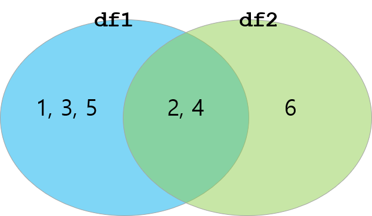

```{r setup, include=FALSE}
knitr::opts_chunk$set(echo = TRUE)
knitr::opts_chunk$set(background = '718CBA')
```

# Part 0. Setup  

##  

```{r, message=FALSE}
library(tidyverse) # Wickham's
library(sqldf)
source("infile-tidyr.R")
```  

1. `tidyverse`
    + Wickham이 만든 packages들을 다 모아놓은 패키지  
    + `ggplot2`, `dplyr`, `tidyr`, `readr`, `purrr`, `tibble`, `stringr`, `forcats`  
    + <https://www.tidyverse.org/packages/>
2. `sqldf`  
    + R에서 SQL 명령어를 사용할 수 있게 해주는 패키지   
    + SQL은 대용량의 복잡한 데이터를 다루는 데에 적합한 언어  
    + 이런 Cross-Language 패키지들은 새로운 환경에서의 연착률을 도와줌  
3. `source("infile-tidyr.R")`  
    + 해당 R 소스코드를 실행한 효과가 나옴  
    + 긴 코드를 보이지 않게 숨기게 하는데에 유용함  
    + 이번 노트에 사용되는 데이터프레임들을 정의하는 코드   
    + 아래와 같은 코드가 들어있습니다.  
    
```{r, eval=FALSE} 
df1 <- data.frame(
  CustomerId = c(1:5), 
  Product = c(rep("Toaster", 3), rep("Radio", 2)))
df2 <- data.frame(
  CustomerId = c(2, 4, 6), 
  State = c(rep("Seoul", 2), rep("Busan", 1)))
```

# Part I. `join`: 두 개의 데이터 프레임을 합하는 법 (a.k.a. `merge`)  

## 0. `df1`과 `df2`를 어떻게 합해야 할까요?  

\lc  

```{r}
df1
df2
```

\vspace{10pt}  

+ 어느쪽이 primary?  
+ 결측치가 생겨도 상관없음?  

\rc  

+ `join`에는 4가지 방법이 있습니다.  

{height=100}\  

1. `inner`  
2. `full` (`outer`)  
3. `left`  
4. `right`  

\ec 

## 

#### 1. Inner Join  

```{r, eval=FALSE}
inner_join(df1, df2) # dplyr 
merge(x = df1, y = df2, by = "CustomerId") # base 
sqldf("SELECT CustomerId, Product, State 
       FROM df1 JOIN df2 USING(CustomerID)") # sqldf   
```

```{r, echo=FALSE}
inner_join(df1, df2)
```

\vspace{10pt} 

#### 2. Outer Join (full) 

```{r, eval=FALSE}
full_join(df1, df2) # dplyr 
merge(x = df1, y = df2, by = "CustomerId", all = TRUE) # base 
```

```{r, echo=FALSE}
full_join(df1, df2)
```

## 

#### 3. Left Join 

```{r, eval=FALSE}
left_join(df1, df2) # dplyr
merge(x = df1, y = df2, by = "CustomerId", all.x = TRUE) # base
sqldf("SELECT CustomerId, Product, State 
       FROM df1 LEFT JOIN df2 USING(CustomerID)") # sqldf  
```

```{r, echo=FALSE}
left_join(df1, df2)
```

\vspace{10pt} 

#### 4. Right Join

```{r, eval=FALSE}
right_join(df1, df2) # dplyr
merge(x = df1, y = df2, by = "CustomerId", all.y = TRUE) # base
```

```{r, echo=FALSE}
right_join(df1, df2)
```

## Summary

+ Summary  

```{r, eval=FALSE}
inner_join(df1, df2)
left_join(df1, df2)
full_join(df1, df2)
right_join(df1, df2)
```

\vspace{10pt} 

+ `join`할때 사용할 `key`변수를 구체화  
    + `by =` argument로 key 변수를 아래처럼 지정합니다.  
    + `by =`을 입력하지 않으면 같은 이름의 변수를 찾아서 key로 사용합니다. 

```{r, eval=FALSE}
inner_join(df1, df2)
inner_join(x=df1, y=df2)
inner_join(x=df1, y=df2, by = "CustomerId")
inner_join(x=df1, y=df2, by = c("CustomerId"))
inner_join(x=df1, y=df2, by = c("CustomerId"="CustomerId"))
```

+ `vlookup`이나 `index-match`함수를 이용해서 엑셀 파일 합해본 경험있으세요?  
+ R에서는 이게 정말 끝입니다.    

## Discussion  

+ 여러분의 데이터가...
    + 각각의 관찰값에 1개 혹은 2개의 key 변수를 가지고 관리되고 있습니까?  
    + &rarr; (아니라면 직관적인 처리를 위해서 만드는 것이 좋습니다.)  
    + 여러 분의 key변수는 알기 쉽고, 중복되지 않고, 체계적인 규칙을 가지고 있습니까?  
    + &rarr; (주민등록번로를 생각해보세요!)

## Appendix - `NA`의 처리 

```{r}
df3 <- full_join(df1, df2)
df3$Population <- c(NA, 1000, NA, 1000, NA, 200)
df3
```

\vspace{10pt} 

+ 여러가지 이유로 위처럼 `NA` (결측치)가 생깁니다.  
+ 주로 3가지 방법으로 해결합니다.   
    1. 결측치가 있는 관찰값을 제거하기  
    2. 결측치를 다른 수치로 대체하기 (평균, 0 등의 값)  
    3. 그대로 두고 함수를 적용할 때 주의해서 분석 (많은 함수들에서 `na.rm=TRUE`등의 옵션 사용이 가능합니다.)  
    
##  

1. 결측치가 있는 관찰값을 제거하기  

```{r}
is.na(df3$State)
is.na(df3$State) %>% which() 
```

```{r}
df3[-(is.na(df3$State) %>% which()),]  
```

\vspace{20pt} 

+ 아래 명령들도 같은 결과를 만들어 냅니다. 

```{r, eval=FALSE}
df3[!is.na(df3$State),]  
df3[which(!is.na(df3$State)),]  
```

## 

2. 결측치를 다른 수치로 대체하기 (평균, 0등의 값)  

```{r}
is.na(df3$Population) %>% which() 
mean(df3$Population)
mean(df3$Population, na.rm = TRUE)
df3$Population[is.na(df3$Population) %>% which()] <- mean(df3$Population, na.rm = TRUE)
df3
```

# Part II. Workding with "tidy" data    

## 0. 단정한 데이터?  

\lc 

+ `M21` p.17  
+ tidy data.frame!  
    1. 개체 타입은 `data.frame`  
    2. 각각의 row는 관찰값을 의미  
    3. 각각의 column은 변수를 의미  


\rc  

```{r}
table1
```

\vspace{10pt}  
  
+ `table1`과 같은 정보를 담고 있지만, tidy하게 되있지 않은 데이터 구조가 있습니다.  
+ 이들을 tidy하게 `table1` 모양으로 바꿉니다.  
+ Excel의 `pivot_table` 기능 

\ec

## 0. 목 적  

+ 각 국가의 연도별 범죄 건수와 인구수입니다.  
+ `table2`, `table3`, `table4`로 부터 `table1`모양을 만들어야 했던 ~~아픈~~ 기억이 있으신가요?   

\lc

+ Before  

```{r}
table4a 
table4b 
```

\rc  

+ After  

```{r}
table1
```  

\ec  

##  

\lc

+ Before  

```{r}
table2
```

\rc  

+ After  

```{r}
table1
```  

\ec  

##  

\lc

+ Before  

```{r}
table3
```

\rc  

+ After  

```{r}
table1
```  

\ec  

## 1. `dplyr` Review (`mutate`)  

```{r}
table1
```  
  
```{r}
table1 %>% mutate(rate = cases / population * 100)  
```  

## 1. `dplyr` Review (`group_by` & `summarise`)  

```{r}
table1
```  
  
```{r, eval=FALSE}
table1 %>% group_by(year) %>% summarise(n = sum(cases))  
table1 %>% count(year, wt = cases) # same as above   
``` 
```{r, echo=FALSE}
table1 %>% group_by(year) %>% summarise(n = sum(cases))
```

## 2. `gather` from `table4a` & `table4b`  

\lc  

```{r}
table4a
tidy4a <- table4a %>% 
  gather(colnames(table4a)[-1], 
         key = "year", 
         value = "cases")
tidy4a
```

\rc  

```{r}
table4b
tidy4b <- table4b %>% 
  gather(colnames(table4b)[-1], 
         key = "year", 
         value = "population")
tidy4b
```

\ec  

\vspace{10pt} 

+ `gather()` 함수로 tidy 해집니다.  
+ 이제 `tidy4a`와 `tidy4b`로 어떻게 하면 `table1`이 만들어 질까요??  

##  

```{r, eval=FALSE}
inner_join(tidy4a, tidy4b)
inner_join(tidy4a, tidy4b, by = c("country", "year"))
inner_join(tidy4a, tidy4b, by = c("country"="country", "year"="year"))
```

```{r, echo=FALSE}
inner_join(tidy4a, tidy4b)
```

## 3. `spread` from `table2`

```{r}
table2
table2 %>% spread(key = "type", value = "count")
```

## 4. `separate` from `table3`

```{r}
table3
table3 %>% separate(rate, into = c("cases", "population"), sep = "/")
```

\vspace{10pt}  

**참고: Classical method**    

```{r}
table3$cases <- 
  sapply(strsplit(table3$rate, split = "/"), function(x) x[1])
table3$popul <- 
  sapply(strsplit(table3$rate, split = "/"), function(x) x[2])
```
  
<!-- 

## Summary  

+ "**0. 목 적**"을 다시 한 번 볼까요?  
+ `M51`이 끝나면서 무엇을 꼭 기억해야 할까요?   

--> 


