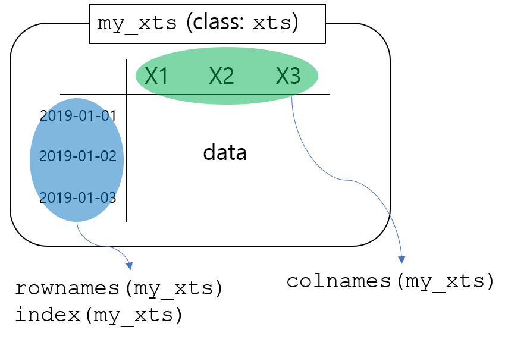
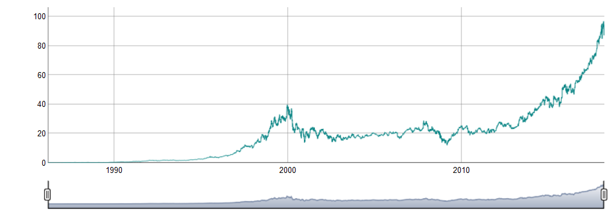

---
title: "M52-Time Series Data (`xts`, `dygraph`, `lubridate`)"  
author: "LearningSpoonsR "  
date: "`r Sys.Date()`"  
output:
  beamer_presentation:
    colortheme: default
    includes:
      in_header: myRmdBeamerStyle/latex-topmatter.tex
    latex_engine: xelatex
    slide_level: 2  
    theme: Montpellier
    toc: yes
  ioslides_presentation: default
  slidy_presentation: default
mainfont: NanumMyeongjo # NanumGothic  
fontsize: 9pt
classoption: t 
--- 

```{r setup, include=FALSE}
knitr::opts_chunk$set(echo = TRUE)
knitr::opts_chunk$set(background = '718CBA')
# options(encoding = 'euc-kr')
```

# Part 0. Introduction  

## 시계열 데이터 다루기 (데이터 구조 & 날짜/시간 다루기 & 그래프)

0. **목적: Microsoft의 주가에 대해서 시계열 그래프 그리기**    

1. Time Series Data   
    + 시간에 따라서 값이 변화하는 데이터.  
    + &rarr; 시간에 따라서 정렬된 `data.frame`  
    + &rarr; 1개 column이 시간 정보를 담고 있는 `data.frame`
    + &rarr; `rownames`가 시간 정보를 담고 있는 `data.frame` -> `xts`라는 새로운 자료구조     
2. `xts`   
    + `rownames`가 시간 정보를 담고 있는 `data.frame`형태의 자료 구조        
    + `data.frame`의 많은 명령어를 그대로 사용할 수 있음.  
    + `data.frame`의 `rownames`에 해당하는 특성을 `index`라고도 함.  
    + `xts`의 `index`는 `Date` 객체등 시간을 나타내는 데이터 타입.

\lc

{height=100px}\ 

\rc

{height=100px}\

\ec  

##  

3. `dygraph`  
    + 시계열 시각화 도구       
    + <https://rstudio.github.io/dygraphs/>  
    + 특징  
        + `highlight`, `annotation`, `label` 등의 기능을 쉽게 추가할 수 있음.   
        + `ggplot2`보다 시계열 데이터에서 강력함  
        + `htmlwidget` (html, fd, shiny에 유용)  
        + `shiny`에서 사용 가능한 `renderDygraph()` 제공  

4. `lubridate`  
    + `Date`객체 등 시간을 나타내는 데이터 타입을 다루는 패키지  

# Part 1. MSFT 데이터 불러오기   

## 데이터 불러오기 (`Quandl`)   

+ 글로벌 금융 데이터 베이스 제공업체   
+ **Quandl:Bloomberg = 위키피디아:브리터니커**의 관계를 지향  

```{r, message = FALSE, cache = TRUE}
library(Quandl) #  `quantmod` is another library for financial data  
Quandl.api_key("SD27xu59qZmj-YCnxwDm")
MSFT <- Quandl("WIKI/MSFT")
str(MSFT)
class(MSFT)
```

##    
  
+ `MSFT`객체에서 날짜, 거래량, 일일 종가만을 선택하여 진행합니다.  
  
```{r}
MSFT <- MSFT[,c(1,6,12)]
head(MSFT)
class(MSFT)
```
$\vspace{5pt}$     

+ `data.frame` 객체이며 첫번째 컬럼이 시간 정보를 포함하고 있습니다.    
+ `xts` 객체로 변환해 볼까요?  
+ 어떤 argument가 포함되어야 할까요?  

# Part 2. `xts` 객체로 변환하기     

## `xts` 객체로 변환  

```{r, message = FALSE }
library(xts)
MSFT_xts <- xts(x = MSFT[,-1], order.by = as.Date(MSFT[,1]))
```

+ `MSFT`는 `data.frame`객체이며 첫번째 컬럼(`Date`)이 시간 정보를 포함하고 있습니다.    
+ `xts()`: `xts`개체를 정의합니다.   
+ `order.by = as.Date(MSFT[,1])`: 첫 번째 컬럼을 index로 정의합니다.  
+ `x = MSFT[,-1]`: 나머지 부분을 넣어줍니다.  

```{r}
str(MSFT_xts)
```

## `data.frame` vs `xts`    

\lc  

```{r}
dim(MSFT)
head(MSFT)
```

\rc  

```{r}
dim(MSFT_xts)
head(MSFT_xts)
```

\ec 

\vspace{10pt}  

+ `xts`로 변환하면서 `dimension`이 줄었습니다. 그런데 모든 정보를 포함하고 있습니다?!  
+ 시간의 정보를 `index`로 만들기 때문에 정보의 손실없이 객체를 변환할 수 있습니다.  

## R vs Python

+ Python의 Pandas는 R의 `data.frame`에서 영감을 받았다 합니다. 
+ 문법, 구조, 기능 유사  
    
|          |   R      | Python   |    
|:--------:|:--------:|:--------:|  
| 데이터 프레임 | `data.frame` | `Pandas.DataFrame`  |   
| 시계열 데이터 | `xts`        | `Pandas.Series`     |  
| 그래프        | `ggplot2`, `dygraph` | `matplotlib` |  


## `xts`객체를 `data.frame`로 변환  

+ `xts`객체를 `data.frame`으로 바꾸는 것도 당연히 가능합니다.  

```{r}
MSFT_df <- data.frame(index(MSFT_xts), MSFT_xts)
head(MSFT_df, 3)
class(MSFT_df)
```
\vspace{10pt} 

+ `data.frame`에서 `rownames`가 거슬린다면 없애주면 됩니다.   

```{r}
rownames(MSFT_df) <- NULL
head(MSFT_df, 3)
```

# Part 3. `dygraph`로 interactive plot 그리기    

## dygraph로 그리기

+ `xts` 객체를 시계열 그래프로 표현하기   
+ `htmlwidget` 이기에 html, slidy, ioslides, flexdashboard, shiny에 유용    
+ x축이 고정되어 있으므로 `ggplot`보다 문법이 더 쉬워요!  
    + `dygraph(xts_object)` 이게 끝입니다.  
    + `dyRangeSelector()`로 간단하게 interactive plot을 만듭니다.  

```{r, eval=FALSE}
library(dygraphs)
dygraph(MSFT_xts[,2]) %>% dyRangeSelector()
```   

{height=200px}\   

# Part 4. `lubridate`로 시간 데이터 다루기    

## `lubridate`로 시계열 데이터 다루기 (`M13` 참조)   

```{r, message=FALSE}
library(lubridate)
theDay <- as.Date("2018-03-26") 
```

+ `theDay`의 한달 전은 언제입니까? "03"에서 1을 빼서 "02"로 바꾸면 되겠네요?    

```{r}
a <- as.numeric(substr(theDay, 6, 7))-1 # subtract month
library(stringr)
lastMonthDay <- as.Date(paste(
  substr(theDay, 1, 4), # Year
  str_pad(a, 2, pad = "0"), # Month: fill with leading zero
  substr(theDay, 9, 10), # Day
  sep = "-"))
lastMonthDay
```

$\vspace{5pt}$  

+ 그런데...  
    + "2018-01-15"의 한달 전은 언제입니까? 위의 코드로 해결이 안됩니다.   
    + "2018-03-31"의 한달 전은 언제입니까? 위의 코드로 해결이 안됩니다.   
+ `lubridate`의 `months`를 이용하면 아래와 같이 간단히 해결됩니다!  

```{r}
theDay - months(1)
```

## 사용 예제   

\lc  

- 이번달 1일    
```{r} 
floor_date(theDay, "month")
```
$\vspace{5pt}$

- 저번달 말일   
```{r} 
floor_date(theDay, "month") - days(1)
```
$\vspace{5pt}$  

- 전년 말일    
```{r}
floor_date(theDay, "years")-1
```
$\vspace{5pt}$  

- 전년 동월 말일  
```{r}
ceiling_date(theDay-years(1), "month") - 1
```
$\vspace{5pt}$  

\rc  

- `r theDay`의 `MSFT`주가는?   
```{r}
MSFT_xts[theDay,]  
MSFT_xts[index(MSFT_xts)==theDay,]  
```
$\vspace{5pt}$

- `theDay`의 1개월전 주가는?   

```{r}
MSFT_xts[theDay-months(1),]
MSFT_xts[index(MSFT_xts)==(theDay-months(1)),]
```
$\vspace{5pt}$

\ec  

##  

- `theDay`의 1년전 주가는?  

```{r}
MSFT_xts[theDay-years(1),]
MSFT_xts[index(MSFT_xts)==(theDay-years(1)),]
```
\vspace{10pt}

+ 왜 없나요?  
    + `weekdays(theDay-years(1))`로 `theDay-years(1)`의 요일을 확인할 수 있습니다.  
    + 확인을 해보니 `r weekdays(theDay-years(1))`입니다. 그래서 기록이 없습니다.  

+ 시계열 데이터의 현실적인 이슈 (특히 금융데이터)          
    + 많은 경우에 관찰값이 없는 경우가 있습니다. (비영업일)    
    + 흔히 `tidyverse`의 `fill`과 같은 명령을 사용해서 데이터셋을 365일로 강제로 바꾸기도 합니다.  
    + 이 경우에는 관찰값이 있었던 날과 아닌 날이 구분이 안되므로 또 다른 문제를 야기하기도 합니다.  
    + 어떻게 해야할까요?  
        1. 해당일 까지의 날짜 중에서  
        2. 관찰값이 존재하는 날짜 중에서  
        3. 가장 나중의 날짜의 값을 조회  

## 

```{r}
available <- which(index(MSFT_xts)<=(theDay-years(1)))
MSFT_xts[max(available),]
```

$\vspace{5pt}$   

1. `which()`는 값이 `TRUE`인 index를 반환합니다.  
2. 즉, `available`은 `theDay-years(1)`이전의 모든 기록의 index입니다.   
3. `max(available)`을 사용해 "해당일 이전 중에서 가장 나중"의 기록을 불러옵니다.    

+ 위의 해결 방식은...  
    + 관찰값이 있던 없던 **해당 시점에 사용가능한 가장 마지막 관찰값**을 불러올 수 있습니다.    
    + 꽤나 자주 사용되며 다른 컴퓨터 언어와 엑셀을 사용할 때도 활용 가능합니다.  


