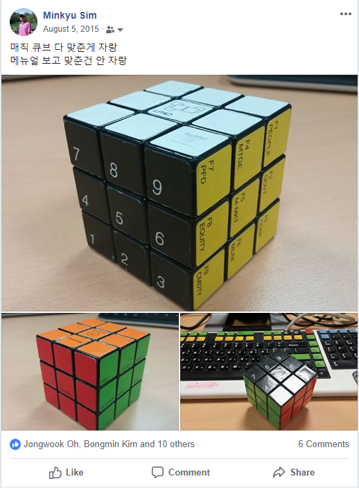
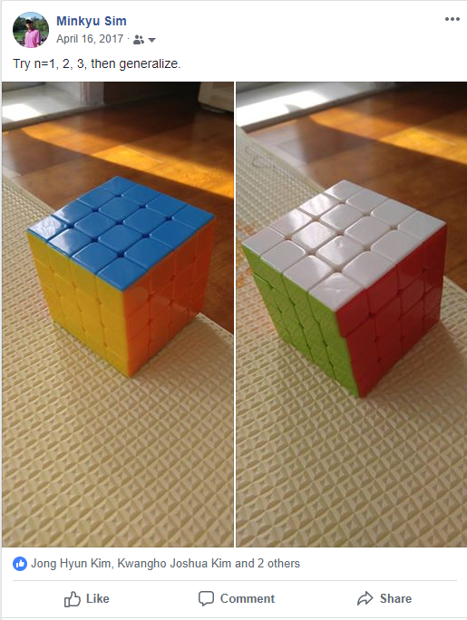

## About 

+ 부족한 강의 수강해주셔서 감사드립니다. 
+ 이 페이지는 수업 이후의 데이터 분석에 대한 가이드를 제공해드리고자 작성되었습니다.

## Future You

1. 프로그램의 목적을 정하고 구현  
2. 질문하고, 대답하고, 공유하고, 가르치고...  
3. 방어적인 프로그래밍 (Defensive Programming)  
4. 벡터 단위의 프로그래밍 (Vectorized Programming)  

## 1. 프로그램의 목적을 정하고 구현    

### Find what should it do first, then ask how!   
+ 돌아가고, 느리고, 무식하더라도 **한 번** 가보는 것이 중요.     
+ 프로그램 경험으로 기하적으로 빠른 프로그래머가 되어감.  

### Try 1-2-3 and generalize it.   
+ ``1''에 많은 시간을 쓰는 것을 두려워 말아야    
+ 레고를 만들듯이, 큐브를 맞추듯이...  
+ 공통점과 차이점을 발견하여 함수, 클래스, 패키지를 작성     
+ 새로운 도구를 익혀나감 (Python, Graphics, 통계...)    

|  2015             |  2017           |  ?? |   
|-------------------|-----------------|-----|   
|     |   |  ?? |   

## 2. 질문하고, 대답하고, 공유하고, 가르치고...    

### 질문하고 대답할 곳  
+ Rubber duck (Today-you)  
+ 강사 이메일  
+ Classmates (facebook group)   
+ 친구, 동료 들...   

### Minimal example of your problem     
+ 내 질문을 더 효과적으로 할 수 있는 방법은 무엇인가?  
+ 검색? 질문하는 글의 작성? Youtube?  

### 일 잘하는 사람   
+ 새로운 문제를 찾아낼 수 있는 사람  
+ 필요한 지식과 자원을 찾아낼 수 있는 사람  
+ 문제와 결론을 공유할 수 있는 사람   

## 3. 방어적인 프로그래밍 (Defensive Programming)  

### Styling   
+ 꼼꼼하고 프로페셔널하게...   
+ Font, Spacing, 일관성, 문서화    

### Naming  
+ Function = 동사 = Do something     
+ Variables = 명사 = Exists  

### Commenting   
+ 왜 code가 존재하는가  
+ 이 code는 무엇을 하는가    
+ Future-you에게 message를 보냄  
 
## 4. 벡터 단위의 프로그래밍 (Vectorized Programming)  
 
### 사고와 코드의 단위를 크게   
+ `Element`가 아닌 `Variable`로   
+ `Variable`이 아닌 `data.frame`으로    
+ `data.frame`이 아닌 database로  

## 5. 기 타  
- fb그룹 - 댓글/Like/잡담/질문/의견 독려  
- 일하시다가 디버깅이나 아이디어도 질문 독려   

## Epilogue

+ 수업들으신 것이 여러분에게 즐거운 경험이었고 앞으로의 삶에서 도움이 되길 바라는 마음입니다.  
+ 수업을 하다보면 생각보다 가르치는 사람도 배우는게 무척 많습니다. 수강생 분들 표정을 통해서 설명이 미비했던 부분을 알게되어 더 좋은 교수법을 생각하고 다른 방법으로 전달하는 방법을 배웁니다. 수업에서 배운 내용 안에서만 안주하지 않으려는 마인드를 가진 분들이 택한 알고리즘이나 새로운 기능을 통해서 항상 지적인 경계를 벗어하는 계기가 됩니다. 
+ 그리고 적극적인 태도로 본인의 comfort zone을 넘어가려는 분들에게 더 좋은 미래가 있음을 보게되는 보람은 다른 것과 비교할 수 없습니다.
+ 적극적이고 새로운 관점을 가지려는 태도의 중요성은 데이터 분석과 데이터 사이언스에서도 마찬가지로 중요합니다. 잘 짜여진 교과서와 수업에서 등장하는 tidy한 dataset에서 시작해서 정형화된 결론이 나오는게 끝이 아니라, 탐구하고 생각하려는 의지를 통해서만 훨씬 복잡한 실제 데이터와 세상을 깊이 이해할 수 있습니다. 기초통계와 간단한 분석만으로도 깊이 생각하고 계속 시도하면 다른 누구도 발견하지 못한 것을 발견하고 조직과 세상에 영향을 줄 수 있습니다. 
+ 수업 이후에도 페이스북이나 이메일을 통해서 얘기 나누시고 싶으신 것은 편하게 말씀해 주세요. 감사합니다! 

> Science is not knowledge but a way of thinking. - Carl Sagan  
> It's not that I'm so smart, it's just that I stay with problems longer. - Albert Einstein  

