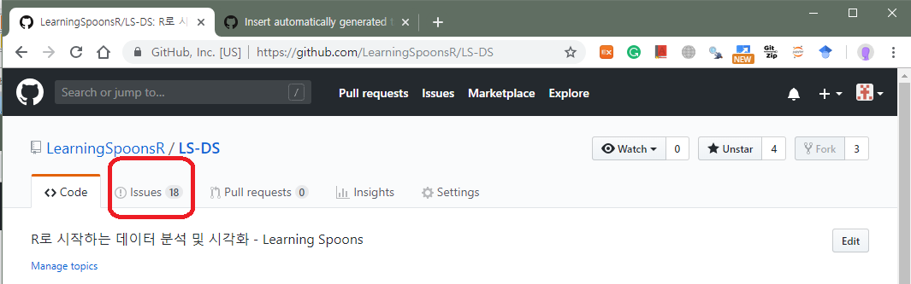
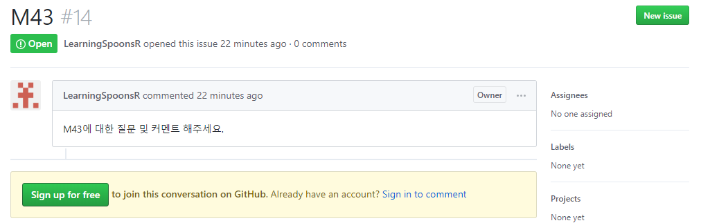
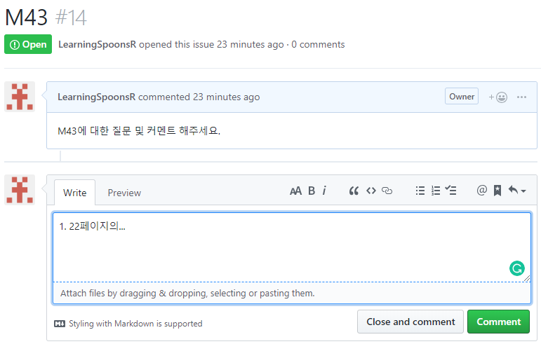

# I. R로 시작하는 데이터 분석 및 시각화    

+ **부제: 마케팅/영업/기획/매출관리 직무가 무엇이든 데이터 분석은 필수**    
+ 강의 페이지 <https://github.com/LearningSpoonsR/LS-DS>   
+ Facebook 비공개 그룹 - 친구 신청 해주세요  
+ 코스매니저 - 김형종 (출결등 기타)  
+ 강사이메일 - `learningSpoonsR@gmail.com`  

***   

# II. Philosophy 

   

> "A person who never made a mistake never tried anything new" - A. Einstein  
> "It is often necessary to do it in the wrong way first to learn the right way." - Hadley Wickham (from R Packages) 

***   

# III. 참고자료 

+ **Interactive Tutorial**
  + **모바일 폰에서도 가능합니다. 수강생 분들의 복습을 위해서 제작하고 있는 중입니다. 이상 기능이나 설명이 명확하지 않은 경우에 질문 주시면 매우 감사드리겠습니다.**
  + Data Types: https://learningspoonsr.shinyapps.io/01_basics/
  + Vector: https://learningspoonsr.shinyapps.io/02_vector/
  + Data Frame: https://learningspoonsr.shinyapps.io/05_data_frame/
  + `dplyr`: https://learningspoonsr.shinyapps.io/21_dplyr/
  + `ggplot2`: 
+ **R for Data Science**
  + **웹사이트**: https://r4ds.had.co.nz/ (크롬에서 우클릭 -> 번역기능 사용) 
  + 아마존: <https://www.amazon.com/Data-Science-Transform-Visualize-Model/dp/1491910399/ref=sr_1_3?keywords=r+for+data+science&qid=1553390913&s=gateway&sr=8-3>
  + 한글 역서도 출판되어 있음
    + <http://book.interpark.com/product/BookDisplay.do?_method=detail&sc.shopNo=0000400000&sc.prdNo=298756807> 
+ **Data Camp (무료)** 
  + Introduction to R 
  + 모바일 폰에서도 가능, 강의와 퀴즈로 연결되어 있음. 
  + <https://www.datacamp.com/courses/free-introduction-to-r>
+ **기수강생 작업물** 
  + http://bitly.kr/1G0Q  
+ 한글 R 메뉴얼 
  + https://homepage.usask.ca/~chl948/doc/manual/R-intro-ko.html  
+ PDF 조판을 위한 texLive 설치 
  + 다운로드 사이트 <http://www.ktug.org/xe/?mid=Install>
  + 설치 가이드 (15분 동영상) <https://youtu.be/V1Q6vEuoAQ0>

***   

# IV. 수업 순서  

M11 (Intro) -> M41 (OECD) ->  M12 (`base`) -> M13 (Quiz) ->    
M21 (`dplyr`) -> M22 (`rmarkdown`) -> M23 (`ggplot2`) -> 
M25, M26, M28 (Templates) -> M24 (`ggplot2` Gallery) ->    
M32 (`flexdashboard`) -> M43 (retail) ->   
M51 (`tidyr`) -> M52 (time-series) ->   
M33 (Shiny) -> M46 (retail2)  

***  

# V. Github에 댓글 다는법 (질문 & 답변 & 오류 신고등) 

1. Github 페이지 상단은 아래 그림처럼 생겼습니다. Code옆에 Issue를 클릭합니다. 

  

2. 댓글을 달고 싶은 Module 번호를 찾아서 들어갑니다.  

  

3. 회원가입이 안 되어 있으면 이렇게 나옵니다. Github 가입을 권장드립니다. (스팸성사이트가 아니라 전세계에서 개발자들이 가장 많이 사용하는 사이트입니다.) 

  

4. 회원 가입후에는 아래처럼 댓글을 달 수 있습니다. 

  

***  

# VI. 모듈 소개  

## M1X: Introduction & Basics    
  
|     | 제목    | 관련 packages | Description |      
| ----|:-------:|:------:|:-----------:|    
| `M11` | intro   |             | 강의 계획서. Data Science와 R 프로그램에 대해 소개합니다. |  
| `M12` | base    | `base`      | Data Type과 Data Structure에 대해서 논의합니다. |  
| `M13` | Quiz 1  | `rmarkdown` | `M12` review (`.docx`) |  
  
## M2X: The First Project  

+ 데이터 분석 프로젝트의 전 과정의 요소를 학습합니다. 

|     | 제목    | 관련 packages | Description |      
| ----|:-------:|:------:|:-----------:|    
| `M21` | `dplyr`    | `dplyr`, `ISLR` | `ISLR`의 `Carseats` 매출데이터로 자료 처리 과정을 다룹니다. |  
| `M22` | `rmarkdown` | `rmarkdown` (`.html`, `.docx`, `.pdf`) | 분석 결과를 보고서와 웹페이지로 만드는 법을 배웁니다. |  
| `M23` | `ggplot2` | `ggplot2` | 시각화 기법에 대해서 배웁니다. |  
| `M24` | `ggplot2` Gallery | `ggplot2` | `ggplot2`를 이용한 아름다운 시각화 사례들을 제공합니다. |
| `M25` | `.pdf` | `rmarkdown`, texlive | 한글로 된 pdf문서를 작성할 수 있는 템플릿입니다. pdf 조판을 위한 texlive 프로그램 설치 과정이 선행되어야 합니다. |
| `M26` | `beamer` | `rmarkdown`, texlive | 한글로 된 프리젠테이션 문서(수업 강의노트)를 작성할 수 있는 템플릿입니다. pdf 조판을 위한 texlive 프로그램 설치 과정이 선행되어야 합니다. |
| `M28` | `docx` | `rmarkdown` | `rmarkdown`을 사용해서 분석 결과와 시각화 자료를 한 번에 MS 워드 파일로 만듭니다. |   

> **M3X** 부터는 dependency가 없습니다.  
> 즉, M1X와 M2X까지를 익숙하게 다룰 수 있다면 M3X이후에는 모듈 각각에 대해서 독립적으로 이해하고 사용할 수 있습니다.  

## M3X: Web Applications  

+ 분석 결과를 정리하여 Dashboard를 제작합니다.  
+ 정적이고 portable한 flexdashboard와  
+ 사용자의 input에 interactive하게 동작하는 Shiny Application을 배웁니다.  

|     | 제목    | 관련 packages | Description |      
| ----|:-------:|:------:|:-----------:|    
| `M32` | `flexdashboard` | `flexdashboard`, `rmarkdown` | `rmarkdown`을 다룰수 있다면 손쉽게 이를 `.html`의 대시보드로 제작할 수 있습니다. 이는 반응형 대시보드(사용자의 마우스/키보드 동작에 반응)로 연장되는 `shiny` 패키지의 기본이 됩니다. |    
| `M33` | `shiny` on fd | `shiny`, `flexdashboard`, `rmarkdown` | `flexdashboard`와 `rmarkdown`을 다룰수 있다면 손쉽게 반응형 대시보드(사용자의 마우스/키보드 동작에 반응)또한 구현할 수 있습니다. `shiny`는 빠른 시간에 구현할 수 있는, elegant하고 professional한 프리젠테이션 기법이 됩니다. | 

## M4X: Case Studies - Data Analysis  

|     | 제목    | 관련 packages | Description |      
| ----|:-------:|:------:|:-----------:|    
| `M41` | longevity | `shiny` |  |    
| `M43` | retail    |   |  |  
| `M46` | retail2    | `shiny`, `tidyr` |  |  

## M5X: Other Advanced Applications  

|     | 제목    | 관련 packages | Description |          
| ----|:-------:|:------:|:-----------:|        
| `M51` | tidyr       | `tidyr`, SQL     |  |        
| `M52` | Time Series | `xts`, `dygraph`, `lubridate` |  |      

## M6X: References  

| 폴더 | Description |           
| ---- |:-----------:|          
| Book        |   |          
| Cheatsheets |   |        
| Dr. Hadley  |   |  

***  

# VII. Recently added 

+ `M29-xaringan`
+ `M36-gganimate`
+ `M37-dust_map` 
+ `M47-dept` 
+ `M55-Query & Report`

