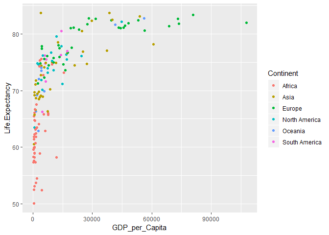
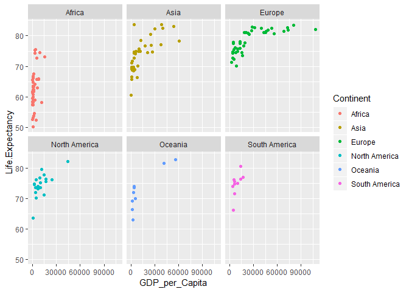
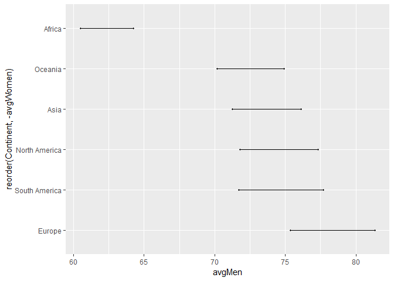

## I. 셋업    

### 0. 강의노트 마지막 페이지에 실습과제를 내드렸는데, 아직 Rmarkdown을 다루지 않았으므로 R을 이용하는 버전으로 바꿔서 아래에 내 드리겠습니다.  

### 1. 이메일에 첨부된 `lifeCountry.csv`파일을 다운받으세요.  


### 2. C:/LS-DS/classProject라는 폴더를 만드세요.  


### 3. Rstudio를 열어서 File -> New File -> R Script를 하면 새로운 소스 파일이 생성됩니다.  


### 4. 이를 File -> Save를 이용해서 위의 폴더에 `classProject1.R`이라는 파일로 저장하세요.   


### 5. RStudio를 완전히 닫고 탐색기에서 `classProject1.R`을 더블클릭하여 엽니다.  


```r
setwd("C:/LS-DS/classProject")
```

## II. 시작  

### 6. 아래 명령을 사용해 파일을 불러옵니다.  


```r
dataset <- read.csv("lifeCountry.csv", stringsAsFactors = FALSE)
```

### 7. library(dplyr)과 library(ggplot2)를 실행합니다.


```r
library(dplyr)
library(ggplot2)
```

### 8. 데이터는 총 몇개의 행과 열로 되어 있습니까? (hint: str)

데이터셋 `dataset`에는 161개의 행과 11개의 열로 구성이 되어있습니다.  

## III. `NA`를 다루는 법  

### `NA`를 다루는 법    

임의로 `OECD_GDP`를 변형해봅니다.  


```r
dataset$OECD_GDP[3] <- "na"
dataset$OECD_GDP[4] <- ""
```

위의 값들을 `NA`로 바꿔보겠습니다. 2가지 접근법이 있습니다. `dataset`의 `OECD_GDP`변수 값이 `"na"`인 경우에 `NA`로 변경하는 방법입니다.  


```r
# before 
head(dataset$OECD_GDP)
```

```
## [1] NA            NA            "na"          ""            NA           
## [6] "18913.23927"
```

```r
# dplyr method  
# https://stackoverflow.com/questions/28013850/change-value-of-variable-with-dplyr
dataset <- dataset %>% 
  mutate(OECD_GDP = replace(OECD_GDP, OECD_GDP=="na", NA)) %>% 
  mutate(OECD_GDP = replace(OECD_GDP, OECD_GDP=="", NA))  
# classic method    
dataset$OECD_GDP[dataset$OECD_GDP == "na"] <- NA
dataset$OECD_GDP[dataset$OECD_GDP == ""] <- NA
# after 
head(dataset$OECD_GDP)
```

```
## [1] NA            NA            NA            NA            NA           
## [6] "18913.23927"
```

더 간단하게 처리하려면 `|` (or)를 사용해서 아래와 같이 할 수 있습니다.  


```r
# dplyr method  
dataset <- dataset %>% 
  mutate(OECD_GDP = replace(OECD_GDP, (OECD_GDP=="na" | OECD_GDP==""), NA)) 
# classic method    
dataset$OECD_GDP[(dataset$OECD_GDP=="na" | dataset$OECD_GDP=="")] <- NA
```

아래와 같은 방법도 가능합니다. 즉, `(OECD_GDP=="na" | OECD_GDP=="")`는 `OECD_GDP %in% c("na", "")`와 같습니다.   


```r
# dplyr method  
dataset <- dataset %>% 
  mutate(OECD_GDP = replace(OECD_GDP, OECD_GDP %in% c("na", ""), NA)) 
# classic method  
dataset$OECD_GDP[dataset$OECD_GDP %in% c("na", "")] <- NA
```

위에는 `"na"`와 `""`값을 `NA`로 바꾸기 위해서 총 6가지 방법을 보여드렸습니다. 이처럼 코딩에는 여러개의 정답이 있습니다. 저는 개인적으로 마지막 방법의 classic method를 사용할 것 같습니다.  

## IV. 계속    

### 9. 가장 GDP가 높고 낮은 나라는 어디인가요? 가장 기대수명이 길고 짧은 나라는 어디인가요?  


정답: <div data-pagedtable="false">
  <script data-pagedtable-source type="application/json">
{"columns":[{"label":[""],"name":["_rn_"],"type":[""],"align":["left"]},{"label":["Country"],"name":[1],"type":["chr"],"align":["left"]}],"data":[{"1":"Luxembourg","_rn_":"1"}],"options":{"columns":{"min":{},"max":[10]},"rows":{"min":[10],"max":[10]},"pages":{}}}
  </script>
</div>  

### 10. 대륙별로 GDP와 기대수명의 평균을 구해보세요.


```r
dataset %>% group_by(Continent) %>% summarise(mean(GDP_per_Capita), mean(Life.Expectancy))
```

<div data-pagedtable="false">
  <script data-pagedtable-source type="application/json">
{"columns":[{"label":["Continent"],"name":[1],"type":["chr"],"align":["left"]},{"label":["mean(GDP_per_Capita)"],"name":[2],"type":["dbl"],"align":["right"]},{"label":["mean(Life.Expectancy)"],"name":[3],"type":["dbl"],"align":["right"]}],"data":[{"1":"Africa","2":"2618.391","3":"62.36522"},{"1":"Asia","2":"13321.189","3":"73.60000"},{"1":"Europe","2":"28589.325","3":"78.39250"},{"1":"North America","2":"11175.105","3":"74.52632"},{"1":"Oceania","2":"13483.111","3":"72.46667"},{"1":"South America","2":"8957.100","3":"74.71000"}],"options":{"columns":{"min":{},"max":[10]},"rows":{"min":[10],"max":[10]},"pages":{}}}
  </script>
</div>

### 11. 각 나라의 GDP를 x축으로, 기대수명을 y축으로 산점도를 그리고 대륙에 따라서 점의 색깔이 달라지게 해보세요.


```r
a <- ggplot(dataset) + 
  geom_point(aes(x = GDP_per_Capita, y = Life.Expectancy, color = Continent))
a
```

<!-- -->

```r
library(plotly)
```

```
## 
## Attaching package: 'plotly'
```

```
## The following object is masked from 'package:ggplot2':
## 
##     last_plot
```

```
## The following object is masked from 'package:stats':
## 
##     filter
```

```
## The following object is masked from 'package:graphics':
## 
##     layout
```

```r
ggplotly(a)
```

<!--html_preserve--><div id="htmlwidget-838712c3b982e59b51b5" style="width:672px;height:480px;" class="plotly html-widget"></div>
<script type="application/json" data-for="htmlwidget-838712c3b982e59b51b5">{"x":{"data":[{"x":[4225,4401,825,7673,696,343,1262,399,799,777,2039,11948,900,860,7583,1607,707,761,1677,1413,474,5166,412,326,793,1284,9671,3176,417,5358,420,2092,754,1749,998,15658,593,6089,221,2917,3513,621,3517,700,1483,1149],"y":[75.6,52.4,60,65.7,59.9,59.6,57.3,52.5,53.1,63.5,63.5,58.2,64.7,64.8,66,62.4,59,58.9,63.4,53.7,61.4,72.7,65.5,58.3,58.2,63.1,74.6,74.3,57.6,65.8,61.8,54.5,66.1,67.5,66.7,73.2,50.1,62.9,57.3,64.1,58.9,59.9,75.3,62.3,61.8,60.7],"text":["GDP_per_Capita:   4225<br />Life.Expectancy: 75.6<br />Continent: Africa","GDP_per_Capita:   4401<br />Life.Expectancy: 52.4<br />Continent: Africa","GDP_per_Capita:    825<br />Life.Expectancy: 60.0<br />Continent: Africa","GDP_per_Capita:   7673<br />Life.Expectancy: 65.7<br />Continent: Africa","GDP_per_Capita:    696<br />Life.Expectancy: 59.9<br />Continent: Africa","GDP_per_Capita:    343<br />Life.Expectancy: 59.6<br />Continent: Africa","GDP_per_Capita:   1262<br />Life.Expectancy: 57.3<br />Continent: Africa","GDP_per_Capita:    399<br />Life.Expectancy: 52.5<br />Continent: Africa","GDP_per_Capita:    799<br />Life.Expectancy: 53.1<br />Continent: Africa","GDP_per_Capita:    777<br />Life.Expectancy: 63.5<br />Continent: Africa","GDP_per_Capita:   2039<br />Life.Expectancy: 63.5<br />Continent: Africa","GDP_per_Capita:  11948<br />Life.Expectancy: 58.2<br />Continent: Africa","GDP_per_Capita:    900<br />Life.Expectancy: 64.7<br />Continent: Africa","GDP_per_Capita:    860<br />Life.Expectancy: 64.8<br />Continent: Africa","GDP_per_Capita:   7583<br />Life.Expectancy: 66.0<br />Continent: Africa","GDP_per_Capita:   1607<br />Life.Expectancy: 62.4<br />Continent: Africa","GDP_per_Capita:    707<br />Life.Expectancy: 59.0<br />Continent: Africa","GDP_per_Capita:    761<br />Life.Expectancy: 58.9<br />Continent: Africa","GDP_per_Capita:   1677<br />Life.Expectancy: 63.4<br />Continent: Africa","GDP_per_Capita:   1413<br />Life.Expectancy: 53.7<br />Continent: Africa","GDP_per_Capita:    474<br />Life.Expectancy: 61.4<br />Continent: Africa","GDP_per_Capita:   5166<br />Life.Expectancy: 72.7<br />Continent: Africa","GDP_per_Capita:    412<br />Life.Expectancy: 65.5<br />Continent: Africa","GDP_per_Capita:    326<br />Life.Expectancy: 58.3<br />Continent: Africa","GDP_per_Capita:    793<br />Life.Expectancy: 58.2<br />Continent: Africa","GDP_per_Capita:   1284<br />Life.Expectancy: 63.1<br />Continent: Africa","GDP_per_Capita:   9671<br />Life.Expectancy: 74.6<br />Continent: Africa","GDP_per_Capita:   3176<br />Life.Expectancy: 74.3<br />Continent: Africa","GDP_per_Capita:    417<br />Life.Expectancy: 57.6<br />Continent: Africa","GDP_per_Capita:   5358<br />Life.Expectancy: 65.8<br />Continent: Africa","GDP_per_Capita:    420<br />Life.Expectancy: 61.8<br />Continent: Africa","GDP_per_Capita:   2092<br />Life.Expectancy: 54.5<br />Continent: Africa","GDP_per_Capita:    754<br />Life.Expectancy: 66.1<br />Continent: Africa","GDP_per_Capita:   1749<br />Life.Expectancy: 67.5<br />Continent: Africa","GDP_per_Capita:    998<br />Life.Expectancy: 66.7<br />Continent: Africa","GDP_per_Capita:  15658<br />Life.Expectancy: 73.2<br />Continent: Africa","GDP_per_Capita:    593<br />Life.Expectancy: 50.1<br />Continent: Africa","GDP_per_Capita:   6089<br />Life.Expectancy: 62.9<br />Continent: Africa","GDP_per_Capita:    221<br />Life.Expectancy: 57.3<br />Continent: Africa","GDP_per_Capita:   2917<br />Life.Expectancy: 64.1<br />Continent: Africa","GDP_per_Capita:   3513<br />Life.Expectancy: 58.9<br />Continent: Africa","GDP_per_Capita:    621<br />Life.Expectancy: 59.9<br />Continent: Africa","GDP_per_Capita:   3517<br />Life.Expectancy: 75.3<br />Continent: Africa","GDP_per_Capita:    700<br />Life.Expectancy: 62.3<br />Continent: Africa","GDP_per_Capita:   1483<br />Life.Expectancy: 61.8<br />Continent: Africa","GDP_per_Capita:   1149<br />Life.Expectancy: 60.7<br />Continent: Africa"],"type":"scatter","mode":"markers","marker":{"autocolorscale":false,"color":"rgba(248,118,109,1)","opacity":1,"size":5.66929133858268,"symbol":"circle","line":{"width":1.88976377952756,"color":"rgba(248,118,109,1)"}},"hoveron":"points","name":"Africa","legendgroup":"Africa","showlegend":true,"xaxis":"x","yaxis":"y","hoverinfo":"text","frame":null},{"x":[572,3690,4097,25169,1532,2886,1389,24740,4123,3858,4958,39974,38550,5677,8585,27236,1139,11683,9659,12568,3552,1272,824,17406,3022,60811,20957,53880,29730,3905,818,6336,10434,7522,37346,2128,856],"y":[60.5,74.8,72.7,76.9,71.8,69.8,68.7,80.5,74.4,69.1,68.9,82.5,83.7,74.1,70.2,74.7,71.1,74.9,75,78.5,68.8,66.6,69.2,76.6,68.5,78.2,74.5,83.1,82.3,83.7,69.7,74.9,75.8,66.3,77.1,69.4,65.7],"text":["GDP_per_Capita:    572<br />Life.Expectancy: 60.5<br />Continent: Asia","GDP_per_Capita:   3690<br />Life.Expectancy: 74.8<br />Continent: Asia","GDP_per_Capita:   4097<br />Life.Expectancy: 72.7<br />Continent: Asia","GDP_per_Capita:  25169<br />Life.Expectancy: 76.9<br />Continent: Asia","GDP_per_Capita:   1532<br />Life.Expectancy: 71.8<br />Continent: Asia","GDP_per_Capita:   2886<br />Life.Expectancy: 69.8<br />Continent: Asia","GDP_per_Capita:   1389<br />Life.Expectancy: 68.7<br />Continent: Asia","GDP_per_Capita:  24740<br />Life.Expectancy: 80.5<br />Continent: Asia","GDP_per_Capita:   4123<br />Life.Expectancy: 74.4<br />Continent: Asia","GDP_per_Capita:   3858<br />Life.Expectancy: 69.1<br />Continent: Asia","GDP_per_Capita:   4958<br />Life.Expectancy: 68.9<br />Continent: Asia","GDP_per_Capita:  39974<br />Life.Expectancy: 82.5<br />Continent: Asia","GDP_per_Capita:  38550<br />Life.Expectancy: 83.7<br />Continent: Asia","GDP_per_Capita:   5677<br />Life.Expectancy: 74.1<br />Continent: Asia","GDP_per_Capita:   8585<br />Life.Expectancy: 70.2<br />Continent: Asia","GDP_per_Capita:  27236<br />Life.Expectancy: 74.7<br />Continent: Asia","GDP_per_Capita:   1139<br />Life.Expectancy: 71.1<br />Continent: Asia","GDP_per_Capita:  11683<br />Life.Expectancy: 74.9<br />Continent: Asia","GDP_per_Capita:   9659<br />Life.Expectancy: 75.0<br />Continent: Asia","GDP_per_Capita:  12568<br />Life.Expectancy: 78.5<br />Continent: Asia","GDP_per_Capita:   3552<br />Life.Expectancy: 68.8<br />Continent: Asia","GDP_per_Capita:   1272<br />Life.Expectancy: 66.6<br />Continent: Asia","GDP_per_Capita:    824<br />Life.Expectancy: 69.2<br />Continent: Asia","GDP_per_Capita:  17406<br />Life.Expectancy: 76.6<br />Continent: Asia","GDP_per_Capita:   3022<br />Life.Expectancy: 68.5<br />Continent: Asia","GDP_per_Capita:  60811<br />Life.Expectancy: 78.2<br />Continent: Asia","GDP_per_Capita:  20957<br />Life.Expectancy: 74.5<br />Continent: Asia","GDP_per_Capita:  53880<br />Life.Expectancy: 83.1<br />Continent: Asia","GDP_per_Capita:  29730<br />Life.Expectancy: 82.3<br />Continent: Asia","GDP_per_Capita:   3905<br />Life.Expectancy: 83.7<br />Continent: Asia","GDP_per_Capita:    818<br />Life.Expectancy: 69.7<br />Continent: Asia","GDP_per_Capita:   6336<br />Life.Expectancy: 74.9<br />Continent: Asia","GDP_per_Capita:  10434<br />Life.Expectancy: 75.8<br />Continent: Asia","GDP_per_Capita:   7522<br />Life.Expectancy: 66.3<br />Continent: Asia","GDP_per_Capita:  37346<br />Life.Expectancy: 77.1<br />Continent: Asia","GDP_per_Capita:   2128<br />Life.Expectancy: 69.4<br />Continent: Asia","GDP_per_Capita:    856<br />Life.Expectancy: 65.7<br />Continent: Asia"],"type":"scatter","mode":"markers","marker":{"autocolorscale":false,"color":"rgba(183,159,0,1)","opacity":1,"size":5.66929133858268,"symbol":"circle","line":{"width":1.88976377952756,"color":"rgba(183,159,0,1)"}},"hoveron":"points","name":"Asia","legendgroup":"Asia","showlegend":true,"xaxis":"x","yaxis":"y","hoverinfo":"text","frame":null},{"x":[4520,3690,46435,4097,5585,43243,4540,7924,12862,24740,56335,19618,45693,39673,4123,44184,18945,13459,73092,68604,31618,8585,15402,16443,107708,27567,7071,48271,73615,13429,20575,10372,5599,17491,23276,28212,53248,80837,10434,2458],"y":[77.8,74.8,81.5,72.7,72.3,81.1,77.4,74.5,78,80.5,80.6,77.6,81.1,82.4,74.4,81,81,75.9,82.7,81.4,82.7,70.2,74.6,73.6,82,81.7,76.1,81.9,81.8,77.5,81.1,75,75.6,76.7,80.8,82.8,82.4,83.4,75.8,71.3],"text":["GDP_per_Capita:   4520<br />Life.Expectancy: 77.8<br />Continent: Europe","GDP_per_Capita:   3690<br />Life.Expectancy: 74.8<br />Continent: Europe","GDP_per_Capita:  46435<br />Life.Expectancy: 81.5<br />Continent: Europe","GDP_per_Capita:   4097<br />Life.Expectancy: 72.7<br />Continent: Europe","GDP_per_Capita:   5585<br />Life.Expectancy: 72.3<br />Continent: Europe","GDP_per_Capita:  43243<br />Life.Expectancy: 81.1<br />Continent: Europe","GDP_per_Capita:   4540<br />Life.Expectancy: 77.4<br />Continent: Europe","GDP_per_Capita:   7924<br />Life.Expectancy: 74.5<br />Continent: Europe","GDP_per_Capita:  12862<br />Life.Expectancy: 78.0<br />Continent: Europe","GDP_per_Capita:  24740<br />Life.Expectancy: 80.5<br />Continent: Europe","GDP_per_Capita:  56335<br />Life.Expectancy: 80.6<br />Continent: Europe","GDP_per_Capita:  19618<br />Life.Expectancy: 77.6<br />Continent: Europe","GDP_per_Capita:  45693<br />Life.Expectancy: 81.1<br />Continent: Europe","GDP_per_Capita:  39673<br />Life.Expectancy: 82.4<br />Continent: Europe","GDP_per_Capita:   4123<br />Life.Expectancy: 74.4<br />Continent: Europe","GDP_per_Capita:  44184<br />Life.Expectancy: 81.0<br />Continent: Europe","GDP_per_Capita:  18945<br />Life.Expectancy: 81.0<br />Continent: Europe","GDP_per_Capita:  13459<br />Life.Expectancy: 75.9<br />Continent: Europe","GDP_per_Capita:  73092<br />Life.Expectancy: 82.7<br />Continent: Europe","GDP_per_Capita:  68604<br />Life.Expectancy: 81.4<br />Continent: Europe","GDP_per_Capita:  31618<br />Life.Expectancy: 82.7<br />Continent: Europe","GDP_per_Capita:   8585<br />Life.Expectancy: 70.2<br />Continent: Europe","GDP_per_Capita:  15402<br />Life.Expectancy: 74.6<br />Continent: Europe","GDP_per_Capita:  16443<br />Life.Expectancy: 73.6<br />Continent: Europe","GDP_per_Capita: 107708<br />Life.Expectancy: 82.0<br />Continent: Europe","GDP_per_Capita:  27567<br />Life.Expectancy: 81.7<br />Continent: Europe","GDP_per_Capita:   7071<br />Life.Expectancy: 76.1<br />Continent: Europe","GDP_per_Capita:  48271<br />Life.Expectancy: 81.9<br />Continent: Europe","GDP_per_Capita:  73615<br />Life.Expectancy: 81.8<br />Continent: Europe","GDP_per_Capita:  13429<br />Life.Expectancy: 77.5<br />Continent: Europe","GDP_per_Capita:  20575<br />Life.Expectancy: 81.1<br />Continent: Europe","GDP_per_Capita:  10372<br />Life.Expectancy: 75.0<br />Continent: Europe","GDP_per_Capita:   5599<br />Life.Expectancy: 75.6<br />Continent: Europe","GDP_per_Capita:  17491<br />Life.Expectancy: 76.7<br />Continent: Europe","GDP_per_Capita:  23276<br />Life.Expectancy: 80.8<br />Continent: Europe","GDP_per_Capita:  28212<br />Life.Expectancy: 82.8<br />Continent: Europe","GDP_per_Capita:  53248<br />Life.Expectancy: 82.4<br />Continent: Europe","GDP_per_Capita:  80837<br />Life.Expectancy: 83.4<br />Continent: Europe","GDP_per_Capita:  10434<br />Life.Expectancy: 75.8<br />Continent: Europe","GDP_per_Capita:   2458<br />Life.Expectancy: 71.3<br />Continent: Europe"],"type":"scatter","mode":"markers","marker":{"autocolorscale":false,"color":"rgba(0,186,56,1)","opacity":1,"size":5.66929133858268,"symbol":"circle","line":{"width":1.88976377952756,"color":"rgba(0,186,56,1)"}},"hoveron":"points","name":"Europe","legendgroup":"Europe","showlegend":true,"xaxis":"x","yaxis":"y","hoverinfo":"text","frame":null},{"x":[16826,24510,17158,4698,44773,11856,7360,4303,10328,4184,761,2729,5023,9249,2201,14409,9780,7395,14784],"y":[76.4,76.1,75.5,70.1,82.2,79.6,73.9,73.5,73.6,71.9,63.5,74.6,76.2,76.7,74.8,77.8,75.2,73.2,71.2],"text":["GDP_per_Capita:  16826<br />Life.Expectancy: 76.4<br />Continent: North America","GDP_per_Capita:  24510<br />Life.Expectancy: 76.1<br />Continent: North America","GDP_per_Capita:  17158<br />Life.Expectancy: 75.5<br />Continent: North America","GDP_per_Capita:   4698<br />Life.Expectancy: 70.1<br />Continent: North America","GDP_per_Capita:  44773<br />Life.Expectancy: 82.2<br />Continent: North America","GDP_per_Capita:  11856<br />Life.Expectancy: 79.6<br />Continent: North America","GDP_per_Capita:   7360<br />Life.Expectancy: 73.9<br />Continent: North America","GDP_per_Capita:   4303<br />Life.Expectancy: 73.5<br />Continent: North America","GDP_per_Capita:  10328<br />Life.Expectancy: 73.6<br />Continent: North America","GDP_per_Capita:   4184<br />Life.Expectancy: 71.9<br />Continent: North America","GDP_per_Capita:    761<br />Life.Expectancy: 63.5<br />Continent: North America","GDP_per_Capita:   2729<br />Life.Expectancy: 74.6<br />Continent: North America","GDP_per_Capita:   5023<br />Life.Expectancy: 76.2<br />Continent: North America","GDP_per_Capita:   9249<br />Life.Expectancy: 76.7<br />Continent: North America","GDP_per_Capita:   2201<br />Life.Expectancy: 74.8<br />Continent: North America","GDP_per_Capita:  14409<br />Life.Expectancy: 77.8<br />Continent: North America","GDP_per_Capita:   9780<br />Life.Expectancy: 75.2<br />Continent: North America","GDP_per_Capita:   7395<br />Life.Expectancy: 73.2<br />Continent: North America","GDP_per_Capita:  14784<br />Life.Expectancy: 71.2<br />Continent: North America"],"type":"scatter","mode":"markers","marker":{"autocolorscale":false,"color":"rgba(0,191,196,1)","opacity":1,"size":5.66929133858268,"symbol":"circle","line":{"width":1.88976377952756,"color":"rgba(0,191,196,1)"}},"hoveron":"points","name":"North America","legendgroup":"North America","showlegend":true,"xaxis":"x","yaxis":"y","hoverinfo":"text","frame":null},{"x":[56135,5761,1625,41629,2689,4283,2074,4176,2976],"y":[82.8,69.9,66.3,81.6,62.9,74,69.2,73.5,72],"text":["GDP_per_Capita:  56135<br />Life.Expectancy: 82.8<br />Continent: Oceania","GDP_per_Capita:   5761<br />Life.Expectancy: 69.9<br />Continent: Oceania","GDP_per_Capita:   1625<br />Life.Expectancy: 66.3<br />Continent: Oceania","GDP_per_Capita:  41629<br />Life.Expectancy: 81.6<br />Continent: Oceania","GDP_per_Capita:   2689<br />Life.Expectancy: 62.9<br />Continent: Oceania","GDP_per_Capita:   4283<br />Life.Expectancy: 74.0<br />Continent: Oceania","GDP_per_Capita:   2074<br />Life.Expectancy: 69.2<br />Continent: Oceania","GDP_per_Capita:   4176<br />Life.Expectancy: 73.5<br />Continent: Oceania","GDP_per_Capita:   2976<br />Life.Expectancy: 72.0<br />Continent: Oceania"],"type":"scatter","mode":"markers","marker":{"autocolorscale":false,"color":"rgba(97,156,255,1)","opacity":1,"size":5.66929133858268,"symbol":"circle","line":{"width":1.88976377952756,"color":"rgba(97,156,255,1)"}},"hoveron":"points","name":"Oceania","legendgroup":"Oceania","showlegend":true,"xaxis":"x","yaxis":"y","hoverinfo":"text","frame":null},{"x":[14061,10019,14314,6237,5875,4662,4138,6598,6415,17252],"y":[76.3,75,80.5,74.8,76.2,66.2,74,75.5,71.6,77],"text":["GDP_per_Capita:  14061<br />Life.Expectancy: 76.3<br />Continent: South America","GDP_per_Capita:  10019<br />Life.Expectancy: 75.0<br />Continent: South America","GDP_per_Capita:  14314<br />Life.Expectancy: 80.5<br />Continent: South America","GDP_per_Capita:   6237<br />Life.Expectancy: 74.8<br />Continent: South America","GDP_per_Capita:   5875<br />Life.Expectancy: 76.2<br />Continent: South America","GDP_per_Capita:   4662<br />Life.Expectancy: 66.2<br />Continent: South America","GDP_per_Capita:   4138<br />Life.Expectancy: 74.0<br />Continent: South America","GDP_per_Capita:   6598<br />Life.Expectancy: 75.5<br />Continent: South America","GDP_per_Capita:   6415<br />Life.Expectancy: 71.6<br />Continent: South America","GDP_per_Capita:  17252<br />Life.Expectancy: 77.0<br />Continent: South America"],"type":"scatter","mode":"markers","marker":{"autocolorscale":false,"color":"rgba(245,100,227,1)","opacity":1,"size":5.66929133858268,"symbol":"circle","line":{"width":1.88976377952756,"color":"rgba(245,100,227,1)"}},"hoveron":"points","name":"South America","legendgroup":"South America","showlegend":true,"xaxis":"x","yaxis":"y","hoverinfo":"text","frame":null}],"layout":{"margin":{"t":26.2283105022831,"r":7.30593607305936,"b":40.1826484018265,"l":37.2602739726027},"plot_bgcolor":"rgba(235,235,235,1)","paper_bgcolor":"rgba(255,255,255,1)","font":{"color":"rgba(0,0,0,1)","family":"","size":14.6118721461187},"xaxis":{"domain":[0,1],"automargin":true,"type":"linear","autorange":false,"range":[-5153.35,113082.35],"tickmode":"array","ticktext":["0","30000","60000","90000"],"tickvals":[0,30000,60000,90000],"categoryorder":"array","categoryarray":["0","30000","60000","90000"],"nticks":null,"ticks":"outside","tickcolor":"rgba(51,51,51,1)","ticklen":3.65296803652968,"tickwidth":0.66417600664176,"showticklabels":true,"tickfont":{"color":"rgba(77,77,77,1)","family":"","size":11.689497716895},"tickangle":-0,"showline":false,"linecolor":null,"linewidth":0,"showgrid":true,"gridcolor":"rgba(255,255,255,1)","gridwidth":0.66417600664176,"zeroline":false,"anchor":"y","title":"GDP_per_Capita","titlefont":{"color":"rgba(0,0,0,1)","family":"","size":14.6118721461187},"hoverformat":".2f"},"yaxis":{"domain":[0,1],"automargin":true,"type":"linear","autorange":false,"range":[48.42,85.38],"tickmode":"array","ticktext":["50","60","70","80"],"tickvals":[50,60,70,80],"categoryorder":"array","categoryarray":["50","60","70","80"],"nticks":null,"ticks":"outside","tickcolor":"rgba(51,51,51,1)","ticklen":3.65296803652968,"tickwidth":0.66417600664176,"showticklabels":true,"tickfont":{"color":"rgba(77,77,77,1)","family":"","size":11.689497716895},"tickangle":-0,"showline":false,"linecolor":null,"linewidth":0,"showgrid":true,"gridcolor":"rgba(255,255,255,1)","gridwidth":0.66417600664176,"zeroline":false,"anchor":"x","title":"Life.Expectancy","titlefont":{"color":"rgba(0,0,0,1)","family":"","size":14.6118721461187},"hoverformat":".2f"},"shapes":[{"type":"rect","fillcolor":null,"line":{"color":null,"width":0,"linetype":[]},"yref":"paper","xref":"paper","x0":0,"x1":1,"y0":0,"y1":1}],"showlegend":true,"legend":{"bgcolor":"rgba(255,255,255,1)","bordercolor":"transparent","borderwidth":1.88976377952756,"font":{"color":"rgba(0,0,0,1)","family":"","size":11.689497716895},"y":0.93503937007874},"annotations":[{"text":"Continent","x":1.02,"y":1,"showarrow":false,"ax":0,"ay":0,"font":{"color":"rgba(0,0,0,1)","family":"","size":14.6118721461187},"xref":"paper","yref":"paper","textangle":-0,"xanchor":"left","yanchor":"bottom","legendTitle":true}],"hovermode":"closest","barmode":"relative"},"config":{"doubleClick":"reset","modeBarButtonsToAdd":[{"name":"Collaborate","icon":{"width":1000,"ascent":500,"descent":-50,"path":"M487 375c7-10 9-23 5-36l-79-259c-3-12-11-23-22-31-11-8-22-12-35-12l-263 0c-15 0-29 5-43 15-13 10-23 23-28 37-5 13-5 25-1 37 0 0 0 3 1 7 1 5 1 8 1 11 0 2 0 4-1 6 0 3-1 5-1 6 1 2 2 4 3 6 1 2 2 4 4 6 2 3 4 5 5 7 5 7 9 16 13 26 4 10 7 19 9 26 0 2 0 5 0 9-1 4-1 6 0 8 0 2 2 5 4 8 3 3 5 5 5 7 4 6 8 15 12 26 4 11 7 19 7 26 1 1 0 4 0 9-1 4-1 7 0 8 1 2 3 5 6 8 4 4 6 6 6 7 4 5 8 13 13 24 4 11 7 20 7 28 1 1 0 4 0 7-1 3-1 6-1 7 0 2 1 4 3 6 1 1 3 4 5 6 2 3 3 5 5 6 1 2 3 5 4 9 2 3 3 7 5 10 1 3 2 6 4 10 2 4 4 7 6 9 2 3 4 5 7 7 3 2 7 3 11 3 3 0 8 0 13-1l0-1c7 2 12 2 14 2l218 0c14 0 25-5 32-16 8-10 10-23 6-37l-79-259c-7-22-13-37-20-43-7-7-19-10-37-10l-248 0c-5 0-9-2-11-5-2-3-2-7 0-12 4-13 18-20 41-20l264 0c5 0 10 2 16 5 5 3 8 6 10 11l85 282c2 5 2 10 2 17 7-3 13-7 17-13z m-304 0c-1-3-1-5 0-7 1-1 3-2 6-2l174 0c2 0 4 1 7 2 2 2 4 4 5 7l6 18c0 3 0 5-1 7-1 1-3 2-6 2l-173 0c-3 0-5-1-8-2-2-2-4-4-4-7z m-24-73c-1-3-1-5 0-7 2-2 3-2 6-2l174 0c2 0 5 0 7 2 3 2 4 4 5 7l6 18c1 2 0 5-1 6-1 2-3 3-5 3l-174 0c-3 0-5-1-7-3-3-1-4-4-5-6z"},"click":"function(gd) { \n        // is this being viewed in RStudio?\n        if (location.search == '?viewer_pane=1') {\n          alert('To learn about plotly for collaboration, visit:\\n https://cpsievert.github.io/plotly_book/plot-ly-for-collaboration.html');\n        } else {\n          window.open('https://cpsievert.github.io/plotly_book/plot-ly-for-collaboration.html', '_blank');\n        }\n      }"}],"cloud":false},"source":"A","attrs":{"587c11e36941":{"x":{},"y":{},"colour":{},"type":"scatter"}},"cur_data":"587c11e36941","visdat":{"587c11e36941":["function (y) ","x"]},"highlight":{"on":"plotly_click","persistent":false,"dynamic":false,"selectize":false,"opacityDim":0.2,"selected":{"opacity":1},"debounce":0},"base_url":"https://plot.ly"},"evals":["config.modeBarButtonsToAdd.0.click"],"jsHooks":[]}</script><!--/html_preserve-->

### 12. facet을 이용해서 대륙별로 GDP와 기대수명에 대한 산점도를 그려보세요. 


```r
a + facet_wrap(~ Continent)
```

<!-- -->

### 13. 국가별로 성별에 따라 기대수명이 다릅니다. mutate함수를 사용해서 ageSexDiff라는 변수를 만들어 보세요.


```r
dataset <- dataset %>% mutate(ageSexDiff = Female - Male)
```

### 14. 어떤 대륙에서 ageSexDiff가 가장 크고 작은가요? 


```r
dataset %>% 
  group_by(Continent) %>% 
  summarise(contiSexDiff = mean(ageSexDiff)) %>% 
  arrange(desc(contiSexDiff))
```

<div data-pagedtable="false">
  <script data-pagedtable-source type="application/json">
{"columns":[{"label":["Continent"],"name":[1],"type":["chr"],"align":["left"]},{"label":["contiSexDiff"],"name":[2],"type":["dbl"],"align":["right"]}],"data":[{"1":"Europe","2":"5.997500"},{"1":"South America","2":"5.970000"},{"1":"North America","2":"5.521053"},{"1":"Asia","2":"4.856757"},{"1":"Oceania","2":"4.711111"},{"1":"Africa","2":"3.717391"}],"options":{"columns":{"min":{},"max":[10]},"rows":{"min":[10],"max":[10]},"pages":{}}}
  </script>
</div>

### 15. 자유롭게 분석을 시작해보세요.

Dumbell plot을 그려보겠습니다.  


```r
# Dumbell plot (p25 in M24-ggplot2_Gallery)
library(ggalt)
continentGender <- dataset %>% 
  group_by(Continent) %>% 
  summarise(avgMen = mean(Male), avgWomen = mean(Female)) %>% 
  arrange(desc(avgWomen))
b <- ggplot(continentGender, 
            aes(x = avgMen, 
                xend = avgWomen, 
                y= reorder(Continent, -avgWomen), 
                group = Continent)) +
  geom_dumbbell()
b
```

<!-- -->

```r
c <- b + 
  labs(x=NULL, y=NULL, title="Continents difference in life expectancy",
       subtitle = "left: Men, right: Women",
       caption = "Source: OECD") +
  theme(plot.title = element_text(hjust=0.5, face="bold"),
        plot.background=element_rect(fill="#f7f7f7"),
        panel.background=element_rect(fill="#f7f7f7"),
        axis.ticks=element_blank(),
        legend.position="top",
        panel.border=element_blank())
c
```

<!-- -->

### 18. `classProject1.R`을 저장해서 learningSpoonsR@gmail.com 로 보내주세요.    


