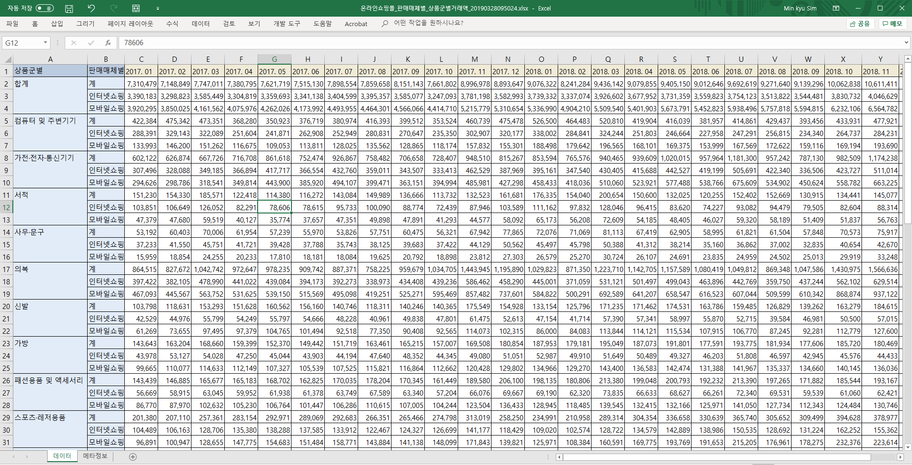
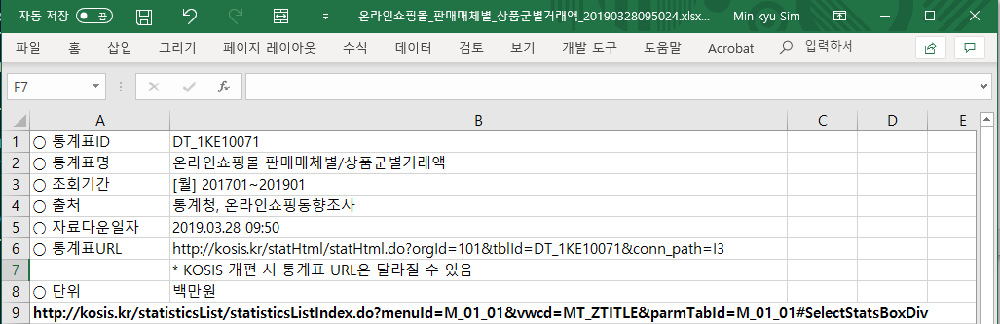
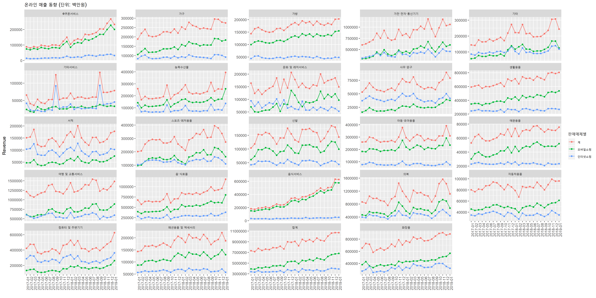

```{r setup, include=FALSE}
knitr::opts_chunk$set(echo = TRUE)
library(zoo)
library(readxl)
library(tidyverse)
library(plotly)
```

# I. Background  

+ 온라인쇼핑몰 판매매체별 상품군별거래액 조사 (통계청)  
+ 목적: 온라인쇼핑몰을 통한 전자상거래의 규모․인프라 등을 파악하여 전자상거래의 확산도를
측정하고, 주로 온라인쇼핑동향을 분석하여 정부의 정책수립, 기업의 경영계획 수립, 연구
소 및 각종 협회 등에 필요한 자료 제공
+ `data` 폴더의 `이용자용 통계정보보고서_온라인쇼핑동향조사2018.pdf`참조  

  

  

# II. Infile  

```{r}
library(readxl)
raw <- read_excel("data/온라인쇼핑몰_판매매체별_상품군별거래액_20190328095024.xlsx", sheet = "데이터")
raw[1:6,1:6]
```

# III. Preprocessing 

+ Task 1: `상품군별`의 NA 채워넣기 
+ Task 2: `M51`을 참고하여 tidy dataset으로 만들기 (Year-Month를 나타내는 `YM`컬럼 생성) 
+ Task 3: `YM` 변수의 값을 깔끔하게 정리 
+ Task 4: `Y`와 `M`도 생성  
+ Task 5: Tidy dataset 완성 확인 

## Task 1: `상품군별`의 NA 채워넣기  

+ google에서 "fill na with above value R"로 검색  
+ <https://stackoverflow.com/questions/7735647/replacing-nas-with-latest-non-na-value>  
  
  

+ 따라해보기 
  + 아래에서 `x`는 벡터를 `zoo` 타입으로 바꾸고 실행했는데, 
  + 해당 stackoverflow의 아래 쪽 댓글을 읽어보면 `zoo` 타입으로 바꾸는 것이 필수적이지는 않습니다. 
  + 즉, `y`와 같이 할 수도 있습니다. 

```{r}
library(zoo)
x <- zoo(c(2,NA,1,4,5,2))
na.locf(x)
y <- c(2,NA,1,4,5,2)
na.locf(y)
```

+ 우리 데이터에 적용하기 

```{r}
raw$상품군별 <- na.locf(raw$상품군별)
raw[1:6,1:6]
```

+ 성공! 다음 단계로 

## Task 2: `M51`을 참고하여 tidy dataset으로 만들기 

+ Year-Month를 나타내는 `YM`컬럼 생성하여 tidy하게 만드는 것이 목표 
+ `M51`의 `table4a`와 모양이 유사합니다.  
+ Trial and error의 과정을 거치다 보면 아래 명령어를 찾아낼 수 있습니다. 

```{r}
library(tidyverse)
my_tidy <- raw %>%
  gather(colnames(raw)[-(1:2)], key = "YM", value = "Revenue")
head(my_tidy)
tail(my_tidy)
```

## Task 3: `YM` 변수의 값을 깔끔하게 정리  

+ `head(my_tidy)`와 `tail(my_tidy)`에서 `YM` 부분의 일관성이 떨어지는 것이 보입니다. 

```{r}
unique(my_tidy$YM)
```

+ 아래 코드는 별로 어렵지 않죠?  

```{r}
my_tidy$YM <- paste(substr(my_tidy$YM, 1, 4), substr(my_tidy$YM, 7, 8), sep = "-")
unique(my_tidy$YM)
```

## Task 4: `Y`와 `M`도 생성  

```{r}
my_tidy <- my_tidy %>%
  mutate(Y = substr(YM, 1, 4) %>% as.numeric(),
         M = substr(YM, 6, 7) %>% as.numeric())
```

+ 아래 코드로도 가능합니다. (classical way)  

```{r, eval=FALSE}
my_tidy$Y <- as.numeric(substr(YM, 1, 4))
my_tidy$M <- as.numeric(substr(YM, 6, 7))
```

+ 확인  

```{r}
my_tidy %>% head()
```

## Task 5: Tidy dataset 완성 확인    

```{r}
my_tidy %>% str()
```

+ 이제 전처리가 끝났습니다. 변수의 순서를 바꾸고 정렬하여 `dataset`이라는 이름을 붙여주고 분석을 진행해보겠습니다. 

```{r}
dataset <- my_tidy %>%
  select(YM, Y, M, 상품군별, 판매매체별, Revenue) %>% 
  arrange(YM, Y, M, 상품군별, 판매매체별, Revenue)
head(dataset)
```

# IV. `판매매체별`분석 (``r unique(dataset$판매매체별)``)  

```{r}
head(dataset)
```

```{r}
library(ggplot2)
library(plotly)
options(scipen=999) # Avoid scientific expression e.g.) 1e+05
unique(dataset$상품군별)
fig1 <- ggplot(dataset %>% filter(상품군별=="합계"), 
               aes(x = YM, y = Revenue, color = 판매매체별)) + 
  geom_point() + 
  geom_line(aes(group = 판매매체별)) +
  labs(x = "", title = "온라인 매출 동향 (단위: 백만원)") +
  theme(axis.text.x = element_text(angle = 90, hjust = 1)) 
fig1 %>% ggplotly()
```

```{r}
fig2 <- ggplot(dataset, 
               aes(x = YM, y = Revenue, color = 판매매체별)) + 
  geom_point() + 
  geom_line(aes(group = 판매매체별)) +
  labs(x = "", title = "온라인 매출 동향 (단위: 백만원)") +
  theme(axis.text.x = element_text(angle = 90, hjust = 1)) +
  facet_wrap(~ 상품군별)
ggsave(plot = fig2, filename = "data/fig2.png", dpi = 300, width = 20, height = 10)

fig2b <- fig2 + facet_wrap(~ 상품군별, scales = "free_y") # google: "facet to have different y axis"
ggsave(plot = fig2b, filename = "data/fig2b.png", dpi = 300, width = 20, height = 10)
```


 

# V.  

# VI. 

# X. 작업중 + Appendix + 미완 

## 참고. 목적에 따른 테이블 변환   

```{r}
dataset2 <- dataset %>% spread(key = "판매매체별", value = "Revenue")
head(dataset2)
```
